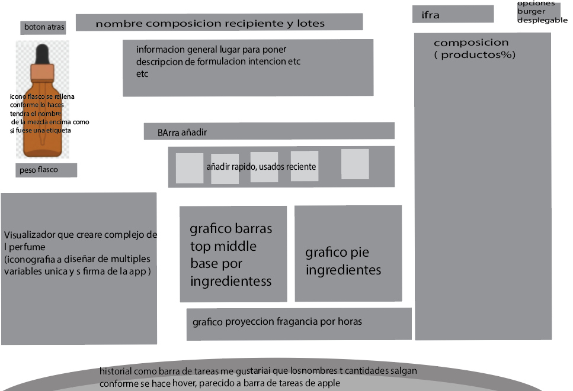

# Interrogatorio de diseño — la intención de la app

Registro de preguntas y respuestas para aclarar qué tiene que ser la app, empezando por
la **formulación**. **Se añade, no se reescribe**: si una respuesta cambia, se añade la
corrección con fecha debajo.

Método adaptado del [prompt de interrogatorio](antecedentes/formulacion/prompt-interrogatorio-diseno.md):
tandas de tres preguntas como máximo. El usuario puede responder **en prosa**. La
respuesta se interpreta, la lectura se escribe aquí y el usuario la confirma o la
corrige.

Cuando las rondas R1 a R4 estén cerradas, lo decidido pasa a [`decisiones.md`](decisiones.md)
como v3. Los [antecedentes](antecedentes/README.md) no obligan a nada.

Última sesión: 2026-09-25 (rondas 1 a 8, la formulación, cerradas; ronda 9, el diseño, abierta)

---

## Ronda 1 — El núcleo

### P1 — ¿Qué es una fórmula?
- Bloque: 1 · el núcleo
- Abierta por: `antecedentes/formulacion/02-dominio-y-datos.md` §1 (composición cerrada con versiones) frente al Banco v2 (el historial de adiciones es la fórmula)
- Opciones presentadas: A) historial de adiciones · B) composición editable con versiones · C) las dos: se trabaja por adiciones y «cerrar versión» da una composición editable
- Recomendación: C
- Respuesta: **propia, más cercana a A**
- Razón del autor: *«lo ideal es que imiten la realidad, las formulas pueden ser editables pero aditivamente, pero con una sucesion de descendencia. por ejemplo si abro una formula que he creado y esta igual, añadirle productos la alterara pero esto no alterara las mezclas que se hayan creado a traves de la formula previa a la edicion. […] las formulas son una categoria de informacion en el proyecto que registrara una adicion de todos los componentes que la conforman. lo que hace falta es que luego puedan ser usadas para otros perfumes, por ejemplo, como acorde. creo que aqui el secreto seria seleccionar una opcion en opciones, importar formula como material. en cuanto la importas deja de ser una formula vinculada a otra formula, sino la formula importada se traduce en lo que la compone para la formula en la que se esta trabajando (se registra en el documento como el nombre de la formula ha sido agregada, pero internamente se desglosa en las materias primas que la componen)»*
- **Lectura:**
  1. Una fórmula es **un registro de adiciones**. Se edita **solo añadiendo**, como en el
     banco real, donde lo vertido no se desvierte.
  2. **Cada estado del registro queda fijo.** Lo que se haya hecho a partir de un estado
     anterior no cambia al añadir después: la versión de una fórmula es *hasta qué adición
     llega*.
  3. **Descendencia:** de cualquier estado puede nacer una fórmula hija que recuerda de qué
     madre y de qué estado sale.
  4. **Importar una fórmula como material.** Es una opción al añadir, y se hace **por
     copia desglosada, no por vínculo**:
     - el registro muestra una línea, «Fórmula X, 500 mg»;
     - por dentro se reparten esos 500 mg entre sus materias primas, en la proporción
       exacta de ese estado;
     - si la fórmula X cambia después, la que la importó no se entera.

     Es la «base inmutable» del Banco v2, generalizada a cualquier fórmula.
  5. **Lo que se descarta de los antecedentes:** acordes anidados con vínculo vivo, versión
     fijada, detección de ciclos y profundidad máxima (`02` §1, `03` §4). Al desglosar en
     el momento de importar, nada de eso hace falta.
- Fecha: 2026-09-25
- Estado: cerrada · lectura por confirmar
- Destino: decisiones.md

### P2 — ¿Dónde vive la verdad?
- Bloque: 1 · el núcleo
- Abierta por: la app lee los CSV del repositorio (`README.md` de la app, `exportar.py`) frente a un almacén propio
- Opciones presentadas: A) en el repositorio · B) en la app · C) repartida: referencia en el repositorio, fórmulas en la app
- Recomendación: C
- Respuesta: **propia: la app es autónoma, y el repositorio la alimenta mientras se construye**
- Razón del autor: *«la app aunque sea para empezar usandola yo tiene que ser autonoma, porque la infraestructura tiene que existir por si misma, yo diria que lo mejor seria que para la creacion de la app se importe informacion de la repo hasta que pueda existir por si misma, por ejemplo en cuanto la quiera hacer usable y que sea un ejecutable en mi movil si quiero que autocontenga regulacion ifra no que tenga que ir a un repositorio de mi ordenador»*
- **Lectura:**
  1. La app **funciona sola, también en el móvil y sin conexión**. Lleva dentro sus datos:
     IFRA, materiales, niveles de uso.
  2. El repositorio es **la fuente de la que se alimenta**. Los datos de referencia se
     importan del repositorio como un **paquete de datos versionado**. Es lo que ya hace
     [`exportar.py`](../scripts/importar_datos.py), convertido en paso de construcción.
  3. **Autonomía de ejecución no es un repositorio aparte.** El código puede seguir en
     `app/`: lo que no puede hacer la app es necesitar el repositorio para funcionar.
  4. **Queda abierto (P5):** una vez autónoma, dónde se dan de alta los frascos y
     materiales nuevos, y cómo vuelve al repositorio lo que se crea en la app.
- Fecha: 2026-09-25
- Estado: cerrada · lectura por confirmar
- Destino: decisiones.md

### P3 — ¿Hasta dónde llega IFRA desde el primer día?
- Bloque: 1 · el núcleo
- Abierta por: `decisiones.md` §2.1 (suma por sustancia «para una iteración futura») y `antecedentes/formulacion/entradas-para-decisiones-app.md` (IFRA aplazado, **superado**: la fuente primaria ya existe)
- Opciones presentadas: A) techo por material · B) A + suma por sustancia donde haya datos · C) B + alérgenos declarables
- Recomendación: A ya y B enseguida
- Respuesta: **B, con el diseño preparado para C**
- Razón del autor: *«teniendo la bas de datos de ifra ya lo mejor seria estar diseñando de manera que se ponderen ya los alergenos que convergen entre materiales, al menos por diseño, aunque haya materiales que tengan solapamiento de alergenos no registrados es mejor registrar los que si se sepan porque es el estado esperado del funcionamiento, y en caso que no se tenga la informacion de unos simplemente funcionara como si solo tuviera el techo por cada material. en cualquier caso es mejor la segunda creo yo. por ultimo siempre que haya elementos desconocidos se debe avisar en la formulacion»*
- **Lectura:**
  1. **El modelo lleva constituyentes desde el principio.** Cada material puede declarar
     las sustancias reguladas o alérgenas que contiene, con su porcentaje, su base y su
     fuente.
  2. **El cálculo suma por sustancia** sobre toda la fórmula, desglosada: cumarina del
     frasco más la de la tintura, HAP de cade más estoraque, linalol de todas partes.
  3. **Se carga lo que se sabe.** Si un material no tiene constituyentes declarados,
     cuenta solo su techo propio. Ese es el funcionamiento esperado, no un error.
  4. **Lo desconocido siempre se avisa en la formulación.** Un material sin datos, una
     carga `SIN DATO` o un constituyente sin cuantificar salen marcados; nunca en verde.
     Es la regla 1.2 de `decisiones.md`.
  5. **Los alérgenos van en el diseño; los umbrales, pendientes.** Los umbrales de
     declaración en etiqueta de la UE son el vacío 12 de `fuentes/vacios.md`. No se
     inventan.
- Fecha: 2026-09-25
- Estado: cerrada · lectura por confirmar
- Destino: decisiones.md

---

## Ronda 2 — Registro, materiales y frascos

*Preguntas presentadas: P4 (corregir errores en un registro que solo crece), P5 (dónde
nacen frascos y materiales con la app autónoma), P6 (inventario en la primera versión).
El usuario respondió en un solo texto que **corrige P1** y responde a las tres.*

Respuesta literal, completa:

> *«en cuanto a la app durante la formulacion pienso que es practico que se pueda editar, en mi caso con ctrl z iba bien pero aun asi creo que he virado de la idea de que las formulas sean cerradas e ineditables, vira de algunos conceptos que si me gustaban, por ejemplo importar una formula de un tercero y querer recrearla pero ajustandola, las formulas seran editables y estan compuestas de agregados de materiales, son los materials los que no cambian, yo puedo coger una formula de acorde de melocoton y editarla, quitando componentes dulces y añadiendo olores fuertes, hacer acorde de melocoton pasado. en este caso pierde capacidades de ser uno a uno de la realidad pero gana ventajas en lo que considero que es el campo necesario, documentar y adjuntar formulaciones. en linea de esto, la app no tiene que tener un stock real, añade muchas complicaciones, no es intuitivo, el proposito de la app es la informacion intangible que trae, mientras que en mi caso yo tenia y estaba valorando los stocks en la app se enturbia,*
> *en la app hay: materiales conocidos, todos en glosario, capacidad de dar de alta materiales con la misma rigurosidad y parametros que los materiales conocidos, o con agujeros (tinturas limite ifra desconocido) de manera que esten tagged, capacidad de dar de alta acordes o materiales a raiz de las formulas, por ejemplo usar un perfume creado para otro o reducirlo a un eau de perfum pero añadiendole fijadores como remedio al cambio de concentracion... La idea es que las opciones de materiales no dependan de dar de alta manualmente stock eso para mi fue tedioso para gente puede ser hasta mas, aporta valor solo en pequeños casos. Creo que los pesos reales tienen que mandar solo en la formulacion, por ejemplo si un acorde de higos que hiciste de 10g es usado como material y se debe reformular al volverlo a reformular es importante que la importacion tenga en cuenta cuanto queda, se usaron 2g por ejemplo y la formulacion no esta preparada puede dar lugar a problemas. hay que definir como navegar con las formulas y materiales, lo ideal es que los amteriales contengan la importacion de los acordes con codigos de lo que lo componen y concentrado, quizas usanndo cas como terminologia, no se por ejemplo "mat(dpgg%50 - 15932-80-6%10 - Angelica seed absolute20% - Anisyl alcohol20%)". de manera que toda la libreria de materiales que manda es en base a ifra y por lo tanto esta al dia de los limites de ifra.»*

### P1 — corrección del 2026-09-25: las fórmulas se editan; los materiales no cambian
- **Lectura, que sustituye a los puntos 1 a 3 de la lectura anterior de P1:**
  1. **Una fórmula se edita libremente**: añadir, quitar, cambiar cantidades, con deshacer
     (Ctrl+Z). Se abandona «solo añadiendo» y «cada estado queda fijo».
  2. **Se deriva copiando.** Cualquier fórmula, propia o de un tercero, se copia y se ajusta
     como fórmula nueva: del acorde de melocotón sale el de melocotón pasado.
  3. **Lo que no cambia son los materiales.** Una fórmula convertida en material queda
     **congelada** como composición. **Sigue en pie el punto 4 de la lectura anterior**:
     importar una fórmula como material es copia desglosada, no vínculo.
  4. **Se acepta perder el uno a uno con el banco** a cambio de lo que es el propósito:
     **documentar y adjuntar formulaciones**.
- Estado: cerrada · lectura por confirmar
- Destino: decisiones.md

### P4 — ¿Cómo se corrige un error?
- Opciones presentadas: A) nada se borra, se tacha · B) deshacer la última mientras nada dependa de ella · C) editar cualquier línea
- Recomendación: B
- Respuesta: **C, con deshacer**, que la corrección de P1 hace innecesaria como pregunta aparte
- Estado: cerrada
- Destino: decisiones.md

### P5 — ¿Dónde nacen los materiales? *(respondida en parte)*
- Opciones presentadas: A) en la app · B) en el repositorio · C) repartido: referencia en el repositorio, lo personal en la app
- Recomendación: C
- **Lectura:**
  1. **La biblioteca son todos los materiales conocidos**, el glosario, no lo que tengas en
     casa. Cada uno con su IFRA por CAS. Es lo que el usuario llama que la librería «manda
     en base a IFRA» y por eso está al día de los límites.
  2. **En la app se dan de alta materiales nuevos** con los mismos campos y el mismo rigor,
     **o con huecos marcados**: una tintura sin carga conocida o un IFRA desconocido llevan
     etiqueta, no un cero.
  3. **En la app se dan de alta materiales a partir de fórmulas**: un acorde, un perfume
     usado como ingrediente de otro, o una reformulación. Por ejemplo, pasar un perfume a
     eau de parfum añadiendo fijadores para compensar el cambio de concentración.
  4. **Un material compuesto lleva su composición como código**, en términos de CAS donde
     los haya. Por ejemplo: `mat(DPG 50 % · 15932-80-6 10 % · Angelica seed absolute 20 % ·
     Anisyl alcohol 20 %)`. Así IFRA se calcula siempre sobre lo que contiene. El formato
     queda abierto en P9; hay precedente en
     [`05-libreria-global-e-intercambio.md`](antecedentes/formulacion/05-libreria-global-e-intercambio.md) §2.
- ⚠️ **Consecuencia:** hoy IFRA está transcrito solo para los **54 materiales de la paleta**
  ([`ifra-cat4.csv`](https://github.com/smortenax/perfumeria-lab/blob/master/conocimiento/normativa/ifra-cat4.csv)). Para que la biblioteca sea el
  glosario entero (3119 ingredientes por CAS), hace falta **una tabla de los 216
  estándares por CAS**, en categoría 4. Es trabajo de datos, con el método ya escrito en
  [la investigación de los 216 estándares](https://github.com/smortenax/perfumeria-lab/blob/master/fuentes/investigaciones/2026-09-23-niveles-de-uso-y-los-216-estandares.md).
  Y para los naturales, los constituyentes siguen siendo el hueco de P3.
- Estado: abierta en parte. Queda qué se trae del repositorio y qué vuelve (ronda 4)
- Destino: decisiones.md

### P6 — Inventario
- Opciones presentadas: A) sin cantidades · B) cantidad por frasco que se descuenta · C) B + planificación
- Recomendación: B
- Respuesta: **ninguna de las tres: no hay inventario de materias primas**
- **Lectura:**
  1. **La app no lleva stock.** La biblioteca no depende de dar nada de alta: se formula
     con cualquier material conocido.
  2. **Los pesos reales mandan solo dentro de la formulación.**
  3. **Una excepción, y es de formulación, no de almacén: las mezclas hechas.** Si hiciste
     10 g de un acorde de higos y lo usas como material, la app sabe cuánto hiciste y cuánto
     has usado. Si una fórmula pide más de lo que queda, avisa.
- Consecuencia: la decisión de agosto de «alta y baja de existencias en un clic» queda
  **superada**, salvo para las mezclas hechas.
- Estado: cerrada · lectura por confirmar
- Destino: decisiones.md

---

## Ronda 3 — Dilución, historial y código de material

*Preguntas presentadas: P7 (dónde vive la dilución sin frascos), P8 (qué guarda una
fórmula de su historia), P9 (código de un material compuesto). El usuario respondió P7
y P8 con una captura anotada de la barra de añadir del Banco v2. **P9 queda sin
responder.***

*La captura: en **blanco**, un «+» sobre el inicio del buscador; en **lila**, el campo
«Buscar material o base»; en **naranja**, el campo «Seleccionado»; en **rojo**, el campo
«Cantidad» en mg.*

Respuesta literal, completa:

> *«p7 exacto, seleccionar un material en el buscador te deja lugar a determinar la disolucion a la derecha*
> *\* en blanco, dar de alta un material fuera del registro, o bien matarial nuevo o añadir formula como material o bien añadir de la lista de materiales del usuario, si el ha dado de alta materiales, como tinturas por ejemplo que puede incluso que haya hecho test de limites de uso y demas estos materiales pueden vivir en la formulacion del usuario pero es añaden a proposito, no forman parte de la paleta base*
> *\* la parte lila funciona parecido a antes en este caso una diferencia significativa es que el propio buscador deja seleccionado el material , no tiene sentido un apartado de seleccionado porque no es compatible buscar un material nuevos sin deselecionar otro*
> *bien matarial nuevo (es practicidad si es algo que no se va a definir duramente con poner un nombre basta y pasa a seleccionado )*
> *añadir formula como material (en este caso la formula se añade como seleccionado, te añadira los porcentajes ponderando los XXXmg en cada uno de los componentes y te lo registrara como nombre formulaXXXmg registrando elnumero en los valores que son de cada material )*
> *la parte naranja es el porcentaje, el porcentaje que determina la dilucion, en el caso normal sera al 100%, y puedes manualmente ajustarla, al lado te sale el diluyente, tambien seleccionable de entre los normales o añadir un placeholder de diluyente por si es uno no estandar, como con el material fuera de registro. ademas lo ideal seria pinnear una dilucion para materiales de manera que puedes tener materiales que tienen diferentes como "favoritas" donde se registra tanto el % como el diluyente, por ultimo como QOF feature el programa te pre selecciona la ultima manera en la que agregaste el material, aunque no este en favoritos.*
> *en la cantidad se queda igual numero en mg seria ideal que etnre todos estos pasos el cursor te pase al siguiente de manera que sea rapido pero esto tambien es qof, todo no tiene que ser en mg seria ideal poder escoger entre gramos para gente que haga big batches pero en mi caso mg es go to.*
> *p8*
> *me gusta que haya un historial y me gusta que se pueda añadir notas en el de manera opcional al hacer una mezcla por ejemplo evaluar, como un material ha cambiado la formula para tenerlo en cuenta en futuras mezclas, lo que el historial tampoco tiene que ser recuperable necesariamente tengo que evaluar mas sobre el historial tiene que parecer mas que una gimmic. ahora se me ha ocurrido para que se vea mas que una tabla de numeros las notas añaden un punto al historial pero tambien creo que se podria luego hacer, con un boton de play una visualizacion de la parte de formulacion uno a uno de como evoluciona la formula. creo que cuando tenga mis diagramas infograficos de descripcion de olores bien hechos podran quedar una evolucion chula de como cambia y ademas puede ser un ups a nivel visual y algo que simplemente note cariño y una intencion visual tras la app, no sera algo tan necesario pero lo hace memorable el poder ver la evolucion de las infografias durante tu dearrollo.»*

### P7 — La barra de añadir
- Opciones presentadas: A) dilución escrita en cada línea · B) A + memoria de las diluciones usadas · C) frascos como registro sin peso
- Recomendación: B
- Respuesta: **B, ampliada con el diseño de la barra**
- **Lectura:**
  1. **Cuatro zonas, de izquierda a derecha**, y el cursor salta de una a la siguiente:
     - **➕ Fuera de la paleta base**, tres vías:
       - *material nuevo rápido:* basta un nombre y queda seleccionado, marcado como sin
         definir;
       - *fórmula como material;*
       - *de «mis materiales»:* los que el usuario ha dado de alta, como una tintura propia
         con sus pruebas de límites. Se añaden a propósito y **no son paleta base**.
     - **Buscador.** Como antes, pero **el propio buscador se queda con el material
       elegido**. Desaparece el campo «Seleccionado»: no se puede buscar otro sin soltar
       el anterior.
     - **Dilución:** porcentaje, **100 % por defecto** y editable, y al lado el
       **diluyente**, de los habituales o uno provisional si no es estándar. Se pueden
       **fijar diluciones favoritas** por material (porcentaje y diluyente), y por defecto
       sale **la última con que se añadió ese material**, aunque no sea favorita.
     - **Cantidad:** **mg por defecto**, con la unidad elegible (g para lotes grandes).
       Enter añade.
  2. **Fórmula como material.** Al añadir X mg, se reparten entre sus componentes en su
     proporción. La línea se ve como «Nombre de la fórmula, X mg», y cada componente suma
     su parte. Es el desglose de P1.
  3. **Tres niveles de material:**
     - *base:* el glosario, con IFRA;
     - *mis materiales:* definidos por el usuario, con rigor o con huecos marcados;
     - *provisionales:* solo un nombre.
- Consecuencia: **un provisional, sea material o diluyente, es un desconocido.** Por P3,
  la fórmula que lo lleve avisa de que no puede comprobar IFRA en esa parte.
- Detalles de interfaz, sin decisión de fondo: salto de cursor entre campos, unidad
  elegible, favoritas y última dilución preseleccionada.
- Fecha: 2026-09-25
- Estado: cerrada · lectura por confirmar
- Destino: decisiones.md

### P8 — El historial
- Opciones presentadas: A) solo la composición actual · B) composición + historial con notas, recuperable · C) el historial es la fórmula
- Recomendación: B
- Respuesta: **B, sin exigir que sea recuperable**
- **Lectura:**
  1. **Cada fórmula tiene historial**, con **notas opcionales**. Sirven para evaluar al hacer
     una mezcla: cómo cambió la fórmula un material, para tenerlo en cuenta en las
     siguientes. **Una nota deja una marca en el historial.**
  2. **Recuperar un punto del historial no es requisito**; está por evaluar.
  3. **Tiene que ser más que una tabla de números.**
  4. **Para más adelante:** un botón de *play* que reproduce la formulación paso a paso. Con
     las infografías de descripción olfativa de la línea paralela, sería ver cómo evoluciona
     la fórmula. No es necesario, pero la hace memorable.
- ⚠️ **Consecuencia que conviene fijar ya:** para que el *play* sea posible algún día,
  **el historial tiene que guardar cada cambio como un evento** (qué, cuánto, cuándo), no
  solo las notas. Guardarlo cuesta poco hoy; reconstruirlo después es imposible.
- Aquí la línea paralela del lenguaje visual **toca** la app, y solo en este punto: la
  app guarda la historia y las infografías la dibujarán. Va a la ronda 5 (lo aplazado).
- Fecha: 2026-09-25
- Estado: cerrada · lectura por confirmar
- Destino: decisiones.md

---

## Ronda 4 — Código de material, receta frente a mezcla, buscador

*Preguntas presentadas: P9 (repetida), P10 (al añadir una fórmula como material: la receta
o la mezcla hecha), P11 (qué encuentra el buscador). El usuario también precisó P7 y P8.*

Respuesta literal, completa:

> *«p7 aunque no haya favorita sale la ultima que usaste, al selecionar el material (en un mismo desarrollo es probable que varias diluciones sean con las mismas caracteristicas) los favoritos siempre son una opcion aun asi*
> *p8*
> *como entiendo el historial yo es asi, el historial ya guarda uno a uno los cambios por gramos y producto, las infografias usan la cantidad en gramos y informaciion de los productos para verse por ejemplo si empiezas con los almizcles y fijadores cada mg añadido es guardado bottom note , solo visualizar el grafico agregando cada intake de material sobre las categorias pertintentes (aun por definir) te "hace una animacion", no va por tiempo cada cambio es un frame, ya se registran en orden por cantidad y por material,*
> *p9 en este caso c es la clara correcta*
> *p10*
> *la informacion de los gramos del producto solo tiene importancia en la formulacion, los materiales como todos son "vectoriales" no escalares, en terminos de que definen como se dividen los porcentages no la cantidad, la cantidad siempre es lo que pongas en el apartado de cantidad y se desglosa en los porcentajes de donde sale la formula. el momento donde importa los pesos de la formulas es en la opcion de reformulacion o editar formulas, ese proceso se hace abriendo una formula de nuevo y queriendo alterarla, lo importante es que cuando has usado una formula y editas la misma se tenga en cuenta que queda menos que cuando la hiciste inicialmente. si tu formula al principio tenia las concetraciones de todo en base a 10g y luego vas a reeditarla y esta en base a 8g ponerle 1g de producto hara parecer que esta al 10% a no ser que los gramos esten ajustados a la cantidad real*
> *p11*
> *un solo sitio donde buscar pero con una opcion de toggle donde se pueda seleccionar si se tienen en cuenta los materiales tuyos o no. la idea de separarlos era que tus materiales no creen confusiones por nombre y demas tienen que estar claramente diferenciados»*

### P7 — precisión
- **Al seleccionar un material sale la última dilución con que lo usaste**, haya favorita o
  no: en un mismo desarrollo se repiten las mismas diluciones. **Las favoritas siguen
  siempre a mano** como opción.
- Estado: cerrada

### P8 — precisión: el historial *es* la secuencia de cambios
- **Lectura:** el historial guarda **cada cambio, uno a uno, con su material y su
  cantidad**, en orden. **Cada cambio es un fotograma, no un instante de tiempo.** Las
  infografías futuras toman esa secuencia y el dato de cada material. Por ejemplo, cada mg
  de un almizcle o un fijador suma a «fondo», y al pasar los fotogramas el gráfico se
  anima. Las categorías sobre las que se acumula están por definir: son de la línea
  paralela.
- La consecuencia que escribí en P8 (guardar cada cambio como evento) **ya estaba en la
  idea del usuario**.
- Estado: cerrada

### P9 — El código de un material compuesto
- Opciones presentadas: A) plano · B) anidado · C) plano como verdad + procedencia aparte
- Recomendación: C
- Respuesta: **C**
- Razón del autor: *«en este caso c es la clara correcta»*
- **Lectura:** un material compuesto se guarda **desglosado hasta materias primas**, con
  CAS o nombre, en % de la mezcla, disolvente incluido. **IFRA se calcula siempre sobre
  eso.** De dónde salió («Acorde de higos, 25-09-2026») es un dato legible aparte, fuera
  del cálculo. Un producto que ya viene diluido de fábrica es un compuesto más, y eso
  resuelve las dos capas de dilución de `decisiones.md` §2.2 sin campos especiales.
- Fecha: 2026-09-25
- Estado: cerrada
- Destino: decisiones.md

### P10 — Receta o mezcla hecha
- Opciones presentadas: A) solo la receta · B) solo mezclas hechas · C) las dos, se elige al añadir
- Recomendación: C
- Respuesta: **A al añadir; las cantidades reales importan al reabrir una fórmula para editarla**
- **Lectura:**
  1. **Los materiales son vectores, no escalares.** Un material, también una fórmula usada
     como material, define **cómo se reparte**, no cuánto hay. La cantidad es siempre la
     que se escribe en «Cantidad», y se desglosa en sus proporciones. **Al añadir no hay
     límite ni aviso.**
  2. **Donde el peso real importa es al reabrir una fórmula para seguir trabajándola.** Si
     la hiciste de 10 g y usaste 2 g en otra, al reabrirla **la base tiene que ser la que
     queda, 8 g**, no la receta de 10 g.
  3. **Por qué:** añadir 1 g sobre la receta de 10 g da 1/11, un 9,1 %. Sobre los 8 g
     reales da 1/9, un 11,1 %. **Sin ajustar la base, la fórmula miente** sobre la
     concentración de lo que hay en el vial.
- Queda abierto **cómo sabe la app cuánto queda** y cuándo un uso descuenta: P12.
- Fecha: 2026-09-25
- Estado: cerrada en lo esencial · lectura por confirmar
- Destino: decisiones.md

### P11 — El buscador
- Opciones presentadas: A) solo paleta base · B) todo, con etiqueta de origen · C) paleta base y mis materiales
- Recomendación: B
- Respuesta: **B con un interruptor**
- **Lectura:** **un solo buscador**, con un **interruptor para incluir o excluir lo tuyo**.
  Lo tuyo tiene que estar **claramente diferenciado** para que un nombre propio no se
  confunda con uno de la paleta base. Entiendo que «lo tuyo» abarca tus materiales y tus
  fórmulas usadas como material; está por confirmar.
- Fecha: 2026-09-25
- Estado: cerrada · lectura por confirmar
- Destino: decisiones.md

---

## Ronda 5 — Reabrir, IFRA sobre el producto final, dónde se usa

*Preguntas presentadas: P12 (cómo sabe la app cuánto queda de una fórmula), P13 (qué es
una fórmula respecto al perfume final), P14 (dónde se formula primero). El usuario
precisó también P11.*

Respuesta literal, completa:

> *«p11 las formulas como material en otro toggle diferente quiero que haya la opcion siempre de no tener exceso de referencias ya que ifra sola ya es extremadamente grande, se definira un queue visual asignado a cada uno quizas un icono aun por definir pero queue visual diferenciador entre, formula, material ifra, material dado de alta propio y material sin definir o placeholder*
> *p12*
> *las formulas se deciden al reabrir pero aun asi seria un reto, ya habia contado con esta idea y es que dentro de la formula se declare el peso del recipiente tambien con la precision del trabajo, es la unica manera de poder recuperar la informacion tras usos. es decir el peso del recipiente va guardado a la vez con el tamaño, el nombre de la disolucion el tamaño de formulacion y el tamaño final que ya estaban definidos.*
> *p13*
> *la app tenia ya en su primera instancia las disoluciones separadas en categorias lote actual o lote de trabajo que es en el que se esta formulando y lote final o lote esperado que aparecia translucido. aqui cabe valorar si establecer reglas especiales. como "tratar como acorde", los acordes no tienen por que obrar bajo estandares ifra, aqui se invertiria la carga de la limitacion si trabajas como acorde, en vez de avisarte que te estas pasando el limite tiene que avisarte de que decirte el porcentaje en el que podrias usar el acorde en una solucion final, a esto no le he dado muchas vueltas hay que iterar*
> *p14*
> *por ahora cuesta de definir en cualqioer caso aunque me guste producto final como app el uso y funcionalidad que le quiero dar yo es desde ordenador entonces creo que hay que partir de ahi hasta que no este acabada a nivel funcional no sse adapta a movil, eso si se tiene siempre en cuenta el port»*

### P11 — precisión: dos interruptores y una señal visual por tipo
- **Lectura:** un solo buscador, con **dos interruptores independientes**, uno para **mis
  materiales** y otro para **fórmulas como material**. Así se puede reducir siempre el
  número de resultados: la base IFRA ya es enorme por sí sola. **Cada tipo lleva una señal
  visual propia**, quizá un icono, por definir:
  - fórmula;
  - material de la base IFRA;
  - material propio dado de alta;
  - material sin definir o provisional.
- Estado: cerrada

### P12 — Cuánto queda de una fórmula: se pesa
- Opciones presentadas: A) todo uso descuenta · B) se pregunta al añadir · C) se decide al reabrir, con los usos anotados
- Recomendación: C
- Respuesta: **C, pero resuelto pesando, no contando usos**
- **Lectura:**
  1. **La fórmula guarda el recipiente**: su **tara**, pesada con la precisión del trabajo,
     y su capacidad. Va junto a lo que ya tenía el Banco: nombre, **lote de trabajo** y
     **lote final**.
  2. **Al reabrir se pesa el vial.** Peso bruto menos tara es **lo que queda de verdad**.
     La app escala todos los componentes a esa masa y lo apunta en el historial como un
     fotograma más.
  3. **No hace falta contar usos.** La báscula ya incluye los usos en otras fórmulas, las
     muestras, lo derramado y lo que se evaporó. Es más fiel a la realidad que cualquier
     registro.
- ⚠️ **Consecuencia:** escalar en proporción da por hecho que **todo se va por igual**.
  Es cierto para lo que sale del vial por uso. **No lo es para lo que se evapora**, que se
  lleva primero el alcohol y las salidas. En un concentrado cerrado y reciente el error es
  pequeño; en un lote final con alcohol, abierto a menudo, puede no serlo. Basta con que
  la app lo diga cuando la pérdida sea grande o haya pasado tiempo. No hace falta
  resolverlo.
- Fecha: 2026-09-25
- Estado: cerrada · lectura por confirmar
- Destino: decisiones.md

### P13 — IFRA sobre el producto final
- Opciones presentadas: A) la fórmula es el concentrado, con concentración final prevista · B) la fórmula incluye el alcohol · C) las dos, y sin dato, «cumple hasta un X %»
- Recomendación: C
- Respuesta: **los campos del Banco ya lo resuelven; y un modo «tratar como acorde» por iterar**
- **Lectura:**
  1. **La concentración final ya está en la fórmula.** El Banco tenía **lote de trabajo**,
     en el que se formula, y **lote final**, el esperado, que se veía translúcido. Lote de
     trabajo entre lote final da la concentración del concentrado en el producto, e **IFRA
     se mide sobre el lote final**.
  2. **«Tratar como acorde» invierte el aviso.** Un acorde no es un producto: no tiene que
     cumplir IFRA él mismo. En vez de «te pasas del límite», dice **«este acorde se puede
     usar hasta un X % en un producto final»**.
  3. **Por iterar.** El usuario no le ha dado todavía muchas vueltas.
- Fecha: 2026-09-25
- Estado: abierta en parte (el modo acorde, en P17)
- Destino: decisiones.md

### P14 — Dónde se formula
- Opciones presentadas: A) ordenador en el banco · B) móvil primero · C) las dos por igual
- Recomendación: A, con reservas (dependía de dónde está el móvil al pesar)
- Respuesta: **A**
- **Lectura:** **se diseña para el ordenador** hasta que la app funcione entera. **El móvil
  viene después**, pero cada decisión se toma **pensando en poder llevarla** a pantalla
  estrecha.
- Fecha: 2026-09-25
- Estado: cerrada
- Destino: decisiones.md

---

## Ronda 6 — Organización, guardado y lecturas de IFRA

*Preguntas presentadas: P15 (cómo se organiza el trabajo con varias fórmulas), P16 (qué
vuelve al repositorio y dónde se guardan los datos), P17 (si hace falta un modo acorde).*

Respuesta literal, completa:

> *«p15, tengo sentimientos encontrados con conservar relaciones de dependencia entre formulas creo que aun cuando hagas una formula a base de la otra no tienen por que conserver dependencias, lo que las diferencia son nombres si editas una formula que pretende ser una variacion se guarda y entiende con el matiz, si pretendes que la sustituya se sustituye. en cuanto a lo que es previo a la fase de formulacion no esta diseñado aun pero la app no es directamente el banco de formulacion, tiene una biblioteca de formulas habilidad de dar de alta materiales de manera compleja y glosario de visualizacion para materiales ifra y formulas*
> *p16 hay que diseñar la app  con posibiliadad de autonomia, incluso sin internet, en realidad se basa en datos, para los guardados cuando guardas la forumula se tienen que guardar todos los datos preferiblemente de manera condensada e incluyendo el historial cache interno de la app aunque no exportes y simplemente la guardes como formula, hay que valorar formatos para guardarlo quizas csv  o quizas hay mejores*
> *p17 la b es la mejor, doble insight sobre ifra si  por si solo podria usarse en tamaño esperado (en acordes lo mas seguro es que esto salga que no) y lo maximo que se podria usar en un perfume en porcentaje(informacion que vale para cualquier perfume independientemente de su tamaño)»*

### P15 — Sin dependencias entre fórmulas; la app es más que el banco
- Opciones presentadas: A) una pantalla de trabajo, como el Banco · B) archivo de fórmulas y mesa de trabajo en pantallas separadas · C) mesa de trabajo con un panel de archivo en árbol, madre → hijas
- Recomendación: C
- Respuesta: **ni el árbol ni ningún vínculo; y la app tiene más partes que el banco**
- **Lectura:**
  1. **Las fórmulas no guardan relación de dependencia entre sí**, aunque una salga de otra.
     Lo que las distingue es **el nombre**.
  2. Al editar una fórmula hay dos salidas:
     - **Guardar**: la edición **sustituye** a la fórmula, que sigue siendo la misma.
     - **Guardar como**: la edición es **una variación** y se guarda como fórmula nueva,
       con un nombre que lleve el matiz.
  3. **La app no es solo el banco de formulación.** Tiene, al menos:
     - una **biblioteca de fórmulas**;
     - el **alta de materiales**, completa (P5);
     - un **glosario de visualización** de los materiales IFRA y de las fórmulas, que es la
       línea paralela, para más adelante;
     - y el **banco**, donde se formula, que es el foco actual.
  4. **Lo que va antes de formular** (cómo se llega al banco) **no está diseñado** todavía.
- Se retira de P1 lo que quedaba de «descendencia». Los materiales hechos a partir de una
  fórmula conservan su procedencia como dato legible (P9); las fórmulas entre sí, no.
- Queda por ver qué pasa con el recipiente y el historial al «guardar como»: P19 y P20.
- Fecha: 2026-09-25
- Estado: cerrada · lectura por confirmar
- Destino: decisiones.md

### P16 — Autonomía, y guardar lo guarda todo
- Opciones presentadas: A) archivo propio, nada al repositorio · B) A + «exportar al cuaderno» · C) sincronización automática
- Recomendación: B
- Respuesta: **B implícita; el formato, por valorar**
- **Lectura:**
  1. **La app se diseña para poder funcionar sola, sin internet.** Es una app de datos.
  2. **Guardar una fórmula escribe todos sus datos**, historial incluido, de forma
     condensada. Guardar no es exportar: lo guardado queda completo en la app aunque nunca
     se exporte.
  3. **Exportar al cuaderno es otra acción, aparte.** La deduzco de «aunque no exportes»;
     está por confirmar.
  4. **El formato de guardado está por decidir.** El usuario pide valorar si CSV u otro:
     P18.
- Con esto se cierra lo que quedaba de P5. Lo de referencia llega a la app desde el
  repositorio en un paquete de datos; lo que se crea en la app vive en ella, y al cuaderno
  llega por exportación.
- Fecha: 2026-09-25
- Estado: cerrada · lectura por confirmar
- Destino: decisiones.md

### P17 — Dos lecturas de IFRA, siempre
- Opciones presentadas: A) dos modos por fórmula · B) sin modos, dos lecturas siempre · C) el modo se deduce del lote final
- Recomendación: B
- Respuesta: **B**
- Razón del autor: *«doble insight sobre ifra si por si solo podria usarse en tamaño esperado (en acordes lo mas seguro es que esto salga que no) y lo maximo que se podria usar en un perfume en porcentaje (informacion que vale para cualquier perfume independientemente de su tamaño)»*
- **Lectura:** el panel de IFRA da **siempre dos lecturas**, salidas del mismo cálculo por
  sustancia:
  1. **¿Se puede usar tal cual, a su lote final?** En un acorde, lo normal es que no.
  2. **¿Hasta qué % se puede usar en un perfume?** Vale para cualquier perfume, sea cual
     sea su tamaño.

  «Tratar como acorde» ya no es un modo. Como mucho, cambia cuál de las dos se destaca.
- ⚠️ **Consecuencias:**
  - la segunda lectura, **con desconocidos en la fórmula**, se da como «hasta X %, según lo
    conocido», y dice qué no se ha podido contar (P3);
  - lo que se rige por **certificado** y no por porcentaje, como el cade o el estoraque,
    aparece como **condición**, no como cifra.
- Con esto se cierra P13.
- Fecha: 2026-09-25
- Estado: cerrada
- Destino: decisiones.md

---

## Ronda 7 — Formato de guardado, «guardar como», y un ejecutable propio

*Preguntas presentadas: P18 (formato de guardado), P19 (el recipiente al «guardar como»),
P20 (el historial al «guardar como»). El usuario abrió además la pregunta de hacer la app
como ejecutable propio: P21.*

Respuesta literal, completa:

> *«p18*
> *propongo ya que se mire la creacion de app rpopiamente no quiero que se abra con chrome de momento sino que lo que se diseñe sea ejecutable independiente, esto vale la pena y es factible hacerlo? creo que empeora las cosas de exportacion a movil o de uso como app en general. que funcione como formulair para cuandoe ste en el movil*
> *en cuanto a lo que se almacena, hay que recordar que la formula tiene que contener los valores como cambio hitstorial y todas esas variables cuando se abre como formula, cuando se importa desde el buscador a otra formula para usarse como material (conjunto de materiales) tiene que resolverse toda esa informacion es importante que no de problemas por ejemplo si intento juntar un acorde como formula en otro proyecto, y sobretodo es muy importante que al añadir la formula como material lo unico que se conserva son la vectorizacion de la formula, es decir la concentracion de todos los materiales (diluyentes incluidos) en la formula que se esta importando. de ahi propongo una material ID para todas las formulas que sean lo que manda en la importacion parecido al codigo que hacia antes de los materiales que la componenen y sus porcentajes*
> *p19 b*
> *p20 b»*

### P18 — Qué se guarda y qué viaja
- Opciones presentadas: A) CSV · B) JSON, un archivo por fórmula · C) SQLite
- Recomendación: B
- Respuesta: **B, no discutida; y la distinción entre lo que se guarda y lo que viaja**
- **Lectura:**
  1. **Abierta como fórmula, lo guarda todo**: historial de cambios y todas sus variables
     (nombre, recipiente y tara, lotes, notas).
  2. **Importada como material, solo viaja su vector**: la concentración de cada material,
     **diluyentes incluidos**. Nada de historial, tara, lotes ni notas.
  3. **Cada fórmula tiene un ID de material**, y **ese ID es lo que manda al importar**: el
     vector, con el formato de código de P9.
  4. **La importación no puede fallar.** Un acorde traído a otro proyecto se resuelve
     entero.
- ⚠️ **Consecuencias:**
  - **Si el ID se calcula a partir del vector**, dos composiciones idénticas dan el mismo ID,
    y cualquier edición da un ID nuevo. **«Los materiales no cambian» (P1) sale por
    construcción**: lo que importaste ayer sigue siendo ese vector aunque la fórmula cambie
    hoy. Hay precedente en [`05-libreria-global-e-intercambio.md`](antecedentes/formulacion/05-libreria-global-e-intercambio.md) §2.
  - **El vector guarda proporciones exactas, no porcentajes redondeados.** El % es solo cómo
    se muestra. Es la regla del Banco v2, «las bases no pierden decimales»: un componente
    de 1,2 µg tiene que seguir siéndolo.
  - **Para viajar completo, cada componente tiene que poder resolverse en destino.** Los de
    la base, por CAS. Los propios (una tintura) y los provisionales **llevan dentro su
    definición**; si no, al llegar serían desconocidos.
- Fecha: 2026-09-25
- Estado: cerrada · lectura por confirmar
- Destino: decisiones.md

### P19 — El recipiente al «guardar como»
- Opciones presentadas: A) la variación nunca hereda el recipiente · B) pregunta «¿mismo recipiente?» · C) las dos conservan el recipiente
- Recomendación: B
- Respuesta: **B**
- **Lectura:** al «guardar como», la app pregunta si la variación **sigue en el mismo vial**.
  Si sigue, el recipiente pasa a la variación y la original queda como **receta sin vial**,
  que ya no se reabre pesando. Si no, pide la tara nueva.
- Fecha: 2026-09-25
- Estado: cerrada
- Destino: decisiones.md

### P20 — El historial al «guardar como»
- Opciones presentadas: A) empieza vacía · B) se lleva una copia del historial · C) vacía con nota «partió de X»
- Recomendación: B
- Respuesta: **B**
- **Lectura:** la variación **se lleva una copia del historial** hasta ese momento y desde ahí
  sigue sola. Es una copia, no un vínculo, así que respeta P15.
- Fecha: 2026-09-25
- Estado: cerrada
- Destino: decisiones.md

### P21 — Un ejecutable propio *(pregunta del usuario)*
- Abierta por: el usuario, en su respuesta a P18
- **Lo que pide:** que la app **no se abra con el navegador**, sino que sea **un ejecutable
  independiente**. Y, en el móvil, que funcione **como Formulair**. Pregunta si vale la pena,
  si es factible, y si complica el paso al móvil.
- **Evaluación:** sí es factible y vale la pena, **con Tauri 2**:
  - es un instalador `.exe` propio, de unos 5-10 MB, con ventana e icono propios, sin
    navegador a la vista;
  - la interfaz se escribe con tecnología web, así que **se aprovecha el Banco**, y el SVG de
    las infografías futuras encaja sin esfuerzo;
  - lee y escribe archivos del disco sin permisos del navegador;
  - **la misma base de código compila para Android e iOS**. No empeora el paso al móvil: lo
    prepara.
- **Límites, dichos claramente:**
  - en Windows, Tauri dibuja con WebView2, **el mismo motor que Edge**, pero integrado: no
    se abre ningún navegador;
  - en el móvil, la interfaz vive dentro de un contenedor nativo. Se acerca mucho a una app
    nativa, pero no es SwiftUI, que es con lo que está hecho Formulair;
  - **iOS solo se compila en un Mac con Xcode**. Android se compila desde Windows.
- **Alternativas descartadas:**
  - una app web instalable (PWA): por debajo sigue siendo el navegador, y en iPhone guarda
    peor;
  - Electron: ocupa unos 120 MB y no llega al móvil;
  - nativo por plataforma: Swift perdería Windows, y Flutter obliga a rehacer todo en otro
    lenguaje y es peor para las infografías SVG.
- Fuentes: [requisitos de Tauri 2](https://v2.tauri.app/start/prerequisites/),
  [Tauri 2.0 estable](https://v2.tauri.app/blog/tauri-20/),
  [instalador de Windows](https://v2.tauri.app/distribute/windows-installer/).
- Estado: abierta · esperando confirmación y el sistema del móvil (P22)
- Destino: decisiones.md

---

## Ronda 8 — Confirmación del ejecutable, y el móvil

Respuesta literal, completa:

> *«p21 si es un desarrollador de apps que luego dara lugar a un producto independiente perfecto,*
> *para apple android si es compatible desarrollo a la vez y la unica implicacion es el final al publicar yo tengo apple pero puedo usar bluestack o algo parecido para probar la app de diseño como si fuese en movil, sino ya mirare otras maneras*
> *aun si no es posible la direccion principal ahora es un ejecutable descargable funcional en windows*
> *como procedemos»*

### P21 — Tauri 2
- Respuesta: **sí**, también pensando en que llegue a ser un producto independiente
- Estado: cerrada
- Destino: decisiones.md

### P22 — El móvil
- Respuesta: **iPhone.** Android e iOS se desarrollan a la vez; la diferencia aparece al
  publicar. Para probar la interfaz en formato móvil, un emulador en Windows.
- **Lectura:** la dirección de ahora es **un ejecutable de Windows descargable y que
  funcione**. Para probar en formato móvil desde Windows sirve el **emulador de Android
  Studio**, más fiable que BlueStacks para desarrollar. **Probar en el iPhone y publicar en
  iOS exigen un Mac**, en ese momento, no antes.
- Estado: cerrada
- Destino: decisiones.md

**El interrogatorio para la formulación queda cerrado.** Todo pasa a [`decisiones.md`](decisiones.md)
v3, un borrador que el usuario revisa de una vez, y el orden de trabajo a
[`plan-desarrollo.md`](plan-desarrollo.md).

---

## Revisión de la v3 — §2.5

> *«sobre los materiales solo hay pureza y porcentaje, si compras una dilucion y la diluyes pones el porcentaje final diluido no el de la dilucion»*

- **Lectura:** un material tiene **pureza** (100 % si es puro; castoreum, 20 %). En la línea
  se escribe **el porcentaje final de materia pura**, no el de la dilución comprada. Se
  mantiene la regla de la v2; la propuesta de la v3 queda descartada. Un producto diluido de
  fábrica tiene pureza; no es un material compuesto.
- Fecha: 2026-09-25
- Estado: cerrada
- Destino: decisiones.md §2.3 y §2.5

---

## Ronda 9 — Diseño: qué manda en el banco

*Empieza el diseño de la interfaz. Mismo método, **una decisión cada vez y con bocetos**.
Lo que las decisiones ya fijan no se vuelve a preguntar: la barra de cuatro zonas (§4), cada
número con su base (§1.1), lo desconocido nunca en verde y el rango del proveedor distinto de
IFRA (§1.2, §1.3, §5.5), una señal por tipo de material (§2.1), las dos lecturas de IFRA
(§5.4), los lotes a la vista (§3.3), un historial que sea más que una tabla (§3.4) y el
ordenador primero, pensando en la pantalla estrecha (§0).*

*Orden propuesto, en seis bloques: (1) qué manda en el banco; (2) dónde va cada pieza y cómo
se pliega; (3) las piezas con más carga: tabla, IFRA, historial; (4) el lenguaje visual, con
las referencias del usuario; (5) los flujos: reabrir pesando, guardar como, material nuevo
rápido; (6) biblioteca y alta de materiales.*

### P23 — ¿Qué manda en la pantalla del banco?
- Bloque: diseño 1 · el banco
- Abierta por: el Banco v2 guardaba el historial en un cajón, y P8 pide que sea más que una tabla
- Opciones presentadas, en bocetos grises: A) la composición al centro y el historial en un cajón, como el Banco v2 · B) el historial al centro, como un cuaderno, y la composición resumida al lado · C) la composición al centro y el historial en una cinta de fotogramas, siempre visible
- Recomendación: C
- Respuesta: **un boceto propio**, cercano a C
- Respuesta literal: *«algo asi habia pensado en nivel general de idea»*, con este boceto:

*Lo que dice el boceto, anotación por anotación:*

| Dónde | Anotación literal |
|---|---|
| Arriba a la izquierda | *«boton atras»* |
| Arriba | *«nombre composicion recipiente y lotes»* |
| Arriba a la derecha | *«ifra»* · *«opciones burger desplegable»* |
| Izquierda: un frasco cuentagotas ámbar | *«icono flasco se rellena conforme lo haces tendra el nombre de la mezcla encima como si fuese una etiqueta»* · debajo, *«peso flasco»* |
| Izquierda, abajo | *«Visualizador que creare complejo de l perfume (iconografia a diseñar de multiples variables unica y s firma de la app )»* |
| Centro, de arriba abajo | *«informacion general lugar para poner descripcion de formulacion intencion etc etc»* · *«BArra añadir»* · una fila de casillas, *«añadir rapido, usados reciente»* · *«grafico barras top middle base por ingredientess»* · *«grafico pie ingredientes»* · *«grafico proyeccion fragancia por horas»* |
| Derecha, una columna alta | *«composicion ( productos%)»* |
| Abajo, de lado a lado, curvado como un dock | *«historial como barra de tareas me gustariai que losnombres t cantidades salgan conforme se hace hover, parecido a barra de tareas de apple»* |

- **Lectura:**
  1. **Tres columnas y un dock.** A la izquierda, la mezcla como objeto: el frasco y el
     visualizador. En el centro, el trabajo: la descripción, la barra, los recientes y los
     gráficos. A la derecha, **la composición entera, siempre a la vista**, con IFRA encima.
     Abajo, el historial.
  2. **El historial es un dock**, como el de macOS: una pieza por cambio, siempre visible;
     al pasar el ratón se amplía y dice el material y la cantidad. Es la cinta de C.
  3. **El frasco se llena conforme se formula** y lleva el nombre de la mezcla como
     etiqueta. Debajo, su peso: la tara y, al reabrir, el peso bruto (§3.3, §3.5).
  4. **«Añadir rápido», con los usados recientes, sustituye a la biblioteca lateral** del
     Banco v2. Sin inventario (P6), lo que está a mano es lo que acabas de usar, con su
     última dilución (P7).
  5. **Cada fórmula lleva una descripción**: la intención, para qué es. **Es un campo nuevo**
     de la cabecera (§3.3), y entra en el modelo y en el JSON.
  6. **Tres gráficos:** barras por piso para cada ingrediente, que es la pirámide del
     Banco v2; tarta de ingredientes, que es su reparto de la materia; y **proyección de la
     fragancia por horas, que es nuevo**.
  7. **El visualizador es la firma de la app**: una iconografía de muchas variables que
     diseñará el usuario, la línea paralela (§8). **El banco le guarda sitio desde ya.**
  8. **Botón atrás y menú de opciones.** Al banco se llega desde otro sitio, sin diseñar
     todavía (§8). Guardar, guardar como y exportar van en el menú.
- **Añadido en la lectura, por confirmar:**
  - **las notas son marcas en el dock** (§3.4), como las banderas de C;
  - **mientras no exista el visualizador**, su hueco lo ocupan los gráficos.
- ⚠️ **Consecuencias:**
  - **La composición no cabe entera en una columna.** Es la pega que tenía B. Cada línea
    lleva señal de tipo, nombre, cantidad, % con su base, dilución y diluyente, avisos de
    pesada y trazas en ppm, y una fórmula usada como material se despliega. En una columna,
    cada línea enseña lo esencial y el resto se abre: es la primera pregunta del bloque 3.
  - **IFRA, en una caja pequeña, sigue dando las dos lecturas** (§5.4) y no puede salir en
    verde si hay desconocidos (§5.5). Cabe como resumen que se abre en el panel entero.
  - **En el móvil no hay hover.** El equivalente es deslizar el dedo por el dock, que es
    también el gesto del *play*.
  - **El frasco se llena con masa, pero un vial se mide en mL.** Para dibujar el nivel
    hace falta la capacidad en gramos o una densidad, y una densidad supuesta sería un
    número sin fuente.
  - **Datos de los gráficos.** El piso está para **los 54 materiales del laboratorio**
    (`inventario.csv`, `niveles-de-uso.csv`), con pisos intermedios (salida-corazón,
    corazón-fondo); los **3119 del glosario FIG no tienen piso**, y salen como «sin piso»,
    como en el Banco v2. **Para la proyección por horas no hay ninguna cifra**: en el
    laboratorio solo hay tenacidad cualitativa en algunas monografías («excepcional»,
    «nula», «sin dato»). Hay que investigarla, con fuente y confianza, antes de dibujarla,
    y un material sin dato no puede desaparecer de la curva (§1.2).
- Fecha: 2026-09-25
- Estado: cerrada · lectura por confirmar
- Destino: decisiones.md, en una sección nueva de interfaz; el campo de descripción, en §3.3

---

## Estado

| Ronda | Cerradas | Abiertas |
|---|---|---|
| R1 a R8 | 22 (P1 a P22) | 0 |
| R9 · diseño | 1 (P23, lectura por confirmar) | 0 |

**Consolidado el 2026-09-25** en [`decisiones.md`](decisiones.md) v3, pendiente de revisión.
