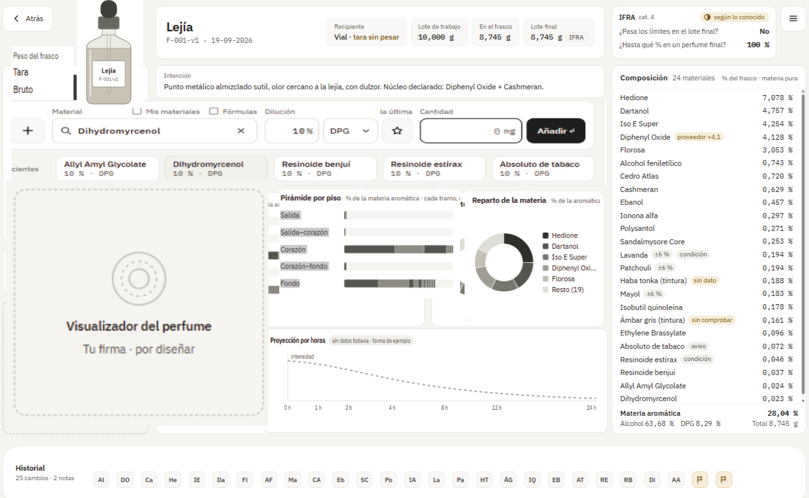
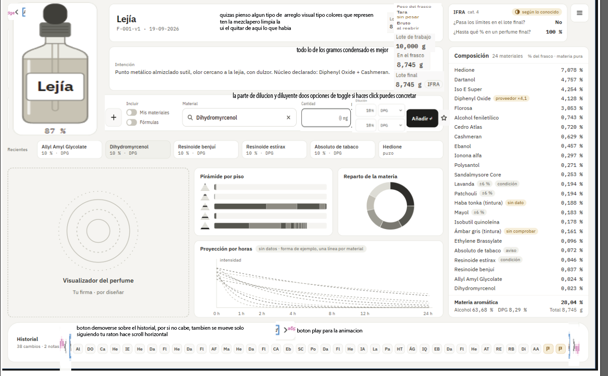

# Interrogatorio de diseño — la intención de la app

Registro de preguntas y respuestas para aclarar qué tiene que ser la app, empezando por
la **formulación**. **Se añade, no se reescribe**: si una respuesta cambia, se añade la
corrección con fecha debajo.

Método adaptado del [prompt de interrogatorio](antecedentes/formulacion/prompt-interrogatorio-diseno.md):
tandas de tres preguntas como máximo. El usuario puede responder **en prosa**. La
respuesta se interpreta, la lectura se escribe aquí y el usuario la confirma o la
corrige.

Cuando las rondas R1 a R4 estén cerradas, lo decidido pasa a [`decisiones.md`](decisiones.md)
como v3. Los [antecedentes](antecedentes/README.md) no obligan a nada.

Última sesión: 2026-09-26 (rondas 1 a 11 cerradas: la formulación, el diseño del banco, los
datos de los materiales y lo que vino al terminar el núcleo; la 12, las infografías, abierta)

---

## Ronda 1 — El núcleo

### P1 — ¿Qué es una fórmula?
- Bloque: 1 · el núcleo
- Abierta por: `antecedentes/formulacion/02-dominio-y-datos.md` §1 (composición cerrada con versiones) frente al Banco v2 (el historial de adiciones es la fórmula)
- Opciones presentadas: A) historial de adiciones · B) composición editable con versiones · C) las dos: se trabaja por adiciones y «cerrar versión» da una composición editable
- Recomendación: C
- Respuesta: **propia, más cercana a A**
- Razón del autor: *«lo ideal es que imiten la realidad, las formulas pueden ser editables pero aditivamente, pero con una sucesion de descendencia. por ejemplo si abro una formula que he creado y esta igual, añadirle productos la alterara pero esto no alterara las mezclas que se hayan creado a traves de la formula previa a la edicion. […] las formulas son una categoria de informacion en el proyecto que registrara una adicion de todos los componentes que la conforman. lo que hace falta es que luego puedan ser usadas para otros perfumes, por ejemplo, como acorde. creo que aqui el secreto seria seleccionar una opcion en opciones, importar formula como material. en cuanto la importas deja de ser una formula vinculada a otra formula, sino la formula importada se traduce en lo que la compone para la formula en la que se esta trabajando (se registra en el documento como el nombre de la formula ha sido agregada, pero internamente se desglosa en las materias primas que la componen)»*
- **Lectura:**
  1. Una fórmula es **un registro de adiciones**. Se edita **solo añadiendo**, como en el
     banco real, donde lo vertido no se desvierte.
  2. **Cada estado del registro queda fijo.** Lo que se haya hecho a partir de un estado
     anterior no cambia al añadir después: la versión de una fórmula es *hasta qué adición
     llega*.
  3. **Descendencia:** de cualquier estado puede nacer una fórmula hija que recuerda de qué
     madre y de qué estado sale.
  4. **Importar una fórmula como material.** Es una opción al añadir, y se hace **por
     copia desglosada, no por vínculo**:
     - el registro muestra una línea, «Fórmula X, 500 mg»;
     - por dentro se reparten esos 500 mg entre sus materias primas, en la proporción
       exacta de ese estado;
     - si la fórmula X cambia después, la que la importó no se entera.

     Es la «base inmutable» del Banco v2, generalizada a cualquier fórmula.
  5. **Lo que se descarta de los antecedentes:** acordes anidados con vínculo vivo, versión
     fijada, detección de ciclos y profundidad máxima (`02` §1, `03` §4). Al desglosar en
     el momento de importar, nada de eso hace falta.
- Fecha: 2026-09-25
- Estado: cerrada · lectura por confirmar
- Destino: decisiones.md

### P2 — ¿Dónde vive la verdad?
- Bloque: 1 · el núcleo
- Abierta por: la app lee los CSV del repositorio (`README.md` de la app, `exportar.py`) frente a un almacén propio
- Opciones presentadas: A) en el repositorio · B) en la app · C) repartida: referencia en el repositorio, fórmulas en la app
- Recomendación: C
- Respuesta: **propia: la app es autónoma, y el repositorio la alimenta mientras se construye**
- Razón del autor: *«la app aunque sea para empezar usandola yo tiene que ser autonoma, porque la infraestructura tiene que existir por si misma, yo diria que lo mejor seria que para la creacion de la app se importe informacion de la repo hasta que pueda existir por si misma, por ejemplo en cuanto la quiera hacer usable y que sea un ejecutable en mi movil si quiero que autocontenga regulacion ifra no que tenga que ir a un repositorio de mi ordenador»*
- **Lectura:**
  1. La app **funciona sola, también en el móvil y sin conexión**. Lleva dentro sus datos:
     IFRA, materiales, niveles de uso.
  2. El repositorio es **la fuente de la que se alimenta**. Los datos de referencia se
     importan del repositorio como un **paquete de datos versionado**. Es lo que ya hace
     [`exportar.py`](../scripts/importar_datos.py), convertido en paso de construcción.
  3. **Autonomía de ejecución no es un repositorio aparte.** El código puede seguir en
     `app/`: lo que no puede hacer la app es necesitar el repositorio para funcionar.
  4. **Queda abierto (P5):** una vez autónoma, dónde se dan de alta los frascos y
     materiales nuevos, y cómo vuelve al repositorio lo que se crea en la app.
- Fecha: 2026-09-25
- Estado: cerrada · lectura por confirmar
- Destino: decisiones.md

### P3 — ¿Hasta dónde llega IFRA desde el primer día?
- Bloque: 1 · el núcleo
- Abierta por: `decisiones.md` §2.1 (suma por sustancia «para una iteración futura») y `antecedentes/formulacion/entradas-para-decisiones-app.md` (IFRA aplazado, **superado**: la fuente primaria ya existe)
- Opciones presentadas: A) techo por material · B) A + suma por sustancia donde haya datos · C) B + alérgenos declarables
- Recomendación: A ya y B enseguida
- Respuesta: **B, con el diseño preparado para C**
- Razón del autor: *«teniendo la bas de datos de ifra ya lo mejor seria estar diseñando de manera que se ponderen ya los alergenos que convergen entre materiales, al menos por diseño, aunque haya materiales que tengan solapamiento de alergenos no registrados es mejor registrar los que si se sepan porque es el estado esperado del funcionamiento, y en caso que no se tenga la informacion de unos simplemente funcionara como si solo tuviera el techo por cada material. en cualquier caso es mejor la segunda creo yo. por ultimo siempre que haya elementos desconocidos se debe avisar en la formulacion»*
- **Lectura:**
  1. **El modelo lleva constituyentes desde el principio.** Cada material puede declarar
     las sustancias reguladas o alérgenas que contiene, con su porcentaje, su base y su
     fuente.
  2. **El cálculo suma por sustancia** sobre toda la fórmula, desglosada: cumarina del
     frasco más la de la tintura, HAP de cade más estoraque, linalol de todas partes.
  3. **Se carga lo que se sabe.** Si un material no tiene constituyentes declarados,
     cuenta solo su techo propio. Ese es el funcionamiento esperado, no un error.
  4. **Lo desconocido siempre se avisa en la formulación.** Un material sin datos, una
     carga `SIN DATO` o un constituyente sin cuantificar salen marcados; nunca en verde.
     Es la regla 1.2 de `decisiones.md`.
  5. **Los alérgenos van en el diseño; los umbrales, pendientes.** Los umbrales de
     declaración en etiqueta de la UE son el vacío 12 de `fuentes/vacios.md`. No se
     inventan.
- Fecha: 2026-09-25
- Estado: cerrada · lectura por confirmar
- Destino: decisiones.md

---

## Ronda 2 — Registro, materiales y frascos

*Preguntas presentadas: P4 (corregir errores en un registro que solo crece), P5 (dónde
nacen frascos y materiales con la app autónoma), P6 (inventario en la primera versión).
El usuario respondió en un solo texto que **corrige P1** y responde a las tres.*

Respuesta literal, completa:

> *«en cuanto a la app durante la formulacion pienso que es practico que se pueda editar, en mi caso con ctrl z iba bien pero aun asi creo que he virado de la idea de que las formulas sean cerradas e ineditables, vira de algunos conceptos que si me gustaban, por ejemplo importar una formula de un tercero y querer recrearla pero ajustandola, las formulas seran editables y estan compuestas de agregados de materiales, son los materials los que no cambian, yo puedo coger una formula de acorde de melocoton y editarla, quitando componentes dulces y añadiendo olores fuertes, hacer acorde de melocoton pasado. en este caso pierde capacidades de ser uno a uno de la realidad pero gana ventajas en lo que considero que es el campo necesario, documentar y adjuntar formulaciones. en linea de esto, la app no tiene que tener un stock real, añade muchas complicaciones, no es intuitivo, el proposito de la app es la informacion intangible que trae, mientras que en mi caso yo tenia y estaba valorando los stocks en la app se enturbia,*
> *en la app hay: materiales conocidos, todos en glosario, capacidad de dar de alta materiales con la misma rigurosidad y parametros que los materiales conocidos, o con agujeros (tinturas limite ifra desconocido) de manera que esten tagged, capacidad de dar de alta acordes o materiales a raiz de las formulas, por ejemplo usar un perfume creado para otro o reducirlo a un eau de perfum pero añadiendole fijadores como remedio al cambio de concentracion... La idea es que las opciones de materiales no dependan de dar de alta manualmente stock eso para mi fue tedioso para gente puede ser hasta mas, aporta valor solo en pequeños casos. Creo que los pesos reales tienen que mandar solo en la formulacion, por ejemplo si un acorde de higos que hiciste de 10g es usado como material y se debe reformular al volverlo a reformular es importante que la importacion tenga en cuenta cuanto queda, se usaron 2g por ejemplo y la formulacion no esta preparada puede dar lugar a problemas. hay que definir como navegar con las formulas y materiales, lo ideal es que los amteriales contengan la importacion de los acordes con codigos de lo que lo componen y concentrado, quizas usanndo cas como terminologia, no se por ejemplo "mat(dpgg%50 - 15932-80-6%10 - Angelica seed absolute20% - Anisyl alcohol20%)". de manera que toda la libreria de materiales que manda es en base a ifra y por lo tanto esta al dia de los limites de ifra.»*

### P1 — corrección del 2026-09-25: las fórmulas se editan; los materiales no cambian
- **Lectura, que sustituye a los puntos 1 a 3 de la lectura anterior de P1:**
  1. **Una fórmula se edita libremente**: añadir, quitar, cambiar cantidades, con deshacer
     (Ctrl+Z). Se abandona «solo añadiendo» y «cada estado queda fijo».
  2. **Se deriva copiando.** Cualquier fórmula, propia o de un tercero, se copia y se ajusta
     como fórmula nueva: del acorde de melocotón sale el de melocotón pasado.
  3. **Lo que no cambia son los materiales.** Una fórmula convertida en material queda
     **congelada** como composición. **Sigue en pie el punto 4 de la lectura anterior**:
     importar una fórmula como material es copia desglosada, no vínculo.
  4. **Se acepta perder el uno a uno con el banco** a cambio de lo que es el propósito:
     **documentar y adjuntar formulaciones**.
- Estado: cerrada · lectura por confirmar
- Destino: decisiones.md

### P4 — ¿Cómo se corrige un error?
- Opciones presentadas: A) nada se borra, se tacha · B) deshacer la última mientras nada dependa de ella · C) editar cualquier línea
- Recomendación: B
- Respuesta: **C, con deshacer**, que la corrección de P1 hace innecesaria como pregunta aparte
- Estado: cerrada
- Destino: decisiones.md

### P5 — ¿Dónde nacen los materiales? *(respondida en parte)*
- Opciones presentadas: A) en la app · B) en el repositorio · C) repartido: referencia en el repositorio, lo personal en la app
- Recomendación: C
- **Lectura:**
  1. **La biblioteca son todos los materiales conocidos**, el glosario, no lo que tengas en
     casa. Cada uno con su IFRA por CAS. Es lo que el usuario llama que la librería «manda
     en base a IFRA» y por eso está al día de los límites.
  2. **En la app se dan de alta materiales nuevos** con los mismos campos y el mismo rigor,
     **o con huecos marcados**: una tintura sin carga conocida o un IFRA desconocido llevan
     etiqueta, no un cero.
  3. **En la app se dan de alta materiales a partir de fórmulas**: un acorde, un perfume
     usado como ingrediente de otro, o una reformulación. Por ejemplo, pasar un perfume a
     eau de parfum añadiendo fijadores para compensar el cambio de concentración.
  4. **Un material compuesto lleva su composición como código**, en términos de CAS donde
     los haya. Por ejemplo: `mat(DPG 50 % · 15932-80-6 10 % · Angelica seed absolute 20 % ·
     Anisyl alcohol 20 %)`. Así IFRA se calcula siempre sobre lo que contiene. El formato
     queda abierto en P9; hay precedente en
     [`05-libreria-global-e-intercambio.md`](antecedentes/formulacion/05-libreria-global-e-intercambio.md) §2.
- ⚠️ **Consecuencia:** hoy IFRA está transcrito solo para los **54 materiales de la paleta**
  ([`ifra-cat4.csv`](https://github.com/smortenax/perfumeria-lab/blob/master/conocimiento/normativa/ifra-cat4.csv)). Para que la biblioteca sea el
  glosario entero (3119 ingredientes por CAS), hace falta **una tabla de los 216
  estándares por CAS**, en categoría 4. Es trabajo de datos, con el método ya escrito en
  [la investigación de los 216 estándares](https://github.com/smortenax/perfumeria-lab/blob/master/fuentes/investigaciones/2026-09-23-niveles-de-uso-y-los-216-estandares.md).
  Y para los naturales, los constituyentes siguen siendo el hueco de P3.
- Estado: abierta en parte. Queda qué se trae del repositorio y qué vuelve (ronda 4)
- Destino: decisiones.md

### P6 — Inventario
- Opciones presentadas: A) sin cantidades · B) cantidad por frasco que se descuenta · C) B + planificación
- Recomendación: B
- Respuesta: **ninguna de las tres: no hay inventario de materias primas**
- **Lectura:**
  1. **La app no lleva stock.** La biblioteca no depende de dar nada de alta: se formula
     con cualquier material conocido.
  2. **Los pesos reales mandan solo dentro de la formulación.**
  3. **Una excepción, y es de formulación, no de almacén: las mezclas hechas.** Si hiciste
     10 g de un acorde de higos y lo usas como material, la app sabe cuánto hiciste y cuánto
     has usado. Si una fórmula pide más de lo que queda, avisa.
- Consecuencia: la decisión de agosto de «alta y baja de existencias en un clic» queda
  **superada**, salvo para las mezclas hechas.
- Estado: cerrada · lectura por confirmar
- Destino: decisiones.md

---

## Ronda 3 — Dilución, historial y código de material

*Preguntas presentadas: P7 (dónde vive la dilución sin frascos), P8 (qué guarda una
fórmula de su historia), P9 (código de un material compuesto). El usuario respondió P7
y P8 con una captura anotada de la barra de añadir del Banco v2. **P9 queda sin
responder.***

*La captura: en **blanco**, un «+» sobre el inicio del buscador; en **lila**, el campo
«Buscar material o base»; en **naranja**, el campo «Seleccionado»; en **rojo**, el campo
«Cantidad» en mg.*

Respuesta literal, completa:

> *«p7 exacto, seleccionar un material en el buscador te deja lugar a determinar la disolucion a la derecha*
> *\* en blanco, dar de alta un material fuera del registro, o bien matarial nuevo o añadir formula como material o bien añadir de la lista de materiales del usuario, si el ha dado de alta materiales, como tinturas por ejemplo que puede incluso que haya hecho test de limites de uso y demas estos materiales pueden vivir en la formulacion del usuario pero es añaden a proposito, no forman parte de la paleta base*
> *\* la parte lila funciona parecido a antes en este caso una diferencia significativa es que el propio buscador deja seleccionado el material , no tiene sentido un apartado de seleccionado porque no es compatible buscar un material nuevos sin deselecionar otro*
> *bien matarial nuevo (es practicidad si es algo que no se va a definir duramente con poner un nombre basta y pasa a seleccionado )*
> *añadir formula como material (en este caso la formula se añade como seleccionado, te añadira los porcentajes ponderando los XXXmg en cada uno de los componentes y te lo registrara como nombre formulaXXXmg registrando elnumero en los valores que son de cada material )*
> *la parte naranja es el porcentaje, el porcentaje que determina la dilucion, en el caso normal sera al 100%, y puedes manualmente ajustarla, al lado te sale el diluyente, tambien seleccionable de entre los normales o añadir un placeholder de diluyente por si es uno no estandar, como con el material fuera de registro. ademas lo ideal seria pinnear una dilucion para materiales de manera que puedes tener materiales que tienen diferentes como "favoritas" donde se registra tanto el % como el diluyente, por ultimo como QOF feature el programa te pre selecciona la ultima manera en la que agregaste el material, aunque no este en favoritos.*
> *en la cantidad se queda igual numero en mg seria ideal que etnre todos estos pasos el cursor te pase al siguiente de manera que sea rapido pero esto tambien es qof, todo no tiene que ser en mg seria ideal poder escoger entre gramos para gente que haga big batches pero en mi caso mg es go to.*
> *p8*
> *me gusta que haya un historial y me gusta que se pueda añadir notas en el de manera opcional al hacer una mezcla por ejemplo evaluar, como un material ha cambiado la formula para tenerlo en cuenta en futuras mezclas, lo que el historial tampoco tiene que ser recuperable necesariamente tengo que evaluar mas sobre el historial tiene que parecer mas que una gimmic. ahora se me ha ocurrido para que se vea mas que una tabla de numeros las notas añaden un punto al historial pero tambien creo que se podria luego hacer, con un boton de play una visualizacion de la parte de formulacion uno a uno de como evoluciona la formula. creo que cuando tenga mis diagramas infograficos de descripcion de olores bien hechos podran quedar una evolucion chula de como cambia y ademas puede ser un ups a nivel visual y algo que simplemente note cariño y una intencion visual tras la app, no sera algo tan necesario pero lo hace memorable el poder ver la evolucion de las infografias durante tu dearrollo.»*

### P7 — La barra de añadir
- Opciones presentadas: A) dilución escrita en cada línea · B) A + memoria de las diluciones usadas · C) frascos como registro sin peso
- Recomendación: B
- Respuesta: **B, ampliada con el diseño de la barra**
- **Lectura:**
  1. **Cuatro zonas, de izquierda a derecha**, y el cursor salta de una a la siguiente:
     - **➕ Fuera de la paleta base**, tres vías:
       - *material nuevo rápido:* basta un nombre y queda seleccionado, marcado como sin
         definir;
       - *fórmula como material;*
       - *de «mis materiales»:* los que el usuario ha dado de alta, como una tintura propia
         con sus pruebas de límites. Se añaden a propósito y **no son paleta base**.
     - **Buscador.** Como antes, pero **el propio buscador se queda con el material
       elegido**. Desaparece el campo «Seleccionado»: no se puede buscar otro sin soltar
       el anterior.
     - **Dilución:** porcentaje, **100 % por defecto** y editable, y al lado el
       **diluyente**, de los habituales o uno provisional si no es estándar. Se pueden
       **fijar diluciones favoritas** por material (porcentaje y diluyente), y por defecto
       sale **la última con que se añadió ese material**, aunque no sea favorita.
     - **Cantidad:** **mg por defecto**, con la unidad elegible (g para lotes grandes).
       Enter añade.
  2. **Fórmula como material.** Al añadir X mg, se reparten entre sus componentes en su
     proporción. La línea se ve como «Nombre de la fórmula, X mg», y cada componente suma
     su parte. Es el desglose de P1.
  3. **Tres niveles de material:**
     - *base:* el glosario, con IFRA;
     - *mis materiales:* definidos por el usuario, con rigor o con huecos marcados;
     - *provisionales:* solo un nombre.
- Consecuencia: **un provisional, sea material o diluyente, es un desconocido.** Por P3,
  la fórmula que lo lleve avisa de que no puede comprobar IFRA en esa parte.
- Detalles de interfaz, sin decisión de fondo: salto de cursor entre campos, unidad
  elegible, favoritas y última dilución preseleccionada.
- Fecha: 2026-09-25
- Estado: cerrada · lectura por confirmar
- Destino: decisiones.md

### P8 — El historial
- Opciones presentadas: A) solo la composición actual · B) composición + historial con notas, recuperable · C) el historial es la fórmula
- Recomendación: B
- Respuesta: **B, sin exigir que sea recuperable**
- **Lectura:**
  1. **Cada fórmula tiene historial**, con **notas opcionales**. Sirven para evaluar al hacer
     una mezcla: cómo cambió la fórmula un material, para tenerlo en cuenta en las
     siguientes. **Una nota deja una marca en el historial.**
  2. **Recuperar un punto del historial no es requisito**; está por evaluar.
  3. **Tiene que ser más que una tabla de números.**
  4. **Para más adelante:** un botón de *play* que reproduce la formulación paso a paso. Con
     las infografías de descripción olfativa de la línea paralela, sería ver cómo evoluciona
     la fórmula. No es necesario, pero la hace memorable.
- ⚠️ **Consecuencia que conviene fijar ya:** para que el *play* sea posible algún día,
  **el historial tiene que guardar cada cambio como un evento** (qué, cuánto, cuándo), no
  solo las notas. Guardarlo cuesta poco hoy; reconstruirlo después es imposible.
- Aquí la línea paralela del lenguaje visual **toca** la app, y solo en este punto: la
  app guarda la historia y las infografías la dibujarán. Va a la ronda 5 (lo aplazado).
- Fecha: 2026-09-25
- Estado: cerrada · lectura por confirmar
- Destino: decisiones.md

---

## Ronda 4 — Código de material, receta frente a mezcla, buscador

*Preguntas presentadas: P9 (repetida), P10 (al añadir una fórmula como material: la receta
o la mezcla hecha), P11 (qué encuentra el buscador). El usuario también precisó P7 y P8.*

Respuesta literal, completa:

> *«p7 aunque no haya favorita sale la ultima que usaste, al selecionar el material (en un mismo desarrollo es probable que varias diluciones sean con las mismas caracteristicas) los favoritos siempre son una opcion aun asi*
> *p8*
> *como entiendo el historial yo es asi, el historial ya guarda uno a uno los cambios por gramos y producto, las infografias usan la cantidad en gramos y informaciion de los productos para verse por ejemplo si empiezas con los almizcles y fijadores cada mg añadido es guardado bottom note , solo visualizar el grafico agregando cada intake de material sobre las categorias pertintentes (aun por definir) te "hace una animacion", no va por tiempo cada cambio es un frame, ya se registran en orden por cantidad y por material,*
> *p9 en este caso c es la clara correcta*
> *p10*
> *la informacion de los gramos del producto solo tiene importancia en la formulacion, los materiales como todos son "vectoriales" no escalares, en terminos de que definen como se dividen los porcentages no la cantidad, la cantidad siempre es lo que pongas en el apartado de cantidad y se desglosa en los porcentajes de donde sale la formula. el momento donde importa los pesos de la formulas es en la opcion de reformulacion o editar formulas, ese proceso se hace abriendo una formula de nuevo y queriendo alterarla, lo importante es que cuando has usado una formula y editas la misma se tenga en cuenta que queda menos que cuando la hiciste inicialmente. si tu formula al principio tenia las concetraciones de todo en base a 10g y luego vas a reeditarla y esta en base a 8g ponerle 1g de producto hara parecer que esta al 10% a no ser que los gramos esten ajustados a la cantidad real*
> *p11*
> *un solo sitio donde buscar pero con una opcion de toggle donde se pueda seleccionar si se tienen en cuenta los materiales tuyos o no. la idea de separarlos era que tus materiales no creen confusiones por nombre y demas tienen que estar claramente diferenciados»*

### P7 — precisión
- **Al seleccionar un material sale la última dilución con que lo usaste**, haya favorita o
  no: en un mismo desarrollo se repiten las mismas diluciones. **Las favoritas siguen
  siempre a mano** como opción.
- Estado: cerrada

### P8 — precisión: el historial *es* la secuencia de cambios
- **Lectura:** el historial guarda **cada cambio, uno a uno, con su material y su
  cantidad**, en orden. **Cada cambio es un fotograma, no un instante de tiempo.** Las
  infografías futuras toman esa secuencia y el dato de cada material. Por ejemplo, cada mg
  de un almizcle o un fijador suma a «fondo», y al pasar los fotogramas el gráfico se
  anima. Las categorías sobre las que se acumula están por definir: son de la línea
  paralela.
- La consecuencia que escribí en P8 (guardar cada cambio como evento) **ya estaba en la
  idea del usuario**.
- Estado: cerrada

### P9 — El código de un material compuesto
- Opciones presentadas: A) plano · B) anidado · C) plano como verdad + procedencia aparte
- Recomendación: C
- Respuesta: **C**
- Razón del autor: *«en este caso c es la clara correcta»*
- **Lectura:** un material compuesto se guarda **desglosado hasta materias primas**, con
  CAS o nombre, en % de la mezcla, disolvente incluido. **IFRA se calcula siempre sobre
  eso.** De dónde salió («Acorde de higos, 25-09-2026») es un dato legible aparte, fuera
  del cálculo. Un producto que ya viene diluido de fábrica es un compuesto más, y eso
  resuelve las dos capas de dilución de `decisiones.md` §2.2 sin campos especiales.
- Fecha: 2026-09-25
- Estado: cerrada
- Destino: decisiones.md

### P10 — Receta o mezcla hecha
- Opciones presentadas: A) solo la receta · B) solo mezclas hechas · C) las dos, se elige al añadir
- Recomendación: C
- Respuesta: **A al añadir; las cantidades reales importan al reabrir una fórmula para editarla**
- **Lectura:**
  1. **Los materiales son vectores, no escalares.** Un material, también una fórmula usada
     como material, define **cómo se reparte**, no cuánto hay. La cantidad es siempre la
     que se escribe en «Cantidad», y se desglosa en sus proporciones. **Al añadir no hay
     límite ni aviso.**
  2. **Donde el peso real importa es al reabrir una fórmula para seguir trabajándola.** Si
     la hiciste de 10 g y usaste 2 g en otra, al reabrirla **la base tiene que ser la que
     queda, 8 g**, no la receta de 10 g.
  3. **Por qué:** añadir 1 g sobre la receta de 10 g da 1/11, un 9,1 %. Sobre los 8 g
     reales da 1/9, un 11,1 %. **Sin ajustar la base, la fórmula miente** sobre la
     concentración de lo que hay en el vial.
- Queda abierto **cómo sabe la app cuánto queda** y cuándo un uso descuenta: P12.
- Fecha: 2026-09-25
- Estado: cerrada en lo esencial · lectura por confirmar
- Destino: decisiones.md

### P11 — El buscador
- Opciones presentadas: A) solo paleta base · B) todo, con etiqueta de origen · C) paleta base y mis materiales
- Recomendación: B
- Respuesta: **B con un interruptor**
- **Lectura:** **un solo buscador**, con un **interruptor para incluir o excluir lo tuyo**.
  Lo tuyo tiene que estar **claramente diferenciado** para que un nombre propio no se
  confunda con uno de la paleta base. Entiendo que «lo tuyo» abarca tus materiales y tus
  fórmulas usadas como material; está por confirmar.
- Fecha: 2026-09-25
- Estado: cerrada · lectura por confirmar
- Destino: decisiones.md

---

## Ronda 5 — Reabrir, IFRA sobre el producto final, dónde se usa

*Preguntas presentadas: P12 (cómo sabe la app cuánto queda de una fórmula), P13 (qué es
una fórmula respecto al perfume final), P14 (dónde se formula primero). El usuario
precisó también P11.*

Respuesta literal, completa:

> *«p11 las formulas como material en otro toggle diferente quiero que haya la opcion siempre de no tener exceso de referencias ya que ifra sola ya es extremadamente grande, se definira un queue visual asignado a cada uno quizas un icono aun por definir pero queue visual diferenciador entre, formula, material ifra, material dado de alta propio y material sin definir o placeholder*
> *p12*
> *las formulas se deciden al reabrir pero aun asi seria un reto, ya habia contado con esta idea y es que dentro de la formula se declare el peso del recipiente tambien con la precision del trabajo, es la unica manera de poder recuperar la informacion tras usos. es decir el peso del recipiente va guardado a la vez con el tamaño, el nombre de la disolucion el tamaño de formulacion y el tamaño final que ya estaban definidos.*
> *p13*
> *la app tenia ya en su primera instancia las disoluciones separadas en categorias lote actual o lote de trabajo que es en el que se esta formulando y lote final o lote esperado que aparecia translucido. aqui cabe valorar si establecer reglas especiales. como "tratar como acorde", los acordes no tienen por que obrar bajo estandares ifra, aqui se invertiria la carga de la limitacion si trabajas como acorde, en vez de avisarte que te estas pasando el limite tiene que avisarte de que decirte el porcentaje en el que podrias usar el acorde en una solucion final, a esto no le he dado muchas vueltas hay que iterar*
> *p14*
> *por ahora cuesta de definir en cualqioer caso aunque me guste producto final como app el uso y funcionalidad que le quiero dar yo es desde ordenador entonces creo que hay que partir de ahi hasta que no este acabada a nivel funcional no sse adapta a movil, eso si se tiene siempre en cuenta el port»*

### P11 — precisión: dos interruptores y una señal visual por tipo
- **Lectura:** un solo buscador, con **dos interruptores independientes**, uno para **mis
  materiales** y otro para **fórmulas como material**. Así se puede reducir siempre el
  número de resultados: la base IFRA ya es enorme por sí sola. **Cada tipo lleva una señal
  visual propia**, quizá un icono, por definir:
  - fórmula;
  - material de la base IFRA;
  - material propio dado de alta;
  - material sin definir o provisional.
- Estado: cerrada

### P12 — Cuánto queda de una fórmula: se pesa
- Opciones presentadas: A) todo uso descuenta · B) se pregunta al añadir · C) se decide al reabrir, con los usos anotados
- Recomendación: C
- Respuesta: **C, pero resuelto pesando, no contando usos**
- **Lectura:**
  1. **La fórmula guarda el recipiente**: su **tara**, pesada con la precisión del trabajo,
     y su capacidad. Va junto a lo que ya tenía el Banco: nombre, **lote de trabajo** y
     **lote final**.
  2. **Al reabrir se pesa el vial.** Peso bruto menos tara es **lo que queda de verdad**.
     La app escala todos los componentes a esa masa y lo apunta en el historial como un
     fotograma más.
  3. **No hace falta contar usos.** La báscula ya incluye los usos en otras fórmulas, las
     muestras, lo derramado y lo que se evaporó. Es más fiel a la realidad que cualquier
     registro.
- ⚠️ **Consecuencia:** escalar en proporción da por hecho que **todo se va por igual**.
  Es cierto para lo que sale del vial por uso. **No lo es para lo que se evapora**, que se
  lleva primero el alcohol y las salidas. En un concentrado cerrado y reciente el error es
  pequeño; en un lote final con alcohol, abierto a menudo, puede no serlo. Basta con que
  la app lo diga cuando la pérdida sea grande o haya pasado tiempo. No hace falta
  resolverlo.
- Fecha: 2026-09-25
- Estado: cerrada · lectura por confirmar
- Destino: decisiones.md

### P13 — IFRA sobre el producto final
- Opciones presentadas: A) la fórmula es el concentrado, con concentración final prevista · B) la fórmula incluye el alcohol · C) las dos, y sin dato, «cumple hasta un X %»
- Recomendación: C
- Respuesta: **los campos del Banco ya lo resuelven; y un modo «tratar como acorde» por iterar**
- **Lectura:**
  1. **La concentración final ya está en la fórmula.** El Banco tenía **lote de trabajo**,
     en el que se formula, y **lote final**, el esperado, que se veía translúcido. Lote de
     trabajo entre lote final da la concentración del concentrado en el producto, e **IFRA
     se mide sobre el lote final**.
  2. **«Tratar como acorde» invierte el aviso.** Un acorde no es un producto: no tiene que
     cumplir IFRA él mismo. En vez de «te pasas del límite», dice **«este acorde se puede
     usar hasta un X % en un producto final»**.
  3. **Por iterar.** El usuario no le ha dado todavía muchas vueltas.
- Fecha: 2026-09-25
- Estado: abierta en parte (el modo acorde, en P17)
- Destino: decisiones.md

### P14 — Dónde se formula
- Opciones presentadas: A) ordenador en el banco · B) móvil primero · C) las dos por igual
- Recomendación: A, con reservas (dependía de dónde está el móvil al pesar)
- Respuesta: **A**
- **Lectura:** **se diseña para el ordenador** hasta que la app funcione entera. **El móvil
  viene después**, pero cada decisión se toma **pensando en poder llevarla** a pantalla
  estrecha.
- Fecha: 2026-09-25
- Estado: cerrada
- Destino: decisiones.md

---

## Ronda 6 — Organización, guardado y lecturas de IFRA

*Preguntas presentadas: P15 (cómo se organiza el trabajo con varias fórmulas), P16 (qué
vuelve al repositorio y dónde se guardan los datos), P17 (si hace falta un modo acorde).*

Respuesta literal, completa:

> *«p15, tengo sentimientos encontrados con conservar relaciones de dependencia entre formulas creo que aun cuando hagas una formula a base de la otra no tienen por que conserver dependencias, lo que las diferencia son nombres si editas una formula que pretende ser una variacion se guarda y entiende con el matiz, si pretendes que la sustituya se sustituye. en cuanto a lo que es previo a la fase de formulacion no esta diseñado aun pero la app no es directamente el banco de formulacion, tiene una biblioteca de formulas habilidad de dar de alta materiales de manera compleja y glosario de visualizacion para materiales ifra y formulas*
> *p16 hay que diseñar la app  con posibiliadad de autonomia, incluso sin internet, en realidad se basa en datos, para los guardados cuando guardas la forumula se tienen que guardar todos los datos preferiblemente de manera condensada e incluyendo el historial cache interno de la app aunque no exportes y simplemente la guardes como formula, hay que valorar formatos para guardarlo quizas csv  o quizas hay mejores*
> *p17 la b es la mejor, doble insight sobre ifra si  por si solo podria usarse en tamaño esperado (en acordes lo mas seguro es que esto salga que no) y lo maximo que se podria usar en un perfume en porcentaje(informacion que vale para cualquier perfume independientemente de su tamaño)»*

### P15 — Sin dependencias entre fórmulas; la app es más que el banco
- Opciones presentadas: A) una pantalla de trabajo, como el Banco · B) archivo de fórmulas y mesa de trabajo en pantallas separadas · C) mesa de trabajo con un panel de archivo en árbol, madre → hijas
- Recomendación: C
- Respuesta: **ni el árbol ni ningún vínculo; y la app tiene más partes que el banco**
- **Lectura:**
  1. **Las fórmulas no guardan relación de dependencia entre sí**, aunque una salga de otra.
     Lo que las distingue es **el nombre**.
  2. Al editar una fórmula hay dos salidas:
     - **Guardar**: la edición **sustituye** a la fórmula, que sigue siendo la misma.
     - **Guardar como**: la edición es **una variación** y se guarda como fórmula nueva,
       con un nombre que lleve el matiz.
  3. **La app no es solo el banco de formulación.** Tiene, al menos:
     - una **biblioteca de fórmulas**;
     - el **alta de materiales**, completa (P5);
     - un **glosario de visualización** de los materiales IFRA y de las fórmulas, que es la
       línea paralela, para más adelante;
     - y el **banco**, donde se formula, que es el foco actual.
  4. **Lo que va antes de formular** (cómo se llega al banco) **no está diseñado** todavía.
- Se retira de P1 lo que quedaba de «descendencia». Los materiales hechos a partir de una
  fórmula conservan su procedencia como dato legible (P9); las fórmulas entre sí, no.
- Queda por ver qué pasa con el recipiente y el historial al «guardar como»: P19 y P20.
- Fecha: 2026-09-25
- Estado: cerrada · lectura por confirmar
- Destino: decisiones.md

### P16 — Autonomía, y guardar lo guarda todo
- Opciones presentadas: A) archivo propio, nada al repositorio · B) A + «exportar al cuaderno» · C) sincronización automática
- Recomendación: B
- Respuesta: **B implícita; el formato, por valorar**
- **Lectura:**
  1. **La app se diseña para poder funcionar sola, sin internet.** Es una app de datos.
  2. **Guardar una fórmula escribe todos sus datos**, historial incluido, de forma
     condensada. Guardar no es exportar: lo guardado queda completo en la app aunque nunca
     se exporte.
  3. **Exportar al cuaderno es otra acción, aparte.** La deduzco de «aunque no exportes»;
     está por confirmar.
  4. **El formato de guardado está por decidir.** El usuario pide valorar si CSV u otro:
     P18.
- Con esto se cierra lo que quedaba de P5. Lo de referencia llega a la app desde el
  repositorio en un paquete de datos; lo que se crea en la app vive en ella, y al cuaderno
  llega por exportación.
- Fecha: 2026-09-25
- Estado: cerrada · lectura por confirmar
- Destino: decisiones.md

### P17 — Dos lecturas de IFRA, siempre
- Opciones presentadas: A) dos modos por fórmula · B) sin modos, dos lecturas siempre · C) el modo se deduce del lote final
- Recomendación: B
- Respuesta: **B**
- Razón del autor: *«doble insight sobre ifra si por si solo podria usarse en tamaño esperado (en acordes lo mas seguro es que esto salga que no) y lo maximo que se podria usar en un perfume en porcentaje (informacion que vale para cualquier perfume independientemente de su tamaño)»*
- **Lectura:** el panel de IFRA da **siempre dos lecturas**, salidas del mismo cálculo por
  sustancia:
  1. **¿Se puede usar tal cual, a su lote final?** En un acorde, lo normal es que no.
  2. **¿Hasta qué % se puede usar en un perfume?** Vale para cualquier perfume, sea cual
     sea su tamaño.

  «Tratar como acorde» ya no es un modo. Como mucho, cambia cuál de las dos se destaca.
- ⚠️ **Consecuencias:**
  - la segunda lectura, **con desconocidos en la fórmula**, se da como «hasta X %, según lo
    conocido», y dice qué no se ha podido contar (P3);
  - lo que se rige por **certificado** y no por porcentaje, como el cade o el estoraque,
    aparece como **condición**, no como cifra.
- Con esto se cierra P13.
- Fecha: 2026-09-25
- Estado: cerrada
- Destino: decisiones.md

---

## Ronda 7 — Formato de guardado, «guardar como», y un ejecutable propio

*Preguntas presentadas: P18 (formato de guardado), P19 (el recipiente al «guardar como»),
P20 (el historial al «guardar como»). El usuario abrió además la pregunta de hacer la app
como ejecutable propio: P21.*

Respuesta literal, completa:

> *«p18*
> *propongo ya que se mire la creacion de app rpopiamente no quiero que se abra con chrome de momento sino que lo que se diseñe sea ejecutable independiente, esto vale la pena y es factible hacerlo? creo que empeora las cosas de exportacion a movil o de uso como app en general. que funcione como formulair para cuandoe ste en el movil*
> *en cuanto a lo que se almacena, hay que recordar que la formula tiene que contener los valores como cambio hitstorial y todas esas variables cuando se abre como formula, cuando se importa desde el buscador a otra formula para usarse como material (conjunto de materiales) tiene que resolverse toda esa informacion es importante que no de problemas por ejemplo si intento juntar un acorde como formula en otro proyecto, y sobretodo es muy importante que al añadir la formula como material lo unico que se conserva son la vectorizacion de la formula, es decir la concentracion de todos los materiales (diluyentes incluidos) en la formula que se esta importando. de ahi propongo una material ID para todas las formulas que sean lo que manda en la importacion parecido al codigo que hacia antes de los materiales que la componenen y sus porcentajes*
> *p19 b*
> *p20 b»*

### P18 — Qué se guarda y qué viaja
- Opciones presentadas: A) CSV · B) JSON, un archivo por fórmula · C) SQLite
- Recomendación: B
- Respuesta: **B, no discutida; y la distinción entre lo que se guarda y lo que viaja**
- **Lectura:**
  1. **Abierta como fórmula, lo guarda todo**: historial de cambios y todas sus variables
     (nombre, recipiente y tara, lotes, notas).
  2. **Importada como material, solo viaja su vector**: la concentración de cada material,
     **diluyentes incluidos**. Nada de historial, tara, lotes ni notas.
  3. **Cada fórmula tiene un ID de material**, y **ese ID es lo que manda al importar**: el
     vector, con el formato de código de P9.
  4. **La importación no puede fallar.** Un acorde traído a otro proyecto se resuelve
     entero.
- ⚠️ **Consecuencias:**
  - **Si el ID se calcula a partir del vector**, dos composiciones idénticas dan el mismo ID,
    y cualquier edición da un ID nuevo. **«Los materiales no cambian» (P1) sale por
    construcción**: lo que importaste ayer sigue siendo ese vector aunque la fórmula cambie
    hoy. Hay precedente en [`05-libreria-global-e-intercambio.md`](antecedentes/formulacion/05-libreria-global-e-intercambio.md) §2.
  - **El vector guarda proporciones exactas, no porcentajes redondeados.** El % es solo cómo
    se muestra. Es la regla del Banco v2, «las bases no pierden decimales»: un componente
    de 1,2 µg tiene que seguir siéndolo.
  - **Para viajar completo, cada componente tiene que poder resolverse en destino.** Los de
    la base, por CAS. Los propios (una tintura) y los provisionales **llevan dentro su
    definición**; si no, al llegar serían desconocidos.
- Fecha: 2026-09-25
- Estado: cerrada · lectura por confirmar
- Destino: decisiones.md

### P19 — El recipiente al «guardar como»
- Opciones presentadas: A) la variación nunca hereda el recipiente · B) pregunta «¿mismo recipiente?» · C) las dos conservan el recipiente
- Recomendación: B
- Respuesta: **B**
- **Lectura:** al «guardar como», la app pregunta si la variación **sigue en el mismo vial**.
  Si sigue, el recipiente pasa a la variación y la original queda como **receta sin vial**,
  que ya no se reabre pesando. Si no, pide la tara nueva.
- Fecha: 2026-09-25
- Estado: cerrada
- Destino: decisiones.md

### P20 — El historial al «guardar como»
- Opciones presentadas: A) empieza vacía · B) se lleva una copia del historial · C) vacía con nota «partió de X»
- Recomendación: B
- Respuesta: **B**
- **Lectura:** la variación **se lleva una copia del historial** hasta ese momento y desde ahí
  sigue sola. Es una copia, no un vínculo, así que respeta P15.
- Fecha: 2026-09-25
- Estado: cerrada
- Destino: decisiones.md

### P21 — Un ejecutable propio *(pregunta del usuario)*
- Abierta por: el usuario, en su respuesta a P18
- **Lo que pide:** que la app **no se abra con el navegador**, sino que sea **un ejecutable
  independiente**. Y, en el móvil, que funcione **como Formulair**. Pregunta si vale la pena,
  si es factible, y si complica el paso al móvil.
- **Evaluación:** sí es factible y vale la pena, **con Tauri 2**:
  - es un instalador `.exe` propio, de unos 5-10 MB, con ventana e icono propios, sin
    navegador a la vista;
  - la interfaz se escribe con tecnología web, así que **se aprovecha el Banco**, y el SVG de
    las infografías futuras encaja sin esfuerzo;
  - lee y escribe archivos del disco sin permisos del navegador;
  - **la misma base de código compila para Android e iOS**. No empeora el paso al móvil: lo
    prepara.
- **Límites, dichos claramente:**
  - en Windows, Tauri dibuja con WebView2, **el mismo motor que Edge**, pero integrado: no
    se abre ningún navegador;
  - en el móvil, la interfaz vive dentro de un contenedor nativo. Se acerca mucho a una app
    nativa, pero no es SwiftUI, que es con lo que está hecho Formulair;
  - **iOS solo se compila en un Mac con Xcode**. Android se compila desde Windows.
- **Alternativas descartadas:**
  - una app web instalable (PWA): por debajo sigue siendo el navegador, y en iPhone guarda
    peor;
  - Electron: ocupa unos 120 MB y no llega al móvil;
  - nativo por plataforma: Swift perdería Windows, y Flutter obliga a rehacer todo en otro
    lenguaje y es peor para las infografías SVG.
- Fuentes: [requisitos de Tauri 2](https://v2.tauri.app/start/prerequisites/),
  [Tauri 2.0 estable](https://v2.tauri.app/blog/tauri-20/),
  [instalador de Windows](https://v2.tauri.app/distribute/windows-installer/).
- Estado: abierta · esperando confirmación y el sistema del móvil (P22)
- Destino: decisiones.md

---

## Ronda 8 — Confirmación del ejecutable, y el móvil

Respuesta literal, completa:

> *«p21 si es un desarrollador de apps que luego dara lugar a un producto independiente perfecto,*
> *para apple android si es compatible desarrollo a la vez y la unica implicacion es el final al publicar yo tengo apple pero puedo usar bluestack o algo parecido para probar la app de diseño como si fuese en movil, sino ya mirare otras maneras*
> *aun si no es posible la direccion principal ahora es un ejecutable descargable funcional en windows*
> *como procedemos»*

### P21 — Tauri 2
- Respuesta: **sí**, también pensando en que llegue a ser un producto independiente
- Estado: cerrada
- Destino: decisiones.md

### P22 — El móvil
- Respuesta: **iPhone.** Android e iOS se desarrollan a la vez; la diferencia aparece al
  publicar. Para probar la interfaz en formato móvil, un emulador en Windows.
- **Lectura:** la dirección de ahora es **un ejecutable de Windows descargable y que
  funcione**. Para probar en formato móvil desde Windows sirve el **emulador de Android
  Studio**, más fiable que BlueStacks para desarrollar. **Probar en el iPhone y publicar en
  iOS exigen un Mac**, en ese momento, no antes.
- Estado: cerrada
- Destino: decisiones.md

**El interrogatorio para la formulación queda cerrado.** Todo pasa a [`decisiones.md`](decisiones.md)
v3, un borrador que el usuario revisa de una vez, y el orden de trabajo a
[`plan-desarrollo.md`](plan-desarrollo.md).

---

## Revisión de la v3 — §2.5

> *«sobre los materiales solo hay pureza y porcentaje, si compras una dilucion y la diluyes pones el porcentaje final diluido no el de la dilucion»*

- **Lectura:** un material tiene **pureza** (100 % si es puro; castoreum, 20 %). En la línea
  se escribe **el porcentaje final de materia pura**, no el de la dilución comprada. Se
  mantiene la regla de la v2; la propuesta de la v3 queda descartada. Un producto diluido de
  fábrica tiene pureza; no es un material compuesto.
- Fecha: 2026-09-25
- Estado: cerrada
- Destino: decisiones.md §2.3 y §2.5

---

## Ronda 9 — Diseño: qué manda en el banco

*Empieza el diseño de la interfaz. Mismo método, **una decisión cada vez y con bocetos**.
Lo que las decisiones ya fijan no se vuelve a preguntar: la barra de cuatro zonas (§4), cada
número con su base (§1.1), lo desconocido nunca en verde y el rango del proveedor distinto de
IFRA (§1.2, §1.3, §5.5), una señal por tipo de material (§2.1), las dos lecturas de IFRA
(§5.4), los lotes a la vista (§3.3), un historial que sea más que una tabla (§3.4) y el
ordenador primero, pensando en la pantalla estrecha (§0).*

*Orden propuesto, en seis bloques: (1) qué manda en el banco; (2) dónde va cada pieza y cómo
se pliega; (3) las piezas con más carga: tabla, IFRA, historial; (4) el lenguaje visual, con
las referencias del usuario; (5) los flujos: reabrir pesando, guardar como, material nuevo
rápido; (6) biblioteca y alta de materiales.*

### P23 — ¿Qué manda en la pantalla del banco?
- Bloque: diseño 1 · el banco
- Abierta por: el Banco v2 guardaba el historial en un cajón, y P8 pide que sea más que una tabla
- Opciones presentadas, en bocetos grises: A) la composición al centro y el historial en un cajón, como el Banco v2 · B) el historial al centro, como un cuaderno, y la composición resumida al lado · C) la composición al centro y el historial en una cinta de fotogramas, siempre visible
- Recomendación: C
- Respuesta: **un boceto propio**, cercano a C
- Respuesta literal: *«algo asi habia pensado en nivel general de idea»*, con este boceto:

*Lo que dice el boceto, anotación por anotación:*

| Dónde | Anotación literal |
|---|---|
| Arriba a la izquierda | *«boton atras»* |
| Arriba | *«nombre composicion recipiente y lotes»* |
| Arriba a la derecha | *«ifra»* · *«opciones burger desplegable»* |
| Izquierda: un frasco cuentagotas ámbar | *«icono flasco se rellena conforme lo haces tendra el nombre de la mezcla encima como si fuese una etiqueta»* · debajo, *«peso flasco»* |
| Izquierda, abajo | *«Visualizador que creare complejo de l perfume (iconografia a diseñar de multiples variables unica y s firma de la app )»* |
| Centro, de arriba abajo | *«informacion general lugar para poner descripcion de formulacion intencion etc etc»* · *«BArra añadir»* · una fila de casillas, *«añadir rapido, usados reciente»* · *«grafico barras top middle base por ingredientess»* · *«grafico pie ingredientes»* · *«grafico proyeccion fragancia por horas»* |
| Derecha, una columna alta | *«composicion ( productos%)»* |
| Abajo, de lado a lado, curvado como un dock | *«historial como barra de tareas me gustariai que losnombres t cantidades salgan conforme se hace hover, parecido a barra de tareas de apple»* |

- **Lectura:**
  1. **Tres columnas y un dock.** A la izquierda, la mezcla como objeto: el frasco y el
     visualizador. En el centro, el trabajo: la descripción, la barra, los recientes y los
     gráficos. A la derecha, **la composición entera, siempre a la vista**, con IFRA encima.
     Abajo, el historial.
  2. **El historial es un dock**, como el de macOS: una pieza por cambio, siempre visible;
     al pasar el ratón se amplía y dice el material y la cantidad. Es la cinta de C.
  3. **El frasco se llena conforme se formula** y lleva el nombre de la mezcla como
     etiqueta. Debajo, su peso: la tara y, al reabrir, el peso bruto (§3.3, §3.5).
  4. **«Añadir rápido», con los usados recientes, sustituye a la biblioteca lateral** del
     Banco v2. Sin inventario (P6), lo que está a mano es lo que acabas de usar, con su
     última dilución (P7).
  5. **Cada fórmula lleva una descripción**: la intención, para qué es. **Es un campo nuevo**
     de la cabecera (§3.3), y entra en el modelo y en el JSON.
  6. **Tres gráficos:** barras por piso para cada ingrediente, que es la pirámide del
     Banco v2; tarta de ingredientes, que es su reparto de la materia; y **proyección de la
     fragancia por horas, que es nuevo**.
  7. **El visualizador es la firma de la app**: una iconografía de muchas variables que
     diseñará el usuario, la línea paralela (§8). **El banco le guarda sitio desde ya.**
  8. **Botón atrás y menú de opciones.** Al banco se llega desde otro sitio, sin diseñar
     todavía (§8). Guardar, guardar como y exportar van en el menú.
- **Añadido en la lectura, por confirmar:**
  - **las notas son marcas en el dock** (§3.4), como las banderas de C;
  - **mientras no exista el visualizador**, su hueco lo ocupan los gráficos.
- ⚠️ **Consecuencias:**
  - **La composición no cabe entera en una columna.** Es la pega que tenía B. Cada línea
    lleva señal de tipo, nombre, cantidad, % con su base, dilución y diluyente, avisos de
    pesada y trazas en ppm, y una fórmula usada como material se despliega. En una columna,
    cada línea enseña lo esencial y el resto se abre: es la primera pregunta del bloque 3.
  - **IFRA, en una caja pequeña, sigue dando las dos lecturas** (§5.4) y no puede salir en
    verde si hay desconocidos (§5.5). Cabe como resumen que se abre en el panel entero.
  - **En el móvil no hay hover.** El equivalente es deslizar el dedo por el dock, que es
    también el gesto del *play*.
  - **El frasco se llena con masa, pero un vial se mide en mL.** Para dibujar el nivel
    hace falta la capacidad en gramos o una densidad, y una densidad supuesta sería un
    número sin fuente.
  - **Datos de los gráficos.** El piso está para **los 54 materiales del laboratorio**
    (`inventario.csv`, `niveles-de-uso.csv`), con pisos intermedios (salida-corazón,
    corazón-fondo); los **3119 del glosario FIG no tienen piso**, y salen como «sin piso»,
    como en el Banco v2. **Para la proyección por horas no hay ninguna cifra**: en el
    laboratorio solo hay tenacidad cualitativa en algunas monografías («excepcional»,
    «nula», «sin dato»). Hay que investigarla, con fuente y confianza, antes de dibujarla,
    y un material sin dato no puede desaparecer de la curva (§1.2).
- Fecha: 2026-09-25
- Estado: cerrada · lectura por confirmar
- Destino: decisiones.md, en una sección nueva de interfaz; el campo de descripción, en §3.3

### P23 — confirmación y precisiones del 2026-09-25

Respuesta literal, completa:

> *«si, pasalo a limpio con F-001*
> *matizo la composicinon en la columna es un listado ordenado por % de lo que hay dentro, producto+%*
> *la caja ifra es pequeña ya que en mi idea lo que creo que podrian ser dos lineas (*
> *-pasa los limites ifra para el final esperado?*
> *\* hasta que porcentaje se puede usar en un perfume final?)*
> *el frasco en realidad se llena tambien en masa, es la solucion en la que se trabaja aunque no seaaccurate es solo un visualizador y realmente cuando el flasco tiene 10g de 10g de trabajo esta lleno y cuando hay 5g y se trabaja con 10g esta a la mitad, viene definido por eso el flasco*
> *la falta de datos si es importante pero no es algo de ahora, es buscar datos, habra que ver que materiales se usan para eso pero todo lo que es visualizacion de graficos queda por resolver en lo que respecta a ingenieria de datos, ahora estamos evaluando sobretodo lo que es ui user experience y features de la app»*

- **Lectura:**
  1. **La lectura de P23 queda confirmada**, con lo añadido: notas como marcas en el dock y
     el hueco del visualizador.
  2. **La columna de composición es un listado ordenado por %: producto y %.** No es la
     tabla entera; eso resuelve la pega de que no cabía.
  3. **La caja de IFRA son dos líneas**, las dos lecturas de §5.4: *¿pasa los límites en el
     lote final?* y *¿hasta qué % se puede usar en un perfume final?*
  4. **El frasco se llena en masa, sobre el lote de trabajo**: 10 g de 10 g es lleno; 5 g de
     10 g, la mitad. **Es un visualizador, no una medida**: no hace falta densidad.
  5. **Los datos de los gráficos no son de ahora.** Son ingeniería de datos, para después.
     Ahora se evalúan la interfaz, la experiencia de uso y las funciones.
- **El boceto a limpio**, con F-001-v1 dentro, está en el
  [lienzo de bocetos](https://claude.ai/artifact/RXLX4e5WKR6xFNApMeyphj). Lo que tuvo que
  decidirse al pasarlo a limpio, **por confirmar**:
  - **los disolventes van aparte**, al pie de la columna: en F-001 el alcohol es el 63,68 % y
    encabezaría la lista;
  - **el % de la columna es de materia pura sobre el frasco**, la columna que manda en el
    cuaderno; el vertido, la dilución, el piso e IFRA se abren al pulsar la línea;
  - **en la lista solo se marca lo que no se puede callar**: sin dato, sin comprobar, avisos
    de pesada, rango del proveedor y condiciones;
  - **el detalle de IFRA se abre sobre la columna** al pulsar la caja.
- Fecha: 2026-09-25
- Estado: cerrada
- Destino: decisiones.md §10.1 y §3.3

### P24 — Revisión del boceto 1: dónde va cada pieza
- Bloque: diseño 2 · el banco a tamaño real
- Abierta por: el boceto 1, a 1440 × 900 con F-001-v1 dentro, en el lienzo de bocetos
- Presentado: el boceto, con cuatro decisiones del paso a limpio por confirmar (disolventes al
  pie, % de materia pura, solo las marcas imprescindibles, detalle de IFRA encima de la
  composición) y una pregunta: en qué pantalla se formula
- Respuesta: **una revisión dictada, y una reordenación del boceto**:

Respuesta literal, completa. *El dictado repetía el primer bloque; va una sola vez:*

> *«Eh, voy a hacer una evaluación eh, en general de cómo es el estado y de las cosas que creo que están bien para que quede mi opinión mejor plasmada lo haré en un eh, texto chat la parte de arriba está bastante bien al menos de momento eh, la parte de elegía cuando se ha creado eh, todo esto y la intención también me parece que está bien la parte del buscador en general la noto bastante apretada y habrá que ver cómo resolverlo también en la parte del buscador el dihidromircenol y toda esta parte lo que habría que que poner en cuanto a los que guardas en favoritos es eh, alguna manera de aparte de la estrellita para guardarlo alguna manera de seleccionar los favoritos porque si no no ganarías tanto Entonces, eh, aparte de utilizar la estrella para guardarlo, a lo mejor en la estrella tendrías que tener un desplegable, o sea, al lado de la estrella tendrías que tener un desplegable que fueran los que tienes guardados como favorito y el botón propio que sería la estrella para guardarlo como favorito. Eh, lo de cantidad está bien, añadir está bien, eh, lo de recientes me parece bien, o sea, era justo... Lo que yo pensaba que te ahorraría un poco de tiempo si quieres reusarlos. En cuanto a la pirámide de eh, por piso, mi idea en realidad era eh, ahora faltan los datos, pero eh, no que se acumulen eh, digamos eh, de manera puramente por adición eh, sino como un poco compuesta La idea sería que todos los componentes eh, tengan su ratio preciso entre salida y fondo con precisión eh, no in, no íntegra, digamos. O sea, uno puede ser entre salida y salida a fondo, por ejemplo, o sea... Puede ser que eh, el mm, ver, la bergamota sea mucho más salida que eh, una nota de corazón eh, pongamos por ejemplo no sé eh, Edione o la que sea eh, pero a la vez el aliol maltol o alguno de estos sea más salida y menos corazón. O sea, la idea es que se eh, se componga este eh, este gráfico por cada una de las eh, de las notas. Entonces te quedaría como mucho más granulado. Eh, esto tengo que ver si es posible en cuanto a información. Ahora Lo vamos a dejar así, pero para que quede clara la intención y en cuanto a es una tontería, pero para ahorrar palabras la salida, salida corazón, corazón corazón fondo y fondo en icono quedarían mejor son muy entendibles, simplemente hacer como una pirámide repartida como en eh, cinco slices verticales y bueno, de hecho Formulate lo tiene así también y esos cinco slices verticales son los que los que hacen entender a la persona ya eso eh, al ser tan, o sea, al ser iconográfico a lo mejor el porcentaje y los miligramos y todo esto puede excluirse o al menos a lo mejor conservar solo los miligramos no, conservarlo en hover, creo que sería a lo mejor Si pones el dedo, por, o sea, si pones el ratón o el cursor o el dedo en el móvil por encima de del cada uno de los gráficos que te lo ponga, los gramos que hay en cada uno, en salida, corazón, salida, corazón, corazón, fondo y fondo, pero que esto sea puramente iconográfico creo que lo, lo mejora porque te ahorras un, mira, la mitad de la parte digamos pirámide por piso eh, está ocupada por salida, salida, corazón, corazón, corazón, fondo, que es lo que queremos cambiar por iconos, y por números que a lo mejor hacen un poco más de ruido. ¿no? Y ya está. Y haría lo mismo con reparto de la materia. Porque el problema que tenemos cuando hay tantos iconos eh, es que si además de iconos dentro de los iconos hay números y letras, eh, tienes como esta sensación de cluttering porque hay demasiadas cosas.»*
>
> *«dejo de momento este feedbakc aqui luego sigo*
> *la proyeccion por horas tambien queria que fuese ajustada a cada uno de los materiales, en este caso los materiales tambien tendrian que tener calificacion por longevidad que es otra tarea en si misma.*
> *la parte del historial es la que mas me gusta a nivel de resultado y lo unico que hay que corregir, no se si es por diseño o por lo que habia de informacion en el documento de formula es que los materiales aqui estan agrupados por gramos totales, en vez de por orden de aplicacion, habria muchos duplicados de materiales pero parte de la gracia es que veas exactamente que has estado aplicando y en que orden incluso aunque haya repetidos, de aqui surgen mas retos para tratar todos los materiales base ifra (cada material tiene que tener una referencia, seria imposible basarse solo en dos letras hay que añadir tambien otras variables pero aun asi el resultado final lo valdra)  muchas cosas de visualizacion forman parte de afrontar una categorizacion exaustiva de cada uno de los componentes pero eso forma parte del reto. lo abordaremos al acabar de definir la ui.*
> *la parte que menos me gusta es que visualizador del perfume es pequeño y quiero hacer una infografia compleja, por lo tanto no se entendera y pierde protagonismo, despues de hacer mas pequeña la parte de piramide por piso y reparto de materia mas pequeña se puede ganar espacio)*
> *aun asi hago propuesta de como reordenar cosas para abordar los cambios que veo propios*
> *importante las cosas que he resizeado sobretodo la parte del buscador en medio no es con la intencion de que sea lo mismo mas grande sino que estoy repartiendo por espacio reservado para cada categoria, la idea es resolver la impracticidad de ahora para poener las cosas, por ejemplo lo de mis materias y formulas como toggle no me cuadra que este arriba quizas tiene que estar a la izquierda con un deslizador de on and off siguiendo la linea de diseño elegante la parte de reparto de materia aun valoro que quizas hasta sin nos nombres listados es mejor y que aparezcan solo con color, planteo la posibilidad de que los materiales tambien esten linkeados de manera general a sus graficos desde el historial,(no necesariamente ahora evalua) el hover de abajo hace que resalten todos los diagramas en los que el material esta, hover en hedione donde el hostorial oscurece un poco la pantalla y te lo resalta visualmente en la dilucion del flasco a la izquierda en lalinea que representa del grafico de proyeccion por horas en su lugar en reparto de materia en (si es pequeño sale en otros), en la parte de piramide por piso  y en la parte de composicion, esto pensandolo bien no forma parte de las ocmpetencias de ahora pero hace saber que la programacion de los graficos siempre tiene que tener un representatne en real en las materias, de manera que sea todo linkeable»*

- **Lectura:**
  1. **Se quedan como están** la cabecera, la intención, la caja de IFRA, la cantidad, el
     botón de añadir y los recientes.
  2. **La reordenación** reparte el espacio por categoría; no es lo mismo más grande:
     - el frasco y su peso suben arriba a la izquierda, junto a «Atrás»;
     - la barra y los recientes ocupan todo el ancho de la izquierda;
     - **el visualizador crece** y se queda con la parte baja de la izquierda;
     - la pirámide y el reparto encogen, con la proyección debajo;
     - la composición sigue a la derecha, y el dock abajo.
  3. **La barra está apretada.** Los interruptores de «mis materiales» y «fórmulas» pasan a
     la izquierda del buscador, como interruptores de encendido y apagado.
  4. **Favoritas: la estrella guarda la dilución puesta, y al lado hay un desplegable** con
     las guardadas, para elegir una. Sin lo segundo, guardar no sirve de mucho.
  5. **Los gráficos, iconográficos y sin números a la vista.** Los cinco pisos pasan a ser
     iconos: una pirámide partida en cinco franjas, como en Formulair. Los mg salen al pasar
     el ratón o el dedo. **El reparto, sin leyenda**, solo con color, y el nombre al pasar.
     La razón: iconos con números y letras dentro saturan.
  6. **La pirámide, compuesta.** Cada material tendrá su reparto preciso entre salida y
     fondo, no un piso entero: la bergamota, casi toda salida; otro material, más salida que
     corazón. El gráfico suma esos repartos y sale más granulado. **Es intención; depende de
     que haya datos.**
  7. **La proyección por horas, una línea por material**, con una calificación de
     longevidad por material. **Datos, para después.**
  8. **El historial es lo que más gusta.** Hay que ver **cada aplicación, en su orden, con
     los repetidos**. Que el boceto 1 agrupara por material venía de F-001, que no guardó su
     historial; el diseño ya era un fotograma por cambio (§3.4). **Dos letras no bastan para
     identificar un material**: hace falta una referencia visual con más variables, que es
     parte de la categorización exhaustiva de los materiales. Se aborda al acabar la
     interfaz.
  9. **El visualizador tiene que ser grande**: será una infografía compleja, y pequeño no se
     entiende y pierde protagonismo.
  10. **Todo gráfico, enlazado a sus materiales.** Al pasar por un material del historial,
      la pantalla se oscurece y ese material se resalta en el frasco, en su línea de la
      proyección, en el reparto (dentro de «otros» si es pequeño), en la pirámide y en la
      composición. **No es para ahora, pero fija una regla**: cada marca de un gráfico sabe de
      qué materiales sale.
- **Sin respuesta:** la pantalla en que se formula. Las cuatro decisiones del paso a limpio
  no reciben comentario: **se mantienen mientras no se diga otra cosa**.
- ⚠️ **Consecuencia:** la regla del punto 10 **cuesta poco si se fija ahora**, antes del
  núcleo y de los gráficos: basta con que cada gráfico se calcule por material y guarde de
  qué material sale cada parte. **Meterla después obliga a rehacer los gráficos.**
- **Boceto 2**, con la reordenación y los puntos 3, 4, 5 y 8, en el lienzo de bocetos.
- Fecha: 2026-09-25
- Estado: cerrada · lectura por confirmar sobre el boceto 2
- Destino: decisiones.md §4, §8, §10.1, §10.2 y §10.3; plan, fase 3 (D4)

### P25 — Revisión del boceto 2
- Bloque: diseño 2 · el banco a tamaño real
- Abierta por: el boceto 2, con la reordenación de P24
- Respuesta: **una nueva reordenación, anotada, y una barra pensada para el teclado**:

*Las anotaciones de la imagen, literales:* sobre la cabecera, *«quizas pienso algun tipo de
arreglo visual tipo colores que represen ten la mezclapero limpia la ui el quitar de aqui lo
que habia»*; junto a los gramos, *«todo lo de los gramos condensado es mejor»*; sobre la
dilución, *«la parte de dilucion y diluyente doos opciones de toggle si haces click puedes
concretar»*; en el historial, *«boton demoverse sobre el historial, por si no cabe, tambien se
mueve solo siguiendo tu raton hace scroll horizontal»* y *«boton play para la animacion»*.

Respuesta literal, completa:

> *«paso nuevos cambios, en general.*
> *la parte inicial de la imagen de lejia resultaba ser mejor inicio de lectura mas limpia, en general la izquierda de la ui limpia de imagenes, la derecha de datos, siguiendo esta misma regla todo lo de gramos es una cosa para el inicio lo dejas en la derecha y lo ignoras el resto del rato, intencion sigue igual, la barra se ha movido acorde*
> *la idea de la barra es que ahora la cantidad viene antes, seleccionas producto, al darle enter te pasa a los gramos. nueva adicion, los porcentages de dilucion y los diluyentes hay dos opciones de base, con esta categoria. jamas se uso el material la base es 100% y 10%, diluyente es alcohol y dpg, si se guarda con el asterisco (ahora a la derecha de añadir) el asterisco siempre se prioriza para salir, se pueden guardar dos asteriscos por material y son los que saldran a partir considero que es mas practico hacerlo escribiendo, doble click sobre el % te permite escribir el numero, no hace falta un desplegable para cada opcion de diluyente, te sale uno a la derecha de los dos por si las opciones no son alcoho o dpg. intencion de todo esto, si vas a usar el material siempre con la misma dilucion o diluyente, hacer ctrl intro al poner los gramos te lo añade directamente, los "toggle son para poder navegar sin raton" ejemplo:*
> *cursor en buscador*
> *-usuario escribe, usa enter*
> *cursor salta a cantidad*
> *-usuaario escribe y usa enter*
> *highlight del toggle de dpg*
> *-usuario usa flecha hacia abajo y enter*
> *highligth alcohol*
> *-usuario usa enter*
> *highlicht de añadir.*
> *el raton solo es necesario si el usuario añade a favoritos*
> *aparte de esto el boton de play para la animacion que pondria todos los graficos a 0 y iria numero a numero reproduciendolos, es un efecto como el de procreate, por trazos, pero en este caso por trazas y es solo animar los graficos adicion por adicion (lo que pasa al ponerlos uno a uno pero de manera intencional)*
> *por ultimo las no necesarias pero adecuadas barras a la derecha del historial que si le haces click te mandan al final o el principio, acercarte a las barras desde la barra de historial haria que el historial se desplace poco a poco a modo de scroll horizontal»*

- **Lectura:**
  1. **Izquierda, imágenes; derecha, datos.** El frasco vuelve grande, arriba a la izquierda:
     era un comienzo de lectura mejor y más limpio.
  2. **Los gramos, condensados a la derecha.** El peso del frasco y los lotes sirven al
     empezar y el resto del rato se ignoran. La cabecera se queda con el nombre y la fecha.
     **Idea, sin decidir:** quizá, más adelante, un arreglo de colores que represente la
     mezcla.
  3. **La intención, igual.**
  4. **La barra, en otro orden: material, cantidad, dilución, añadir y estrella.** Eliges el
     producto, Intro, y pasas a los gramos.
  5. **La dilución: dos opciones de porcentaje y dos de diluyente.** Para un material que no
     se ha usado nunca, **100 % y 10 %; DPG y alcohol.** Otro porcentaje se escribe: **doble
     clic sobre el %**. Para otro diluyente, **un solo desplegable**, a la derecha de los dos.
  6. **Favoritas: la estrella pasa a la derecha de Añadir.** Hay **dos por material** y, si
     existen, **son las opciones que salen**, por delante de las de base.
  7. **Todo se hace con el teclado.** El ratón solo hace falta para la estrella:
     buscador e Intro, cantidad e Intro, dilución con las flechas e Intro, y Añadir con
     Intro. **Ctrl+Intro en la cantidad añade directamente**, con la dilución que ya está
     puesta, para el material que se usa siempre igual.
  8. **Play en el historial**: pone todos los gráficos a cero y los reproduce adición a
     adición, como la repetición de Procreate trazo a trazo; aquí, traza a traza. **Solo
     anima los gráficos.**
  9. **Barras a los lados del historial**, para cuando no cabe: con un clic se va al principio
     o al final, y al acercar el ratón el historial se desplaza poco a poco.
- **Añadido en la lectura, por confirmar:**
  - **Si el producto viene diluido, el 100 % se convierte en su pureza**, porque §2.5 no deja
    pasar de ella; si la pureza es del 10 % o menos, la segunda opción es el 1 %;
  - **con el % igual a la pureza no hay diluyente que elegir**: se usa el del producto, y la
    columna de diluyentes se apaga;
  - **con dos favoritas, salen esas dos**; la última usada (P7) queda preseleccionada si es
    una de ellas, y si no, la primera favorita;
  - **en el teclado, primero el % y después el diluyente**: flechas arriba y abajo para
    cambiar, derecha o Intro para pasar al diluyente. En el ejemplo del usuario el foco
    empieza en el diluyente;
  - **F2 hace lo mismo que el doble clic**, para no soltar el teclado.
- ⚠️ **Consecuencia:** **las favoritas son un dato del usuario por material**, no de una
  fórmula. Se guardan en disco como lo demás (§6).
- **Boceto 3**, con todo esto: la barra se puede probar con el teclado.
- Fecha: 2026-09-26
- Estado: cerrada · lectura por confirmar sobre el boceto 3
- Destino: decisiones.md §3.4, §4, §8 y §10.1; plan, fase 4

### P26 — Revisión del boceto 3
- Bloque: diseño 2 · el banco a tamaño real
- Abierta por: el boceto 3, con la barra que se usa con el teclado
- Respuesta: **una revisión dictada**

Respuesta literal, completa:

> *«Esta parte tiene menos cambios. Eh, por una parte, el botón de atrás yo te diría que el botón de atrás de arriba a la izquierda yo te diría que tiene que estar eh, a lo mejor en, el marco de lejía donde está encima del producto debería haber un negativo como un bocado para que no esté solapado el botón de atrás sobre el sobre el propio marco de lejía es una pequeña tontería pero bueno eh, sobre el marco del bote me refiero entonces luego lo que sí que no quiero eh, es ahora mismo los materiales están de alguna manera vinculados a mi estado o a cómo yo los tengo y en realidad para estandarizarlo creo que esto complicará las cosas entonces yo creo que eh, estoy de acuerdo que la opción del 100% no es buena porque la mayoría de gente no, ten, no tendrá los eh, ni aplicará ninguno de los componentes al 100% pero Eh, la dilución debería ser entre diez, eh, y, y uno por ciento, por ejemplo, en, en opciones estándar, y lo que sí que no me gusta es que están como vinculados, supongo que haciendo referencia como yo las tengo hechas o a mi stock o alguna cosa así, y como la parte esta del stock y todo esto lo vamos a, o sea, lo queremos retirar, o sea, por algún motivo, y creo que es por un motivo de este de esta relación, o sea, de cómo yo tengo a los materiales diluidos, eh, por algún motivo eh, cuando yo selecciono una dilución en porcentaje eh, uno se me, se, se me selecciona automáticamente DPG o no sé, hay algo que está mal entre los selectores, entonces hay dos selectores mutuamente excluyentes eh, en cada uno de, de las cosas, entonces está el de dilución que puede ser eh, un, uno de los dos porcentajes o entonces haces clic y lo escribes eh, o eh, el diluyente que es TPG o alcohol eh, pero por algún motivo ah, cuando selecciono la, la, la, el botón de abajo a veces se me cambia automáticamente a DPG eh, o a veces tengo el DPG y el alcohol en, en, en grisáceo como si no los pudiera seleccionar y eso en realidad eh, no, no quiero que sea así ¿vale? Eh, y luego sí que hay algunos que se ponen puros como el Edione que lo he puesto alguna vez puro entonces a lo mejor por por convenio eh, pueden estar yo te diría eh, 10% y eh, 1% por ejemplo total eso solo pasaría la primera vez Y luego ya se guardarían los favoritos de la de la manera en la que los sueles usar tú. Que esa es como en cierta manera la única el único registro entre comillas de stock o de estado de los materiales que tendrá eh, la aplicación en, en sí mismo. O sea, lo que, lo que piensa, lo que pienso yo que debería ser. Entonces, lo que sí que no me gusta es que tengas eh, como. la opción como como excluyente y tal y eh, una cosa que sí que añadiría es que eh, cuando estás escribiendo a veces yo también tiendo a darle al ta, al, al tap al de la dere, al de la derecha porque muchas veces se autocompletan así las frases en programación y en cosas así entonces te diría que esta parte también o sea quiero que el, el tap eh, también te lo te lo agregue porque me ha pasado un par de veces que lo he quitado sin querer aunque sea contraintuitivo a veces, en algunos casos, porque a veces el tab es para mover, pero bueno, es igual, yo quiero que sea así, prefiero que sea así. Entonces, el tab te selecciona el, el, el ingrediente también, te lo autocompleta, pienso yo. Eh, que es lo correcto. Esto es como plenamente ya es, ya ni siquiera es eh, la UI en general, es como más bien user experience y demás. Ya estamos en parte bastante ya final de cómo pienso yo que debería funcionar eh, y cómo creo que sería cómodo. Y luego ya. A ver, por último, unas cosillas, pero la parte de abajo está muy bien y funciona bien, pero sí que es verdad que los botones de la izquierda y de la derecha estarían medio descentrados eh, eh, con respecto al, al, al, de, digamos, al historial, al deslizador horizontal, a la barra de materias, no sé cómo llamarlo, pero eh, no están centrados eh, en tanto y en cuanto eh, está, se ve como raro, entonces deberían estar... Eh, o los botones más hacia abajo, con los materiales, yo creo que en este caso deberían estar los materiales más hacia arriba, y creo que el botón de, de play eh, también debería estar un poquito más hacia abajo, no, no me gusta que salga como así, ah no, mira, no creo que lo que quedaría bien aquí sería hacer un negativo de el play, como, como un bocado de otra vez, como en la parte del, del, del hacia atrás, hacer como una especie de bocado, como una redonda, encima de esta especie de barra de abajo del historial y, y esa parte es cuando le das al play ¿vale? luego cuando le das al play lo que creo que no hace falta es que salgan los botones o sea los la descripción de los ingredientes eh, porque creo que te fastidia un poco la experiencia porque debería ser un poco más visual esto no lo tengo 100% claro pero bueno eh, de momento vamos a hacerlo así a ver qué tal queda Eh, o que sea con menos opacidad también sería una opción que cuando le das al play el, la parte de que salga el ingrediente sea con menos opacidad y luego por último no sé si sería capaz de probarse en esta, en esta parte pero ya que sí que funciona el play y que ya, ya que sí que pasa todo esto de, de ir yendo parte por parte como cambia el, eh, o sea cómo evoluciona el historial la pregunta es ¿podrías hacer como la simulación de cómo se iría evol evolucionando las partes como de el gráfico, o sea, los gráficos, la parte gráfica, eh, conforme avanza para ver cómo queda el, el efecto para ver si más o menos convence o no. Entonces, lo que tendría que pasar es que el reparto de la materia se vaya ajustando a, a cuando aplicas en teoría los ingredientes eh, y también en cuanto le das al play, que eso es la, eso creo que es lo que falta. Cuando le das al play, que desde cero te vaya como poniendo cada uno en el gráfico, porque ahora creo que los gráficos están sellados y aunque yo me vaya al principio del historial, eh, no cambia eh, el cómo estaba el estado del, del, del, de la de la fórmula. Eh, y entonces tendría que cambiar reparto de la materia, pirámide por piso, proyección por horas, y el bote de arriba a la izquierda. Eh, vamos a probar con esto a ver qué tal.»*

- **Lectura:**
  1. **El botón de atrás, en un bocado.** El marco del frasco lleva un negativo redondo donde
     va el botón, para que no se monte encima.
  2. **La dilución no sale del stock del usuario.** Las opciones de base son estándar: **10 %
     y 1 %; DPG y alcohol**, y solo valen la primera vez. Después mandan la última usada y
     **las favoritas, que son lo único que la app guarda sobre el estado de cada material**.
     El 100 % no es opción de base, porque casi nadie usa los materiales puros. Quien usa
     uno puro, como la Hedione, lo escribe y lo guarda como favorita.
  3. **Dos selectores independientes, excluyentes cada uno por dentro**: el % (uno de los
     dos, o escrito) y el diluyente (DPG o alcohol, u otro del desplegable). **Ninguno cambia
     al otro, y ninguno se apaga.** Corrige el boceto 3, donde la regla de la pureza los
     ataba.
  4. **El tabulador también elige el material** en el buscador, como Intro, aunque en
     otros sitios el tabulador mueva el foco.
  5. **Historial:**
     - las barras de los lados y las piezas, centradas a la misma altura;
     - el play, en un bocado redondo en el borde de arriba, como el de atrás;
     - durante el play, **sin rótulos de las piezas**, o más tenues: está por probar.
  6. **Simulación**: el frasco, el reparto, la pirámide y la proyección siguen al historial.
     Con el play empiezan desde cero, y al añadir un material se actualizan al momento.
- **Sin respuesta:** la pantalla. El orden del teclado (primero el %, después el diluyente)
  no recibe comentario: se mantiene.
- ⚠️ **Consecuencia: choca con §2.5.** «La app no deja escribir un porcentaje mayor que la
  pureza» necesita saber la pureza del producto que tiene el usuario, y eso es estado de su
  stock. Se lleva a P27; hasta entonces, la barra no usa la pureza.
- **Boceto 4**, con todo lo anterior. Supuesto de la simulación: cada pasada repetida lleva la
  misma parte del total de su material.
- Fecha: 2026-09-26
- Estado: cerrada · lectura por confirmar sobre el boceto 4
- Destino: decisiones.md §3.4, §4, §9 y §10.1; P27

### P27 — ¿Dónde vive la pureza?
- Bloque: diseño 2, con efecto en el modelo (§2.5)
- Abierta por: P26, que saca de la barra todo lo que dependa del stock del usuario, frente a
  §2.5, que da pureza a cada material y no deja escribir un porcentaje mayor
- Opciones presentadas: A) **solo en los productos que el usuario da de alta como suyos**
  (un castoreum al 20 %, un IBQ al 40 %): la base no tiene pureza, y la barra solo impide
  pasar de ella en esos · B) en cada material de la base, con un valor estándar · C) en
  ningún sitio: se escribe el porcentaje final y nada lo comprueba
- Recomendación: A
- Respuesta: **C: nada limita el porcentaje**
- Respuesta literal: *«priemero explico mi planteamiento, es una base de diseño general, que aplique en todo aunque estemos ahora evaluando con el contexto de mis materiales cabe la posibilidad de que alguien añada cashmeran 100%, si lo tiene, limitar eso es contraproducente en el largo plazo, yo se lo que tengo por ejemplo y una vez ya lo ponga y este en favoritos ya no hay lugar para preocuparse de eso mas alla»*
- **Lectura:**
  1. **El diseño es general**: sirve para cualquier usuario, aunque ahora se evalúe con los
     materiales del laboratorio.
  2. **Nada limita el porcentaje que se escribe.** Otro usuario puede tener Cashmeran puro, y
     limitarlo a lo que vende un proveedor es contraproducente a la larga.
  3. **Lo que tiene cada uno lo sabe él.** Lo escribe una vez y queda en sus favoritas; la app
     no tiene por qué vigilarlo.
  4. **Sigue en pie lo esencial de §2.5**: en la línea se escribe el porcentaje final de
     materia pura. Lo que cae es la pureza como dato del material y como límite.
- ⚠️ **Consecuencia:** sin pureza, la app no sabe con qué disolvente viene de fábrica un
  producto diluido. **Todo lo que no es materia pura se cuenta como el diluyente de la
  línea.** Si el castoreum viene en alcohol y se diluye en DPG, el alcohol de fábrica se
  cuenta como DPG. No afecta a IFRA, que va sobre la materia pura; solo al reparto de
  disolventes.
- **Se concede:** mi recomendación era A; la razón del usuario es mejor para un producto
  general.
- Fecha: 2026-09-26
- Estado: cerrada
- Destino: decisiones.md §2.3, §2.5 y §9; §10, como principio

### P28 — Revisión del boceto 4
- Bloque: diseño 2 · el banco a tamaño real
- Abierta por: el boceto 4
- Respuesta literal, a continuación de la de P27: *«un ultimo detalle los dos botones los prefiero cuadrados y con bordes redondeados como el resto del diseño que redondos, por lo tanto puedes rehacer esa parte y ajustar el negativo, en este caso creo que el cuadrado gana, para los deslizadores a los lados del historial la barra vertical me sobra un poco creo que confunde visualmente en todo caso haria un sutil sobreado a los extremos de la barra que se desliza»*
- **Lectura:**
  1. **Atrás y play, cuadrados con esquinas redondeadas**, como el resto del diseño, y sus
     bocados también cuadrados.
  2. **Fuera las barras verticales de los lados del historial**, que confunden. En su lugar,
     **un sombreado sutil en los extremos de la tira**, que solo sale si hay más historial
     por ese lado. Pulsarlo sigue llevando al principio o al final, y acercar el ratón sigue
     desplazando.
- Aplicado en el boceto 4, en su sitio: son retoques.
- Fecha: 2026-09-26
- Estado: cerrada · lectura por confirmar sobre el boceto 4
- Destino: decisiones.md §10.1

---

## Ronda 10 — Datos de los materiales

*Abierta por el usuario al dar paso a la fase 1: el esqueleto tiene que prever dónde vive
cada información.*

### P29 — La referencia IFRA, intocable, y una capa propia por material
- Bloque: datos (fase 3), con efecto en los gráficos (§10.2), el historial (§10.1) y el mapa
  de olores
- Abierta por: el usuario
- Respuesta literal, completa:

> *«si, empieza con la fase 1 yo el unico inconveniente que le veo a todo es que se planea que esto sea una parte dentro de la app, la de formulacion pero seguro que se puede ir montando el esqueleto ya ir estableciendo donde estara la informacion etc etc, en este caso la app funciona con el glosario entero de ifra, esto podria llegar a ser un lugar a dudas o errores si no se gestiona, mi idea seria de los materiales usar el glosario ifra raw para lo que es limitaciones y no tocar el archivo que dictamina esas limitaciones, y paralelamente tener yo un archivo con cada material de ifra donde yo empezare a dictaminar cada uno en sus categorias pertinentes (hay variables que seguro que usare otras tengo aun que ver ) pero los materiales deberian tener*
> *\* seguro: duracion en horas, color code asignado(queda por definir en base a que, probablemente categorias de olores generales, quizas aqui podria tirar de algun estandar tipo fragrantica o de industria, ya que sera lo mas low level comercial y lo mas universal en esta categoria), sigla o abreviatura para icono (el que se presenta en el historial), una ponderacion de categoria que los ponga entre 0 y 1 para tipo de notas (top notes top middle middle middle base base)*
> *\* casi seguro: las 3 categorias que asigna fig a cada uno, se usara para AOM o agregeted odor map que quiero crear y ademas es gratis, es lo que ya tengo, datos de POM(si tienen suficiente glosario usar principal odor map me pareceria super bueno para mi propio mapa de olores), elpeso  del olor ahora no recuerdo el termino el volumen de particulas  odorificas  o lo que suele decirse "intensidad" tambien lo habia pensado añadir a las variables del AOM que es el nombre que creo que le dare al mapa de olores propio»*

- **Lectura:**
  1. **La formulación es una parte de la app**, y el esqueleto tiene que prever desde ya dónde
     vive cada información.
  2. **Cada material tiene dos capas de datos:**
     - **la referencia IFRA, en bruto y sin tocar.** De ahí salen las limitaciones, y el
       archivo que las dicta no se edita nunca;
     - **una capa propia, en un archivo aparte**, con una fila por material de la base, donde
       el usuario va asignando sus categorías. Crece poco a poco, y lo que falte es un hueco,
       nunca un cero (§1.2).
  3. **Lo que llevará cada material en la capa propia:**
     - **seguro:** la duración en horas; un color asignado, con la base por decidir (familias
       olfativas generales, quizá de un estándar comercial o de la industria); la sigla de su
       pieza en el historial; y su posición entre salida y fondo, de 0 a 1;
     - **casi seguro:** los tres descriptores del FIG, que ya están en `glosario-fig.csv`; los
       datos del POM, si cubren bastantes materiales; y la intensidad del olor. Los tres
       alimentan el **AOM, el mapa agregado de olores** propio del usuario.
- **Añadido en la lectura, por confirmar:**
  - **la posición entre salida y fondo es un solo número de 0 a 1**: 0 es salida pura y 1,
    fondo puro, y los cinco pisos son tramos de esa escala. Es la «pirámide compuesta» de
    P24. La alternativa serían cinco pesos que suman 1;
  - **la clave de la capa propia es el CAS**, como en el FIG; los materiales sin CAS, por su
    identificador;
  - **la intensidad que buscabas se llama poder olfativo** (*odor strength*). Ya está, en
    palabras (medio, alto…), en `niveles-de-uso.csv` para los 54 del laboratorio. La medida
    física que la explica es el valor de olor: la concentración en el aire dividida por el
    umbral, como en la adenda de F-001.
- ⚠️ **Consecuencias:**
  - **El POM no cubre los naturales.** Según la comparativa del laboratorio
    ([2026-09-24](antecedentes/lenguaje-visual/2026-09-24-comparativa-ifra-fig-vs-pom.md), sobre Lee et al., 2023),
    solo modela moléculas sueltas, no absolutos, resinoides, tinturas ni mezclas, y no predice
    la intensidad por encima del umbral. Para esos, el AOM tendrá que tirar del FIG o de
    otra fuente;
  - **un color sacado de Fragrantica es de un tercero.** Si la app llega a producto, hay que
    mirar su licencia antes (§8). El FIG ya se tiene, con la cita obligatoria de IFRA;
  - esta capa es **la D4 del plan**, y lo que alimenta los gráficos por material (§10.3).
- **Pregunta abierta, P30:** dónde vive el archivo de la capa propia.
- Fecha: 2026-09-26
- Estado: cerrada · lectura por confirmar
- Destino: decisiones.md §6; plan, fase 3 (D4)

### P30 — ¿Dónde vive la capa propia de los materiales?
- Bloque: datos (fase 3)
- Abierta por: P29
- Opciones presentadas: A) **en el laboratorio**, junto a sus fuentes, y la app la importa
  como el resto, sin editarla · B) en este repositorio, en una carpeta propia que sí se
  edita a mano · C) dentro de la app, editable desde su interfaz
- Recomendación: A
- Respuesta: **A, con una precisión: el archivo también vive en la app**
- Respuesta literal: *«estoy de acuerdo que cada dato de la capa debe vivir en el laboratorio en otro chat, en cuanto a lo que respecta la investigacion pero indudablemente tiene que tener la app ese archivo el archivo con toda esa informacion se usara para los graficos de dentro de la app, teniendo eso en cuenta hay que evaluar solo si la recopilacion de datos es en remoto o no, la capa tendra que estar aqui por definicion puedes proseguir con la siguiente fase»*
- **Lectura:**
  1. **La investigación, en el laboratorio**, en sus propias sesiones: cada dato con su
     fuente y su confianza.
  2. **El archivo, siempre también en la app**, que lo usa para sus gráficos. Entra como los
     demás datos: importado a `datos/fuente/` y metido en el paquete de datos de la app.
  3. **¿En remoto o no?** Al usarse, nunca: la app funciona sin internet (§0). Al
     importarse, en local, como hoy: `importar_datos.py` lee `../Perfumery` y apunta de qué
     commit sale. Traerlo de GitHub solo tendría sentido si algún día se compila la app sin
     el laboratorio al lado.
- Fecha: 2026-09-26
- Estado: cerrada
- Destino: decisiones.md §6; plan, fase 3 (D4)

## Ronda 11 — Al terminar el núcleo

*Abierta al terminar la fase 2: lo que salió al hacer el cálculo, y el arranque de la
investigación de los datos.*

### P31 — IFRA: un cuarto estado, «acotada»
- Bloque: IFRA (fase 2), con efecto en el panel de IFRA (fase 4)
- Abierta por: el núcleo, al pasar la cumarina de F-001
- Opciones presentadas: A) **mantener «acotada» como estado propio**, que nunca se pinta como
  «dentro» · B) tratarla siempre como «sin comprobar»: más estricto, y más avisos
- Recomendación: A
- Respuesta: **A**
- Respuesta literal: *«mantener acotada»*
- **Lectura:**
  1. **Cada sustancia regulada sale en uno de cuatro estados:** dentro, acotada, sin comprobar
     o se pasa.
  2. **«Acotada» es una carga sin dato que ni en el peor caso llega al techo.** El peor caso
     cuenta toda la materia del material como si fuese esa sustancia. En F-001, aunque todo lo
     que aporta la tintura de haba tonka fuese cumarina, se quedaría en 0,188 %, lejos del
     1,5 %: es el razonamiento del propio cuaderno.
  3. **No es un verde falso:** la cuenta vale sea cual sea la carga real. Lo desconocido no vale
     cero; vale lo máximo que podría valer (§1.2). Aun así, **nunca se pinta como «dentro»**:
     tiene su propia señal y dice de qué material sale la carga sin dato.
- **Añadido en la lectura, por confirmar:** en las dos lecturas de IFRA, **la primera puede
  decir «sí»**, porque está demostrado, y avisa de la carga acotada; **la segunda la cuenta en
  su peor caso**. Es lo que ya hace el núcleo, y una prueba lo fija.
- Fecha: 2026-09-26
- Estado: cerrada · lectura por confirmar
- Destino: decisiones.md §5.5; plan, fase 2

### P31 — confirmación y precisión del 2026-09-26

Respuesta literal: *«de acuerdo con que haga la cuenta en el peor caso para el resultado pero creo que aqui matiz si haces hover es valioso, que ponga los rangos.»*

- **Lectura:**
  1. **Lo añadido en la lectura queda confirmado:** el resultado se da siempre con el peor
     caso.
  2. **Al pasar el ratón, el rango**, de lo conocido al peor caso:
     - en cada sustancia, su % en el lote final. Con el ejemplo de la prueba: «cumarina,
       entre el 0 % y el 0,75 %; techo, 1,5 %»;
     - en la segunda lectura, hasta dónde se podría usar según lo que lleve de verdad el
       material sin dato: «entre el 50 % y el 100 %».

     Sin nada desconocido, el rango se cierra en un solo número.
  3. Es la regla de §10.2, los números al pasar, aplicada a IFRA.
- **En el núcleo**, cada sustancia y el informe llevan ya los dos extremos, con pruebas.
- Fecha: 2026-09-26
- Estado: cerrada · lectura por confirmar
- Destino: decisiones.md §5.5

### P32 — La investigación de la base descriptiva, y el POM a fondo
- Bloque: datos (fase 3, D4) y el mapa de olores, con efecto en los gráficos (§10.2) y en lo
  aplazado (§8)
- Abierta por: el usuario
- Respuesta literal: *«paralelamente, con el contexto de aqui puedes hacerme un prompt para empezar el research de todos los materiales sobre todo lo que necesito para crear la base descriptiva para cada CAS de ifra, tambien incluir las ideas que no tengo claro si poner finalmente para ver si son manejables y lo que he sugerido. por otro lado tambien caso explicito de indagar exactamente que hace el POM, en las infografias habia hasta la imagen de como los olores estimulan algunas partes del cerebro, pienso que tiene que haber informacion super valiosa si se indaga en pom, incluso yo he valorado basarse en la investigacion creo que enseñar la estimulacion de los olores a nivel neuronal es muy potente y poco explorado»*
- **Lectura:**
  1. **Se encarga al laboratorio la investigación de la capa propia** (P29, P30) para cada
     ingrediente del glosario FIG. Entra todo: lo seguro (posición, duración, color y sigla),
     lo casi seguro (FIG, POM e intensidad) y las ideas sin decidir, para ver si son
     manejables. Lo que sugirió el usuario va como candidato; por ejemplo, un estándar
     comercial o de la industria para el color, como Fragrantica.
  2. **Aparte, el POM a fondo:** qué hace exactamente, qué datos da y qué se puede sacar de él.
  3. **Una idea del usuario, sin decidir: enseñar cómo estimulan los olores el cerebro, a
     nivel neuronal.** La ve muy potente y poco explorada. Antes de decidir, la investigación
     dice qué datos existen, a qué nivel (por molécula, por familia, por agrado) y qué sería
     honesto enseñar.
  4. **Van como dos frentes, en el formato del laboratorio:** el 6, la base descriptiva, y el
     7, el POM y el cerebro. Se escriben en [`encargos/`](encargos/), porque desde aquí no se
     escribe en el laboratorio; allí se copian a `fuentes/frentes/`.
- ⚠️ **Un dato que corrige una lectura de P29: la clave de la capa propia no puede ser solo
  el CAS.** De las 3119 filas del glosario FIG, 176 CAS se repiten y ocupan 707 filas: hay
  2588 CAS distintos. Por ejemplo, el 8024-01-9 son seis estoraques, del absoluto al
  pirogenado. Además, 18 filas están repetidas enteras. Contado sobre
  `datos/fuente/glosario-fig.csv`, que sale del commit 9949c5f del laboratorio. La clave se
  propone en el frente 6 y se decide en la fase 3.
- Fecha: 2026-09-26
- Estado: cerrada · lectura por confirmar
- Destino: los frentes 6 y 7, en [`encargos/`](encargos/); plan, fase 3 (D3, D4);
  decisiones.md §8

## Ronda 12 — Las infografías, y lo que llega de los frentes

*Abierta por el usuario el 2026-09-26: las categorías de infografía se deciden aquí, después
de investigar lo que dicen los expertos en visualización de datos. En la misma tanda llegan
las decisiones del laboratorio sobre la capa propia.*

### P33 — ¿Qué categorías de infografía, y cómo se dibuja cada una?
- Bloque: diseño 3 y 4 (§10), con efecto en la capa propia (D4) y en el sello de los
  antecedentes
- Abierta por: el usuario
- Respuesta literal, en dos mensajes:

> *«en cuanto a la infografia aun no hay algo claro he hecho un researrch combinanfo infografias posibles con otras visualizaciones en este caso cimaticas me gustaria que aaqui se decidan categorias para las infografias, en algun momento habia deciddio algunas variables pero esto no es una decision cerrada hay que evaluar la informacion a visualizar y la manera de hacerlo, haria un research en detalle a base de estas referencias para obttener insight de data visualization de expertos y aplicado»*
>
> *«las adjunto aqui para contexto, las imagenes son importantes conceptualmente el grosso de lo que se necesita es extraer informacion de los expertos en visualizacion de datos»*

  Venían con un documento de referencias y siete imágenes, descritos en la
  [investigación](investigacion/2026-09-26-visualizacion-de-datos/README.md).
- **Lectura:**
  1. **Las categorías de infografía se deciden aquí**, en la app. Todavía no hay nada claro.
  2. **Nada de lo visual está cerrado.** Pasan a ser propuestas las variables que se habían
     apuntado (el sello de los antecedentes, con doce canales) y los gráficos de §10.2 (la
     pirámide, el reparto y la proyección). Se evalúa primero qué información enseñar, y
     después cómo.
  3. **Antes, una investigación a fondo** de lo que dicen los expertos en visualización de
     datos, a partir de las referencias del usuario y aplicada a esta app. Se hace aquí,
     porque es diseño de la app y no datos de materiales.
  4. **Las imágenes marcan el rango conceptual**: de la figura científica exacta (un radar de
     descriptores, las regiones del cerebro, un mapa con su varianza) al arte de datos (la
     cimática, un espectrograma circular, una malla en 3D).
- **Añadido en la lectura, por confirmar:** no se reabren dos reglas que valen para
  cualquier categoría: **los números, al pasar** (§10.2), y **todo gráfico se calcula por
  material** (§10.3).
- Fecha: 2026-09-26
- Estado: **abierta**; se decide tras la investigación
- Destino: la [investigación](investigacion/2026-09-26-visualizacion-de-datos/README.md);
  decisiones.md §10.2; plan, diseño

### P34 — La concepción inicial del visualizador, y lo sinestésico
- Bloque: diseño 3 y 4 (§10), con efecto en la capa propia (D4, frente 6)
- Abierta por: el usuario
- Respuesta literal, completa, con cuatro imágenes (de la 8 a la 11 de la
  [investigación](investigacion/2026-09-26-visualizacion-de-datos/README.md)):

> *«sobre las variables que habia pensado que formasen parte de la proyeccion bueno hablo un oici  de lo que piensoal respecto, claro esto era antes de terminar la busqueda de las vatiables encontradas pero sirve como concepcion inicial*
> *por un lado creo que variables como la densidad de el olor deberia ser acotada por puntos similar a la foto, pero con un poco de variacion de tamaño, usar un codigo de color para alguna variable de tipo como tipo de olor, usar opacidada para medir la transparencia del olor, luego tengo que considerar en que forma hacerlo habia pensado un circulo o semicirculo parecido a las imagenes que agrego en cuanto a silhueta o forma, luego admito que no tengo tan claro los caracteres sinestesicos que quiero añadir pero sin duda queria hacer una asi donde se considere si es"pegajoso punzante electrico" encontrar una base de datos sobre estos olores no creo que sea posible per se lo que habria que hacer seria extrapolar una categoria propia en base a fig por ejemplo y valorar si hay que hacer esta parte sinestesica para cada componente de ifra y que el total sea el junte de todas las clasificaciones o quizas hacer una ponderacion de todos los componentes que hay en el perfume de manera que se estime (tendria que ser teniendo en cuenta el uso efectivo de cada componente en porcentaje un 1% de castoreum siempre gana a un 1% de hedione) en ambos casos no te salvas de hacer una ampliacion a la base de datos de los CAS hay que valorar de que forma hacerlo, si es simplememnte una categoria plana por cada components no solo no sera efectivo sino sera ruido y no se quiere. Bueno acabo de darme cuenta que la parte de el research de la potencia del olor no es excluyente solo que la estaba obviandeo en el primer caso, seguroo que hay que buscar un baremo en el que se considere que el uso del CAS es olorificamente significativo, o un uso normal, para cada olor. bueno justo este frente se deja para reflexionar  antes de investigar, hay mucho que se tiene que dejar en claro antes, pero por el resto enseño ideas de visualizavion»*

- **Lectura:**
  1. **Es la concepción de partida**, de antes de la investigación, no una decisión.
     Entiendo «la proyección» como el visualizador de la firma: la imagen del perfume, no la
     gráfica por horas. **Por confirmar.**
  2. **Lo visual** pasa a la investigación, que lo contrasta con los expertos:
     - la densidad del olor, con puntos, con algo de variación de tamaño;
     - un color para el tipo de olor;
     - la opacidad para su transparencia;
     - la silueta, un círculo o un semicírculo.
  3. **Lo sinestésico** (si un olor es pegajoso, punzante o eléctrico): no hay una base de
     datos que lo diga. Habría que sacar una categoría propia, por ejemplo a partir del FIG.
  4. **Cómo se agrega en una fórmula**, dos caminos:
     - sumar las clasificaciones de cada material;
     - ponderarlas por su uso efectivo: un 1 % de castoreum pesa más que un 1 % de Hedione.

     En los dos hay que ampliar la base de cada CAS. Una categoría plana por material sería
     ruido.
  5. **La potencia entra en los dos caminos:** hace falta un baremo, olor a olor, de qué uso
     es normal o significativo.
  6. **Lo sinestésico y la ponderación se reflexionan antes de investigarlos**: queda mucho
     por aclarar. Quedan fuera de la investigación de visualización.
- **Lo que ya hay, para esa reflexión:**
  - **El baremo de uso normal existe para los 54 del laboratorio**, en `niveles-de-uso.csv`,
    en % del concentrado:
    - la Hedione va del 5 al 30 %, con poder olfativo bajo;
    - el castoreum (su producto al 20 %), del 0,1 al 1 %, con poder muy alto.

    Así, un 1 % de castoreum está en el techo de su uso, y un 1 % de Hedione, por debajo del
    suelo.
  - **El sello de los antecedentes ya ponderaba así** (04 §7): la contribución de cada material
    era su fracción de masa por su potencia.
  - **La criba ya trató dos de esos caracteres** (06 §8):
    - lo punzante, con la angularidad, que es el cruce entre olor y forma con más respaldo;
    - la textura, con poca evidencia, como convención declarada.
- Fecha: 2026-09-26
- Estado: **abierta**. Lo visual, en la investigación; lo sinestésico y la ponderación, en
  reflexión del usuario
- Destino: la investigación de visualización (P33); después, la capa propia (D4, frente 6)

### P34 — precisión del 2026-09-26: el baremo de uso, una variable más

Respuesta literal: *«si entonces el baremo de uso normal hay que hacerlo en un documento que tenga glosario de toda la app el resto seria buscarlo y y luego añadirlo a el banco o ficha de todas las CAS  como otra variable mas, de todas formas estan a punto de acabar los frentes de investigacion, faltaban unos matices cuando terminen hacemos la evaluacion de todo»*

- **Lectura:**
  1. **El nivel de uso habitual es una variable más de la capa propia**, para cada CAS del
     universo de la app y en el mismo archivo que las demás. Se investiga. El de los 54 del
     laboratorio no vale para la app, porque la base es universal y no lleva valoraciones del
     usuario (P35).
  2. **Lo que se deja para reflexionar es lo sinestésico y la ponderación, no el frente 6.** El
     frente 6 sigue y está a punto de acabar.
  3. **Cuando acaben los frentes, se evalúa todo junto.**
- Fecha: 2026-09-26
- Estado: cerrada
- Destino: decisiones.md §6; [encargo del frente 6](encargos/2026-09-26-frente-6-base-descriptiva.md),
  como añadido; plan, fase 3 (D4)

### P35 — Lo que el laboratorio decidió sobre la capa propia *(llevada desde la bandeja)*
- Bloque: datos (fase 3, D3 y D4) y producto
- Abierta por: el usuario, en una sesión del laboratorio
- Respuesta literal: **el laboratorio no la guardó.** Recogió los matices del usuario como
  lectura suya, en la bandeja (`app/entradas.md`, 2026-09-26) y en su frente 6 («Matices del
  usuario»).
- **Lectura, desde esas dos fuentes:**
  1. **Ninguna descripción del usuario pasa a la app:** ni catas, ni descripciones, ni sus
     valoraciones de sus materiales (el piso y la familia de `inventario.csv`, el poder olfativo
     en palabras de `niveles-de-uso.csv`). El motivo, según el laboratorio: no es un experto
     formado.
  2. **La capa propia es universal**, del universo del FIG, sin sumar los 54 de la paleta, y
     sale de fuentes documentadas.
  3. **La app no usará las categorías del FIG.** El usuario las estudia, con otras fuentes, y
     elabora su propia categorización, que será la del producto. No se piden permisos a IFRA ni
     a TGSC.
  4. **Todas las fuentes sirven para investigar; el producto lleva lo propio.** Lo de uso
     libre (PubChem, EPA, OPERA, OpenPOM) puede ir directo; lo restringido se asimila y se
     reinterpreta, y el resultado se distingue de la fuente.
  5. **El color, muy presente pero sin abrumar:** cuántos tonos se distinguen antes de
     repetirse. Lo estudia la parte B del frente 6, y enlaza con la investigación de
     visualización (pieza 1: de seis a doce colores de categoría, según Ware).
- ⚠️ **Consecuencias para la app, por confirmar:**
  - **Los tres descriptores del FIG salen de la capa propia** (P29, «casi seguro»): los
    sustituye la categorización propia.
  - **La base (D3) deja de sumar los 54 de la paleta.** Es el universo del FIG más IFRA por CAS
    más la capa propia. Un material del usuario que no esté en la base se da de alta como
    propio (§2.1).
  - **`inventario.csv` y `niveles-de-uso.csv` siguen llegando del laboratorio**, pero no
    alimentan la base de la app. Sirven, por ejemplo, para la prueba de F-001.
- Fecha: 2026-09-26 (llevada el mismo día)
- Estado: cerrada, como decisión del usuario · consecuencias por confirmar
- Destino: decisiones.md §6 y §9; plan, fase 3 (D3, D4)

### P36 — De qué lista salen los materiales, fuera los del usuario, y el banco como el boceto 4
- Bloque: datos (D1, D3) y diseño (§10.1)
- Abierta por: el usuario, al ver el banco provisional
- Respuesta literal: *«una pregunta rapida, por qu eel glosario de referencia es el fig?? lo pone al lado de losmateriales, el fig es la descripcion olorifica que hace una parte de ifra los materiales tienen que salir del propio listado de ifra entero, o de una combinacion de ambos, si el mas completo es ifra pues ifra sino el otro por otro lado los materiales mios tienen que ir fuera estamos en una app nueva ya no tiene que haber contaminación luego ha habido una serie de cambios considerables con respecto a la otra version en visualizacion, no digo que todo tenga que estar al mismo nivel de diseño el diseño aun falta pulirlo pero si deberia estar con espacios y proporciones similares, las iteraciones de diseño de ux aqui no estan reflejadas»*
- **Por qué era el FIG:** era la única lista completa de ingredientes importada, y el plan
  (D3) la tomó como universo de la base; P35 lo repitió. No fue una decisión del usuario.
- **Lectura:**
  1. **Los materiales salen del listado entero de IFRA**, la *Transparency List* (3691
     ingredientes en su edición de 2025, según la pieza 2 del frente 6 del laboratorio, que
     cita la página de IFRA), **o de su combinación con el FIG por CAS**: manda la más
     completa. **El FIG es la descripción olfativa**, no el listado de materiales.
  2. **Los materiales del usuario van fuera de la app**, ni como base ni como suyos: es una
     app nueva y sin contaminación. Responde a la consecuencia de P35 que quedaba por
     confirmar, en el sentido más estricto.
  3. **El banco tiene que recoger las iteraciones de diseño**: los espacios y las proporciones
     del boceto 4, aunque el diseño esté por pulir.
- **Añadido en la lectura, por confirmar:**
  - **mientras no llegue la Transparency List, el FIG hace de listado provisional**, sin
    etiqueta al lado de cada material;
  - **los límites de IFRA se leen por CAS**, de lo que el laboratorio transcribió de los
    estándares (`ifra-cat4.csv`): solo el dato de IFRA (techo, especificación, prohibición),
    sin sus notas de frasco ni de proveedor. Lo que no esté, «sin comprobar» (§5.2).
- Fecha: 2026-09-26
- Estado: cerrada · lectura por confirmar
- Destino: decisiones.md §6 y §9; plan, fase 3 (D1, D3) y fase 4; encargo al laboratorio

### P37 — Por dónde entran los archivos de IFRA en la app
- Bloque: datos (D1, D2, D3)
- Abierta por: el usuario, con tres archivos de IFRA de la 51.ª enmienda
- Respuesta literal: *«he estado buscando creo que este es el unico documento  (xls)donde estan todos marcados con el CAS y el numero de regulacion al lado. el otro los agrupa por porcentajes en los que coinciden materiales, y creo que es mas dificil de tratar. esta el pdf de amdendemnt ifra standards que simplemente pone que hay restriccion pero no especifica. quizas tu puedes encontrar otro glosario donde esten todos los materiales con la restriccion al lado yo creo que en mi version previa de la app no lo tenia y simplemente estaba buscado uno por uno la restriccion de cada material. el xsls de contributions parece estar relacionado a naturales , no estoy seguro  puedes mirar de tratar la info y contrastar la cantidad de materiales que hay»*
- **Lo que se vio** ([los archivos de IFRA](investigacion/2026-09-26-archivos-ifra-51/README.md)):
  - **el overview es el índice con los límites al lado:** 263 estándares y 455 CAS, los
    mismos del índice, con las 12 categorías;
  - **el anexo es de naturales:** cuánto trae cada natural de cada constituyente regulado.
    Resuelve los «pendientes»;
  - **no hace falta otro glosario:** lo que no está en el índice no tiene estándar propio. El
    listado entero sigue siendo la *Transparency List*, cruzada por CAS.
- **Lectura:** el usuario propone el overview como tabla de restricciones por CAS, y pide
  cruzar el anexo y contar.
- **Pregunta abierta:** la regla de hoy dice que los datos entran del laboratorio con
  `importar_datos.py`, y que las cifras IFRA salen de la fuente primaria del laboratorio.
  Pero estos archivos son la fuente primaria misma, y el producto no debería depender del
  cuaderno. Opciones:
  - **A · Directo de IFRA** (recomendada): un script de la app convierte el overview y el
    anexo a CSV, en `datos/ifra/51/`, y apunta el archivo, su huella y la enmienda. Lo que
    transcribió el laboratorio queda como contraste.
  - **B · Por el laboratorio:** el laboratorio guarda los archivos, los convierte, y
    `importar_datos.py` los trae.
- **Lo que cuesta dejarla abierta:**
  - el banco sigue con IFRA para unos 50 CAS;
  - el cedro del Atlas, la naranja dulce y el vetiver salen sin nada que comprobar, cuando
    el anexo les da constituyentes con techo.
- Respuesta del usuario, 2026-09-27: *«la A, directo de IFRA totalmente explico mi planteamiento, todo lo que hay en ifra de ifra, lo del laboratorio digo que explicitamente no tiene que salir, se habia usado para probar la app. luego en cuanto a vacios si la lista de ifra es mas pequeña que la de fig hay que ampliarla con los  que no haya en ifra pero si en fig para saber que falra por documentar y luego se buscara si hay regulacion de esos. por otro lado la idea es que se trate este documento de ifra, sabiendo que se va a tratar igual propongo que ya se recopile la info de todas las categorias que habiendo de hacer lo que hay que hacer no encarece el desarrollo, por lo tanto hay que usar ifra para crear un documento que tenga todos los CAS de los que se tengan constancia, (sera el glosario del desplegable del buscador y estos todos tendran categorias ifra ) ademas habra que profundizar para los materiales que tengan solapamiento, con track del componente que se regula, adicionalmente en este mismo documento puede haber las abraviaturas de cada componente, y este sera el glosario del desplegable y de las regulaciones, tambien se puede guardar categorias con respecto a la restriccion como si el material esta sin dato o con dato si hay alguna condicion etc etc, como en la app de prueba cuando decia condicion. adicionalmente añado una iteracion no final de las abraviaturas para los materiales pues es algo que he iteraod a parte, este se hizo por encima de indice fig, pero aun asi las correspondencias funciona ponte con esto si lo conseguimos tener en cada material una abreviatura, informacion por la restriccion y todo en un orden que sirva como base de datos, perfecto, seria el primer gran paso»* (con `fig-materiales-codigos.csv` y su `.json`, iguales)
- **Lectura:**
  1. **A: todo lo de IFRA sale de IFRA.** Lo del laboratorio sale de la app entero: su
     transcripción de IFRA y sus materiales solo servían para probarla.
  2. **Donde IFRA tiene menos que el FIG, el FIG completa**, y lo que solo está en el FIG
     queda marcado como lo que falta por documentar. Su regulación se busca después.
  3. **Se recogen ya todas las categorías**, porque cuesta lo mismo. La app sigue contando
     la 4 (§5.1).
  4. **Un solo documento, el glosario**, con todos los CAS de los que se tiene constancia.
     Es el desplegable del buscador y la base de las regulaciones:
     - cada material, con sus categorías IFRA;
     - un **estado** (sin dato, con techo, condición…);
     - sus **constituyentes regulados**, siguiendo la pista del componente y de la variante
       de donde sale (el solapamiento);
     - su **abreviatura**.
  5. **Las abreviaturas del usuario** son una iteración no final, hecha sobre el FIG. Se
     usan tal cual.
- **Añadido en la lectura, por confirmar:**
  - **un material del FIG que no está en el índice** es «sin estándar propio», porque el
    índice es completo. «Sin dato» queda para los naturales fuera del anexo, que nunca se
    dan por libres (§1.2);
  - **las tres familias sin CAS** (cítricos, pináceas y ésteres alílicos) se asignan por el
    nombre, y así se dice;
  - **si un material puede ser varias variantes del anexo, cuenta la peor** (P31);
  - **lo que solo está en IFRA lleva una abreviatura generada**, con el mismo estilo y
    provisional;
  - **la *Transparency List* sigue pendiente**: añadiría materiales, no restricciones.
- **Hecho:**
  - [`datos/ifra/51/`](../datos/ifra/51/LEEME.md) y
    [`datos/glosario/`](../datos/glosario/LEEME.md);
  - dos scripts, `importar_ifra.py` y `generar_glosario.py`;
  - el banco lee el glosario;
  - `datos/fuente/` ya no trae nada del laboratorio salvo los dos documentos del FIG.
- Fecha: 2026-09-27
- Estado: cerrada · el usuario sigue con «vale» al pedir P38, y la lectura se toma por
  confirmada
- Destino: decisiones.md §5.1, §5.2, §6 y §9; plan, fase 3 (D1, D2, D3) y fase 4; CLAUDE.md

### P38 — Los nombres comerciales, por encima del glosario
- Bloque: datos (D3) y buscador (§4)
- Abierta por: el usuario, al ver el glosario
- Respuesta literal: *«vale entonces ahora haria falta una capa sobre esta que aplique los nombres comerciales, se tiene que buscar y aplicar por encima, los dos nombres son validos. nadie va a buscar 6tert butyquinoleine, buscaran isobutilquinoleina y se conoce como IBQ y deberia ser asi para todas las abraviaturas comerciales tambien, ifra es la profundidad quimica pero hay que acceder comodamente al usuario, en este caso, el ejemplo de ibq hay que aplicarlo a todos los que tengan un nombre comercial predominante, y que ambos sean validos en la busqueda, con esto no quiero decir que se desdeñen los nombres quimicos pero deberian coexistir, con (para los que tengan nombre comercial) prioridad de nombre comercial y abreviatura comercial  y al lado el nombre de compuesto quimico»*
- **Lectura:**
  1. **Una capa por encima del glosario** con el **nombre comercial predominante** y su
     **sigla comercial** (IBQ). Se aplica a todo material que tenga uno, y se busca.
  2. **Los dos nombres valen en la búsqueda.** El químico no se desdeña: coexisten.
  3. **Donde hay nombre comercial, manda:** se ve primero, con su sigla, y el químico al lado.
  4. **IFRA es la profundidad química; el nombre comercial es el acceso cómodo.**
- **Añadido en la lectura, por confirmar:**
  - **de dónde salen:**
    - los sinónimos de PubChem por CAS: traen los nombres de uso («Hedione»,
      «Galaxolide») y algunas siglas («HHCB»);
    - los que IFRA marca como *commercial name*.

    El predominante se elige por el uso en el sector, con su confianza. Una sigla que no
    está en ninguna fuente, como IBQ, se apunta como «uso del sector», con confianza media;
  - **la búsqueda tolera la grafía en español:** «isobutilquinoleina» encuentra
    «Isobutyl quinoline»;
  - ~~la abreviatura propia del usuario sigue siendo la del dock~~ **(corregido en P39: el
    icono es la sigla comercial, y la abreviatura del usuario queda donde no la hay).** La
    sigla comercial va también junto al nombre;
  - **una fórmula guarda el nombre comercial** del material que se añade.
- **Hecho** ([la investigación](investigacion/2026-09-27-nombres-comerciales/README.md)):
  - 302 materiales con nombre comercial y 24 con sigla (303 y 25 con el 1333-58-0). Tras
    la pasada con la web, que pidió el usuario, son 331 y 25, y 60 filas tienen página;
  - cada uno con su fuente (PubChem, IFRA o uso del sector) y su confianza;
  - ocho casos dudosos, apuntados en la investigación.
- Confirmación del usuario, 2026-09-27: *«confirmo P38 y P40, el 1333-58-0 también como IBQ»*
- Fecha: 2026-09-27
- Estado: cerrada
- Destino: decisiones.md §6; plan, D3; el glosario

### P39 — Una sigla para dos CAS: el icono lleva un distintivo
- Bloque: datos (D3) y diseño (señales de tipo)
- Abierta por: el usuario, al saber que «IBQ» se usa en el mercado para el 65442-31-1 y
  para el 93-19-6
- Respuesta literal: *«en casos como este vale la pena que haya un diferenciante en las siglas para que no haya lugar a dudads  6IBQ 2IBQ o quizas hay otra manera que contemplasl hablo de legibilidad de icono, en el buscador da igual que haya duplicados de nombres porque a la derecha siempre pondra el quimico en concreto para verificar»*
- **Lectura:**
  1. **Cuando una sigla comercial nombra a más de un CAS, el icono lleva un distintivo**, para
     que no haya dudas.
  2. **En el buscador, que se repitan los nombres da igual**: al lado va siempre el químico.
  3. **Corrige una parte de P38: el icono es la sigla comercial.** Donde no la hay, sigue la
     abreviatura del usuario.
- **Opciones que se vieron:**
  - **A · El distintivo, pequeño delante (⁶IBQ, ²IBQ).** Es la recomendada: la sigla que
    todo el mundo conoce sigue leyéndose a primera vista.
  - B · El distintivo a tamaño completo (6IBQ), la propuesta del usuario. Se lee igual de
    claro, pero ocupa una letra más en un icono de 28 px.
  - C · Un número al final (IBQ1, IBQ2). No dice nada del material.
- **Hecho con A, por confirmar.** El distintivo sale del nombre químico, de lo que separa a
  los CAS que comparten la sigla:
  - el localizador inicial («6-sec-…» da 6);
  - una letra griega (α, β);
  - cis o trans (c, t);
  - orto, meta o para (o, m, p).

  Si nada de eso los separa, un número por orden de CAS. En la búsqueda valen «IBQ» y
  «6IBQ». Pasar a B es cambiar el estilo del icono.
- **Ampliado el 2026-09-27, al dar el usuario el 1333-58-0 también como IBQ.** Su nombre
  químico da el mismo distintivo que el 93-19-6 (²), porque es el mismo compuesto con otro
  registro. **Por orden de CAS, el segundo lleva prima, como en química: ²IBQ y ²′IBQ.**
  Pasa lo mismo con ¹OTNE y ¹′OTNE. En la búsqueda, la prima se escribe con el apóstrofo
  del teclado: «2'IBQ».
- Fecha: 2026-09-27
- Confirmación del usuario, 2026-09-27: *«⁶IBQ asi en pequeño sin duda es la manera»*
- Estado: cerrada · opción A
- Destino: el glosario (`icono`, `icono_distintivo`); decisiones.md §10 cuando se decida
  el lenguaje visual

### P40 — El tipo de natural, con un carácter propio en el icono
- Bloque: diseño (señales de tipo), glosario
- Abierta por: el usuario, al confirmar P39
- Respuesta literal: *«de la misma forma que alpha gamma usan caracteres especiales para los nombres que la tienen y tambien me gustairia usar una categooria para diferentes categorias que se repitan propongo usar tambien caracteres especiales que sean claramente distinguibles de una letra: por que caracteres especiales (linea de la app funcionalidad-estetica) ver este tipo de caracteres da feedback positivo a los usuarios son atractivos pero ademas son funcionales todos los que tengan el caracter asignado a la letra a por ejemplo la A que es como cursiva a la inversa, hacia la izquierda en vez de hacia la derecha.»* Con esta tabla:

  | Letra | Tipo |
  |---|---|
  | A | absoluto |
  | O | aceite |
  | E | extracto |
  | C | concreto |
  | T | tintura |
  | R | resinoide |
  | L | oleorresina |
  | P | terpenos |
  | D | destilado |
- **Lectura:**
  1. **Cada tipo de natural lleva un carácter especial en el icono**, claramente distinto de
     una letra. Es la línea de la app: **funcional y estético a la vez**. El usuario lo ve
     atractivo, y además dice qué es. Así como α y γ ya van con su carácter.
  2. **El carácter es la letra de la tabla, inclinada hacia la izquierda**: una cursiva al
     revés.
- **Hecho, por confirmar:**
  - **los datos guardan la letra normal** (A, O…), para que la búsqueda y la exportación
    sigan igual;
  - **el icono la dibuja inclinada hacia atrás y en trazo fino** (peso 300), junto a letras
    en negrita. Solo inclinada, la O casi no se distinguía, porque es redonda;
  - **al pasar el ratón**, dice el tipo: «absoluto»;
  - **la abreviatura del usuario ya seguía esta tabla**: sus 828 naturales con tipo acaban
    en su letra, y solo 24 aceites llevan después un número («ASO2»). Con los naturales que
    solo están en IFRA, 920 iconos llevan el carácter;
  - **las abreviaturas que se generan para lo que solo está en IFRA siguen la tabla**: P
    para terpenos y L para oleorresina, en vez de «Te» y «Or». Goma, bálsamo y resina no
    están en la tabla, y no llevan letra.
- Confirmación del usuario, 2026-09-27: *«confirmo P38 y P40»*
- Fecha: 2026-09-27
- Estado: cerrada
- Destino: el glosario (`icono_tipo`); decisiones.md §10 cuando se decida el lenguaje visual

### P41 — Lo que el FIG tiene e IFRA no, y lo que eso descubre
- Bloque: datos (D3), IFRA (§5.2)
- Abierta por: el usuario, tras la Transparency List
- Respuesta literal: *«añade también los tres de Takasago al glosario, haz push y luego haz el ejercicio contrario al de ahora, en vez de buscar todos los glosarios para encontrar referencias de los documentos busca todas las referencias no documentadas para hacer el glosario, que no este en ifra pero si en fig puede ser , o porque es equivalente a otro, o porque no se regula quiero pensar, ifra deberia ser mas completa que fig en tanto y en cuanto es una regla»*
- **Lectura:**
  1. Los tres materiales de Takasago entran al glosario.
  2. **El ejercicio inverso:** tomar lo que no está documentado por IFRA (lo que está en el
     FIG y no en IFRA) y averiguar por qué: si es equivalente a otro, una variante, o algo
     que no se regula.
- **Lo que salió** ([el ejercicio](investigacion/2026-09-27-fig-fuera-de-ifra/README.md)):
  - **La Transparency List no es la regla**: es la encuesta de uso de 2025. La regla son
    los estándares, y su índice es completo. El FIG es de 2020, y lo que dejó de declararse
    no está en la lista. Esto último es una inferencia.
  - **De los 355**:
    - 26 moléculas son el mismo compuesto, o la misma molécula con otra estereoquímica,
      que una que IFRA lista;
    - 58 naturales son otra forma de uno que IFRA lista;
    - 271 no aparecen en la lista de 2025.
  - **Siete moléculas del glosario sin estándar son la misma que una regulada**, como la
    amilcinamaldehído trans frente a la amilcinámica. El banco las daba por libres.
- **Añadido en la lectura:** **esas moléculas heredan el estándar**, porque IFRA cubre su
  sustancia con cualquier CAS. Se detectan por la InChIKey, y la revisión quita lo que es
  otro compuesto: el nerol no hereda el de geraniol.
- Confirmación del usuario, 2026-09-27: *«confirmo P41»*
- Fecha: 2026-09-27
- Estado: cerrada
- Destino: decisiones.md §5.2; el glosario (`fuera_de_ifra`, `ifra-alcance`)

### P42 — La capa descriptiva, campo a campo *(llevada desde la bandeja)*
- Bloque: datos (D4)
- Abierta por: el laboratorio, en la bandeja (`app/entradas.md`, 2026-09-27), con su
  [puesta en común](https://github.com/smortenax/perfumeria-lab/blob/d2852f4/fuentes/investigaciones/2026-09-27-frente-6-puesta-en-comun-app.md)
  de las partes A y C del frente 6 y del frente 7
- Respuesta literal: **no es del usuario**; es el resumen del laboratorio.
- **Lectura:**
  1. **Posición y duración son un solo dato, la presión de vapor**, con dos lecturas. Se
     guarda el dato y se calculan las dos. OPERA la da para 2060 de las 2140 moléculas
     del FIG, y coincide con la experimental bien leída (un factor 1,2).
  2. **La duración estimada solo da el orden de magnitud:** un factor 3,7 de error típico.
     Se queda corta con los materiales potentes; falta una corrección por el umbral.
  3. **La intensidad tiene definición con cita:** OV′ = OV^0,35 del material puro (Calkin
     & Jellinek). **El umbral en aire es el cuello de botella:** hay 160 CAS.
  4. **Los naturales** van por la escala de palabras de Arctander, o por sus
     constituyentes.
  5. **El CAS no sirve de clave**, porque un CAS de natural cubre varias entradas. **La app
     ya tiene una clave por fila**, la del glosario (`fig:N`, `tl:…`), provisional hasta
     cerrar D3.
  6. **Quedan seis decisiones para la app**, que se harán de una en una al retomar D4:
     - los anclajes de la escala de posición;
     - tira o piel para la duración;
     - OV′ puro o en fórmula;
     - cómo enseñar la incertidumbre;
     - la clave;
     - el POM dentro o fuera.
- **Hecho:** **la presión de vapor de OPERA entra en la app** con
  [`importar_datos.py`](../scripts/importar_datos.py), desde el commit `d2852f4` del
  laboratorio (`datos/fuente/`). Es de dominio público y MIT, así que va directa (P35).
  - **Cubre 2069 de las 3107 moléculas del glosario (66,6 %):** 2069 de las 2257 del FIG,
    y **ninguna de las 850 que solo están en IFRA**, porque el laboratorio buscó solo el
    FIG. La misma búsqueda del CompTox, con esos CAS, las cubriría.
  - **No se usa todavía en pantalla:** espera a los anclajes de la escala.
- Fecha: 2026-09-27 (llevada el mismo día)
- Estado: abierta · seis decisiones de D4
- Destino: plan, D4; decisiones.md §6 cuando se decidan

### P43 — La búsqueda en español
- Bloque: búsqueda (§4), glosario
- Abierta por: la revisión del banco (2026-09-27): de los 24 materiales de F-001, 6 no
  salían al escribirlos en español
- Opciones presentadas: A) un diccionario de palabras dentro de la búsqueda · B) un nombre
  en español por material, visible · C) dejarlo como está
- Recomendación: A
- Respuesta literal: *«lo de español se puede dejar afecta a poco y ademas nomenclatura heneral esta bien en todo caso si se hace algo asi que sea allocation mas general no solo en español, postpuesto aplazado»*
- **Lectura:**
  1. **Se aplaza.** Afecta a poco, y la nomenclatura general (química y comercial) está
     bien.
  2. **Si algún día se hace, que sea una capa general de idiomas**, no solo el español.
- Fecha: 2026-09-28
- Estado: cerrada · aplazada
- Destino: decisiones.md §8

### P44 — Guardar con certeza: dónde viven las fórmulas, sus versiones y lo que quedó en el tintero
- Bloque: guardar (§3.2, §6)
- Abierta por: el usuario, 2026-09-28
- Respuesta literal: *«lo principal diria tema guardados y demas […] por otro lado yo diria que lo mas importante es tema de guardados control de versiones un sitio de la app que te guarde las formulas internamente, esos temas donde es importante que haya certeza una vez se desarrolla, tambien considero valorar temas que se pueden haber quedado en el tintero que a la larga pueden dar complicaciones.»*
- **Lectura:**
  1. **Lo más importante ahora es guardar, y con certeza:** una vez hecho, que no haya
     dudas de que nada se pierde.
  2. **Un sitio de la app que guarde las fórmulas**: una biblioteca propia, en vez de que
     cada archivo quede donde el usuario lo dejó.
  3. **Control de versiones.**
  4. **Revisar lo que se quedó en el tintero** y puede complicar las cosas a la larga.
- **El tintero, revisado el 2026-09-28:**
  - **cerrar la ventana perdía lo no guardado, sin avisar.** *Arreglado: ahora pregunta;*
  - **una fórmula sin archivo no se guarda sola**: el guardado automático empieza con el
    primer «Guardar». Se resuelve con el punto 2;
  - **el archivo guardaba cada material solo por su clave del glosario** (`fig:1234`) y su
    nombre. La clave es provisional hasta cerrar D3, y la de los naturales del anexo sale
    de su nombre, que IFRA puede cambiar en otra enmienda. Una fórmula vieja no volvería a
    encontrar su material: quedaría «sin comprobar», nunca libre (§1.2), pero sin IFRA.
    *Arreglado: el archivo guarda también el CAS;*
  - **el archivo no decía con qué enmienda de IFRA se comprobó**, y con la 52 la misma
    fórmula podría cambiar de veredicto sin que se note. *Arreglado: lo apunta.* Avisar al
    abrir si ha cambiado queda para la biblioteca;
  - **un material provisional es distinto cada vez que se escribe.** «Sandalmysore Core» en
    dos fórmulas son dos materiales: si una entra en la otra como material, no se suman.
    Por decidir;
  - **guardar sobrescribe, y no queda copia.** El historial conserva cada adición, pero no
    lo que se deshizo ni los cambios de la cabecera. Por decidir, con el punto 3.
- **Por decidir, de una en una:**
  1. dónde viven las fórmulas;
  2. las versiones y las copias;
  3. si los provisionales se recuerdan entre fórmulas.
- **1 · Dónde viven las fórmulas.**
  - Opciones presentadas: A) una biblioteca en una carpeta visible que lleva la app
    (`Documentos\Perfumería\`) · B) la misma, en la carpeta interna de la app · C) como
    ahora, cada archivo donde lo deje el usuario
  - Recomendación: A
  - Respuesta literal: *«la A, y redacta el encargo de categorías y abordamos la primara parte de este chat»*
  - **Lectura:**
    1. **Opción A.** La app lleva una biblioteca en `Documentos\Perfumería\Fórmulas`, un
       archivo por fórmula, en el formato de siempre. **Se guarda sola desde la primera
       adición**, sin elegir carpeta, y el archivo se llama como la fórmula.
    2. **Se redacta el encargo de las categorías** (P46).
    3. **«La primera parte de este chat» se lee como lo de guardar**, que era la primera
       parte de la respuesta: la biblioteca, y después las versiones y los provisionales.
       *Por confirmar.*
  - **Hecho, por confirmar:**
    - **salir, abrir otra fórmula o cerrar la ventana guarda antes**, en vez de preguntar.
      Solo pregunta si no se ha podido guardar;
    - **si cambia el nombre, el archivo se renombra con él.** Si ya hay otra fórmula con
      ese nombre, el archivo lleva un número: «Lejía (2).json»;
    - **«Guardar como» crea la variación en la biblioteca**, sin elegir carpeta;
    - **el inicio lista la biblioteca**, de la más reciente a la más antigua;
    - **un archivo abierto desde fuera se sigue guardando donde está**, y no se copia a la
      biblioteca.
  - Fecha: 2026-09-28
  - Estado: cerrada · opción A
- Fecha: 2026-09-28
- Estado: abierta (quedan 2 y 3)
- Destino: decisiones.md §3.2 y §6

### P45 — Acorde o perfume al guardar, y la galería de fórmulas
- Bloque: guardar (§6), biblioteca (fase 5), IFRA (§5.4)
- Abierta por: el usuario, 2026-09-28
- Respuesta literal: *«estaba explorando cosas que se pasen a nivel general, por ejemplo vale la pena la posibilidad de distinguir formulas en el guardado, guardarla como acorde o como perfume. ahora no recuerdo de donde salia esta idea pero era con una intencion o con la orientacion de resolver problemas, dicho esto ademas podria ser conveniente que el usuario acabe teniendo glosarios de formulas donde se pueda filtrar  por tipos como acordes o formulas de perfume (me refiero ahora en como la galeria de formulas fuera del banco, tambien puedes filtrar por ejemplo por la predominancia de categorias).»*
- **Lectura:**
  1. **Al guardar, la fórmula lleva un tipo: acorde o perfume.**
  2. **De dónde salía la idea:** de P13. «Tratar como acorde» invertía el aviso de IFRA:
     un acorde no tiene que cumplir por sí mismo; lo útil es hasta qué % se puede usar en
     un perfume. P17 lo cerró sin modo: las dos lecturas, siempre, y **como mucho cambia
     cuál se destaca** (§5.4). **El tipo sería lo que decide cuál.**
  3. **Una galería de fórmulas fuera del banco**, que es la biblioteca de la fase 5, con
     filtros por tipo y por predominancia de categorías.
- **Depende de** P44 (dónde viven las fórmulas) y P46 (las categorías).
- Fecha: 2026-09-28
- Estado: abierta
- Destino: decisiones.md §5.4 y §6; plan, fase 5

### P46 — Las categorías generales, visibles para el usuario
- Bloque: datos (D4), diseño (color), biblioteca
- Abierta por: el usuario, 2026-09-28
- Respuesta literal: *«aun por definir de la app, en lo tematico, tema categorias, se ha arrastrado bastante pero es algo que persiste hay que definir una referencia quizas esto se puede pasar a tarea de lab donde se evaluen mas los datos se le pase glosario de datos si algo falta y ahi se hace un poco cuestionario y investigacion sobre categorias, las categorias que me refiero ahora son las generales, las que seran directamente visibles para el usuario en codigo de color sobre los materiales y las que se serian utiles por ejemplo para filtrar formulas por predominancia de categorias (por ejemplo ordenar por afrutado ascendente o descendente) dicho esto hay que ver que hacer en este sentido y valorarlo. (parentesi de cambios mas alla, se ha de iterar en el como)»*
- **Lectura:**
  1. **Las categorías generales siguen sin definir y se arrastran** desde P29, P33 y P35, y
     la parte B del frente 6.
  2. **Son las que ve el usuario:** el código de color sobre cada material, y las que
     sirven para filtrar y ordenar fórmulas por predominancia («la más afrutada primero»).
  3. **Propuesta del usuario: pasarlo al laboratorio**, con el glosario de la app, para
     evaluar los datos, investigar y hacerle un cuestionario.
  4. **Lo que vaya más allá, por iterar.**
- **Valoración, por confirmar:**
  - **Hay cuatro sitios esperándolas:** el color de cada material, los filtros de la
    galería (P45), las infografías (P33) y la pirámide (D4).
  - **Es investigación y gusto del usuario, así que va al laboratorio**, como encargo
    propio o ampliando la parte B del frente 6.
  - **El universo es el glosario de la app** (4320 materiales), no solo el FIG.
  - **Una pregunta de fondo para el cuestionario:** ¿una categoría por material, o un
    reparto? Para ordenar fórmulas por predominancia sirve mejor un reparto: un material
    70 % afrutado y 30 % floral.
- Fecha: 2026-09-28
- Estado: abierta
- Destino: un encargo al laboratorio; decisiones.md §6 y §10

### P47 — Replicar una fórmula *(exploración)*
- Bloque: banco (fase 4), flujos (diseño, punto 5)
- Abierta por: el usuario, 2026-09-28
- Respuesta literal: *«antes se planteaba el tema de quitar y añadir materiales por ejemplo en lo que respecta a eso creo que deberia haber incluso un paso mas alla, para el proceso inverso, el de la replica se deberia poder ampliar la parte de la derecha con todo el breakdown, si abres la formula pero para replicarla los porcentajes no sirven y a momento de ahora no hay nada que te permitiese hacerlo, quizas el banco de formulacion podria tener un toggle y dentro de el un modo de replicar o editar formula donde cambia la ui y se convierte en una herramienta donde puedes hacer ediciones de las cantidades de la formula por si alguien quiere formular a mano y luego recrearlo, una parte donde ponga los gramos para recrear la formula otra donde puedas ir paso por paso y te lleve por la recreacion, esto de momento todo queda en el parentesis de explorar no hay una direccion clara de que hacer»*
- **Lectura:**
  1. **Para rehacer una fórmula, los porcentajes no sirven: hacen falta gramos**, y hoy no
     hay nada que los dé.
  2. **Una idea: un interruptor en el banco con un modo «replicar o editar».** La parte de
     la derecha se amplía con todo el desglose, y hay tres piezas:
     - editar las cantidades, para quien formula a mano y luego lo pasa;
     - los gramos para rehacerla;
     - un paso a paso que guía la recreación.
  3. **Es exploración:** no hay dirección todavía.
- **Lo que ya existe y sirve:** la composición exacta sale del historial (§3.4); escalarla
  a otro lote es la misma cuenta que reabrir pesando (§3.5); y el desglose de una fórmula
  usada como material, de §3.6.
- Fecha: 2026-09-28
- Estado: abierta · exploración
- Destino: diseño, punto 5 (los flujos)

---

## Estado

| Ronda | Cerradas | Abiertas |
|---|---|---|
| R1 a R8 | 22 (P1 a P22) | 0 |
| R9 · diseño | 6 (P23 a P28) | 0 |
| R10 · datos | 2 (P29, P30) | 0 |
| R11 · al terminar el núcleo | 2 (P31, P32) | 0 |
| R12 · infografías y frentes | 7 (P35 a P41) | 3 (P33, P34, P42) |
| R13 · a pesar en el banco | 1 (P43) | 4 (P44 a P47) |

**Consolidado el 2026-09-25** en [`decisiones.md`](decisiones.md) v3, pendiente de revisión.
