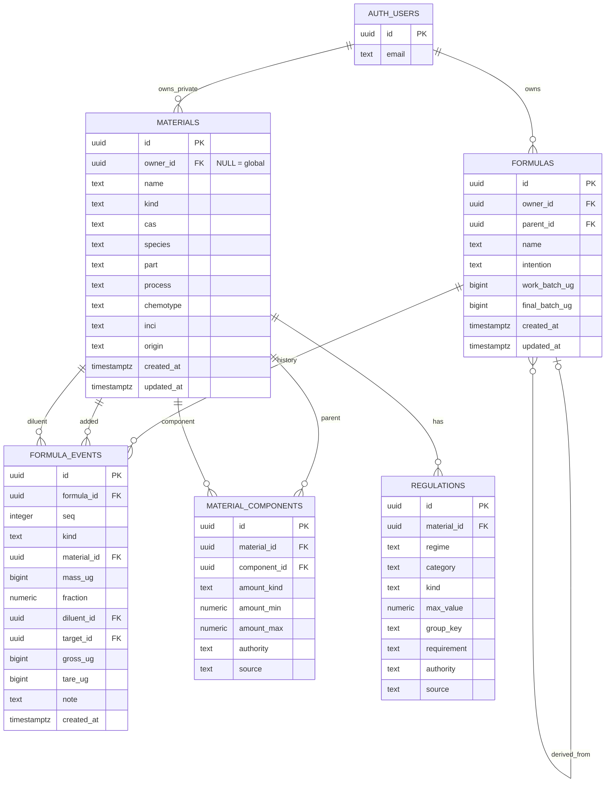

# Propuesta final: Perfumería Web con Supabase + Drizzle

## 1. Objetivo

Perfumería evolucionará de una aplicación Tauri con persistencia local basada en JSON/CSV a una webapp multiusuario sencilla.

La arquitectura objetivo será:

```text
React + TypeScript + Vite
          │
          ▼
       Domain
          │
          ▼
     supabase-js
          │
          ▼
Supabase
├── PostgreSQL
├── Auth
└── Row Level Security
```

Drizzle se utilizará para:

```text
schema
migraciones
seeds
importadores
scripts administrativos
```

Los principios rectores serán:

```text
KISS
YAGNI
```

No se modelarán conceptos que la aplicación todavía no necesite.

---

# 2. Decisiones principales

La nueva arquitectura adopta estas decisiones:

- Tauri desaparece.
- Vite + React + TypeScript serán la aplicación.
- WSL será el entorno principal de desarrollo.
- Supabase será la fuente de verdad.
- PostgreSQL sustituirá JSON/CSV como almacenamiento runtime.
- Supabase Auth gestionará usuarios.
- RLS protegerá los datos privados.
- Drizzle gestionará schema y migraciones.
- No habrá backend CRUD propio inicialmente.
- El motor de dominio seguirá siendo TypeScript puro.
- Los cálculos regulatorios seguirán siendo exactos.
- Los materiales de referencia serán compartidos.
- Los materiales particulares de un usuario podrán convivir en la misma tabla mediante `owner_id`.
- `Formula` será el aggregate root principal.
- El historial será la fuente de verdad de una fórmula.
- `Mixture` será una proyección derivada del historial.
- No existirá tabla `mixtures`.
- No existirá `MixtureItem`.
- No existirá tabla `formula_items`.
- Un material puede estar compuesto de otros materiales.
- Una dilución nunca crea un material nuevo.

---

# 3. Núcleo del dominio

El dominio se puede resumir en tres frases:

> Una `Formula` contiene metadatos y un historial.

> El historial determina una única `Mixture`, que representa qué materiales hay actualmente en la fórmula.

> Un `Material` puede estar compuesto de otros `Material`.

Conceptualmente:

```text
Formula
├── Metadata
├── History
│    └── FormulaEvent[]
│
└── Mixture
     └── Material + cantidad
          │
          ▼
       Material
          │
          └── puede contener otros Material
```

`Mixture` existe en el dominio pero no necesita persistencia propia.

---

# 4. Formula

`Formula` es el contenedor principal de todo el trabajo de formulación.

Conceptualmente:

```ts
interface Formula {
  id: FormulaId;
  ownerId: UserId;

  name: string;
  intention: string;

  workBatchUg: bigint | null;
  finalBatchUg: bigint | null;

  parentId: FormulaId | null;

  history: readonly FormulaEvent[];
}
```

De ella se deriva:

```ts
const mixture = compose(formula);
```

No se persiste una segunda representación independiente de la composición actual.

---

# 5. Metadata de fórmula

La fórmula contendrá inicialmente:

```text
id
owner_id

name
intention

work_batch_ug
final_batch_ug

parent_id

created_at
updated_at
```

No se introducirán inicialmente entidades como:

```text
FormulaFamily
FormulaVersion
Recipe
Batch
Experiment
Execution
```

Si una fórmula deriva de otra:

```text
formula_v2.parent_id = formula_v1.id
```

Eso es suficiente mientras no aparezcan necesidades más complejas de versionado.

---

# 6. FormulaEvent

Cada acción significativa del usuario queda en el historial.

Tipos iniciales:

```text
add
set_mass
remove
reweigh
note
```

Conceptualmente:

```ts
type FormulaEvent =
  | Add
  | SetMass
  | Remove
  | Reweigh
  | Note;
```

El historial conserva cómo se llegó al estado actual.

---

# 7. Añadir un material

Una adición conserva exactamente lo que hizo físicamente el usuario.

```ts
interface Add {
  kind: "add";

  id: EventId;
  materialId: MaterialId;

  massUg: bigint;

  fraction: Ratio;
  diluentId: MaterialId | null;
}
```

Por ejemplo:

```text
100 mg de Geosmina al 1 % en DPG
```

se persiste como:

```text
material = Geosmina
mass     = 100 mg
fraction = 0.01
diluent  = DPG
```

No se crea:

```text
Geosmina 1 % DPG
```

como material.

---

# 8. Regla fundamental sobre diluciones

Esta es una invariante del dominio:

> La dilución describe cómo se pesa un material, no qué material es.

Por tanto:

```text
Geosmina
Geosmina 1 % DPG
Geosmina 2 % DPG
Geosmina 1 % alcohol
```

NO son cuatro materiales.

Solo existe:

```text
Geosmina
```

Las distintas diluciones pertenecen a distintas adiciones.

---

# 9. Ejemplo de dilución

Evento:

```text
+100 mg Geosmina @ 1 % DPG
```

El dominio calcula:

```text
Geosmina     1 mg
DPG         99 mg
```

Posteriormente:

```text
+50 mg Geosmina @ 2 % DPG
```

aporta:

```text
Geosmina     1 mg
DPG         49 mg
```

La mezcla actual pasa a ser:

```text
Geosmina     2 mg
DPG        148 mg
```

No existen dos líneas de Geosmina en `Mixture`.

Se agregan por identidad de material.

---

# 10. Mixture

`Mixture` representa qué materiales hay actualmente en la fórmula.

Conceptualmente:

```ts
interface MaterialAmount {
  materialId: MaterialId;
  massUg: Ratio;
}

type Mixture = readonly MaterialAmount[];
```

Invariante:

> Cada material aparece como máximo una vez en una `Mixture`.

Por ejemplo, si el historial contiene:

```text
+100 mg Hedione
+200 mg Hedione
```

la mezcla es:

```text
Hedione 300 mg
```

El historial sigue conservando las dos adiciones originales.

---

# 11. History vs Mixture

La distinción es:

```text
History
= qué hizo el usuario

Mixture
= qué hay ahora mismo
```

Ejemplo:

```text
Formula
├── History
│   ├── +500 mg Bergamota
│   ├── +200 mg Hedione
│   └── corregir Bergamota → 480 mg
│
└── Mixture
    ├── Bergamota 480 mg
    └── Hedione   200 mg
```

La fuente de verdad sigue siendo el historial.

`Mixture` se reconstruye mediante:

```ts
compose(formula)
```

---

# 12. Corrección de masa

Si una adición fue:

```text
+500 mg Bergamota
```

pero debía ser:

```text
480 mg
```

no se modifica el evento anterior.

Se añade:

```text
set_mass
target = evento original
mass   = 480 mg
```

El historial queda:

```text
+500 mg Bergamota
corregir → 480 mg
```

y `compose()` obtiene:

```text
Bergamota 480 mg
```

---

# 13. Eliminación

Eliminar una adición también se expresa como evento:

```text
remove
target = evento original
```

La mezcla derivada deja de contener esa contribución.

No se destruye el historial.

---

# 14. Re-pesada

Se mantiene el concepto actual:

```text
reweigh
gross_ug
tare_ug
```

La diferencia:

```text
gross - tare
```

representa cuánto queda realmente.

El dominio escala proporcionalmente la mezcla existente según las reglas actuales.

Esta lógica permanece en TypeScript.

---

# 15. Material

`Material` representa algo que puede aparecer en una mezcla o formar parte de otro material.

Ejemplos:

```text
Geosmina
Linalool
Hedione
DPG
Alcohol
Bergamot oil expressed
Rose Base
material provisional del usuario
```

Conceptualmente:

```ts
interface Material {
  id: MaterialId;

  ownerId: UserId | null;

  name: string;
  kind: MaterialKind;

  cas?: string;

  species?: string;
  part?: string;
  process?: string;
  chemotype?: string;

  inci?: string;
  origin?: string;
}
```

---

# 16. Material global y material privado

No se introduce una entidad separada `UserMaterial`.

Se utiliza:

```text
materials.owner_id
```

con esta semántica:

```text
owner_id = NULL
→ material global

owner_id = user UUID
→ material privado
```

Ejemplo:

```text
Geosmina
owner_id = NULL

Linalool
owner_id = NULL

Bergamot oil
owner_id = NULL

DPG
owner_id = NULL
```

y:

```text
"Base almizclada de Sergio"
owner_id = Sergio

"Material provisional X"
owner_id = Sergio
```

---

# 17. Materiales globales

La mayor parte del conocimiento de referencia será común.

Por ejemplo:

```text
Geosmina
Coumarin
Linalool
Limonene
Bergamot oil expressed
DPG
Benzyl benzoate
```

Estos materiales:

- se almacenan una sola vez;
- pueden ser leídos por todos los usuarios;
- no pueden ser modificados por usuarios normales.

---

# 18. Materiales privados

Un usuario podrá crear materiales privados cuando sea necesario.

Por ejemplo:

```text
"Base rosa que hice ayer"

"Musk de Juan"

"Material provisional sin identificar"
```

Estos registros tendrán:

```text
owner_id = auth.uid()
```

y solo serán visibles para su propietario.

---

# 19. Material provisional

Un provisional puede ser:

```text
materials
─────────
id       = ...
owner_id = Sergio
name     = "Musk de Juan"
kind     = provisional
```

Puede añadirse inmediatamente a una fórmula.

Si no conocemos su composición o regulación:

```text
unknown
```

se mantiene como desconocido.

Nunca se convierte automáticamente en cero o libre de restricciones.

---

# 20. Un material puede contener otros materiales

Esta es la segunda relación fundamental del dominio:

```text
Material
   │
   └── contiene Material
```

Por ejemplo:

```text
Bergamot oil
├── Limonene
├── Linalool
└── Linalyl acetate
```

O:

```text
Rose Base
├── Phenethyl alcohol
├── Geraniol
└── Citronellol
```

---

# 21. MaterialComponent

La composición interna de materiales se persiste mediante:

```text
material_components
```

Conceptualmente:

```ts
interface MaterialComponent {
  materialId: MaterialId;
  componentId: MaterialId;

  amount: Concentration;
}
```

Ejemplo:

```text
Rose Base
→ 60 % Phenethyl alcohol

Rose Base
→ 20 % Geraniol

Rose Base
→ 20 % Citronellol
```

---

# 22. Concentration

La cantidad de un componente puede ser:

```text
exact
max
range
unknown
```

Conceptualmente:

```ts
type Concentration =
  | { kind: "exact"; value: Ratio }
  | { kind: "max"; value: Ratio }
  | { kind: "range"; min: Ratio; max: Ratio }
  | { kind: "unknown" };
```

No se crearán entidades distintas para estos casos.

---

# 23. Mixture no expande automáticamente materiales compuestos

Supongamos:

```text
Mixture
├── Rose Base 100 mg
└── Hedione   200 mg
```

y:

```text
Rose Base
├── Phenethyl alcohol 60 %
├── Geraniol          20 %
└── Citronellol       20 %
```

La `Mixture` continúa siendo:

```text
Rose Base 100 mg
Hedione   200 mg
```

No se sustituye por sus componentes.

Esto conserva qué material se utilizó realmente.

---

# 24. ExpandedComposition

Cuando el motor necesita saber qué contiene realmente la fórmula, expande recursivamente la mezcla.

```text
Mixture
├── Rose Base 100 mg
└── Hedione   200 mg
```

se puede expandir a:

```text
ExpandedComposition
├── Phenethyl alcohol 60 mg
├── Geraniol          20 mg
├── Citronellol       20 mg
└── Hedione          200 mg
```

Por tanto existen dos vistas derivadas diferentes:

```text
Mixture
= materiales utilizados

ExpandedComposition
= componentes finales
```

Ninguna necesita persistirse como fuente de verdad.

---

# 25. Flujo principal de aplicación

El flujo fundamental será:

```text
Crear Formula
      │
      ▼
Formula vacía
      │
      ▼
Añadir Material
      │
      ▼
FormulaEvent(add)
      │
      ▼
compose()
      │
      ▼
Mixture actualizada
      │
      ▼
añadir otro Material
      │
      ▼
...
```

Este flujo debe ser el camino más simple del sistema.

---

# 26. Ejemplo completo

Creamos:

```text
Formula
"Prueba cítrica"
```

Inicialmente:

```text
History = []
Mixture = []
```

Añadimos:

```text
+500 mg Bergamota
```

Resultado:

```text
Mixture
└── Bergamota 500 mg
```

Añadimos:

```text
+100 mg Geosmina @ 1 % DPG
```

Resultado:

```text
Mixture
├── Bergamota 500 mg
├── Geosmina     1 mg
└── DPG         99 mg
```

Añadimos:

```text
+200 mg Hedione
```

Resultado:

```text
Mixture
├── Bergamota 500 mg
├── Geosmina     1 mg
├── DPG         99 mg
└── Hedione    200 mg
```

Corregimos la Bergamota:

```text
500 mg → 480 mg
```

Resultado:

```text
Mixture
├── Bergamota 480 mg
├── Geosmina     1 mg
├── DPG         99 mg
└── Hedione    200 mg
```

El historial conserva todas las acciones.

---

# 27. Fórmulas usadas como materiales

Una `Formula` y un `Material` seguirán siendo conceptos distintos.

Una fórmula es:

```text
algo vivo que estamos editando
```

Un material es:

```text
algo que podemos añadir
```

Si una fórmula terminada debe utilizarse como ingrediente, se realiza una operación explícita:

```text
Formula
   │
   │ freeze / guardar como material
   ▼
Material privado
```

Se crea un nuevo `Material` privado con una composición fija derivada de la fórmula.

Así modificar posteriormente la fórmula original no altera el material congelado.

No hace falta introducir una entidad `FormulaSnapshot`.

---

# 28. Regulación

Las restricciones regulatorias permanecen separadas del núcleo de formulación.

Tabla:

```text
regulations
```

Una regulación apunta a un `Material`.

Campos conceptuales:

```text
id
material_id

regime
category
kind

max_value
group_key
requirement

authority
source
```

---

# 29. Tipo de regulación

Inicialmente:

```text
regime
──────
ifra
manufacturer
```

y:

```text
kind
────
max
prohibited
requirement
```

Esto permite representar tanto restricciones IFRA como límites específicos de fabricante sin introducir múltiples jerarquías.

---

# 30. Evaluación regulatoria

El flujo regulatorio será:

```text
Formula
   │
   ▼
compose()
   │
   ▼
Mixture
   │
   ▼
expand()
   │
   ▼
ExpandedComposition
   │
   ▼
regulations
   │
   ▼
ComplianceReport
```

El motor trabaja sobre la composición expandida.

---

# 31. Desconocido nunca equivale a cero

Se conserva esta invariante:

> Ausencia de información no significa ausencia de una sustancia.

Por tanto:

```text
unknown ≠ 0
```

El motor seguirá diferenciando:

```text
within
bounded
unknown
exceeds
```

y podrá marcar cálculos parciales.

---

# 32. Autoridad y procedencia

Los datos de composición pueden conservar:

```text
authority
source
```

Por ejemplo:

```text
authority = ifra
source = "IFRA Annex..."
```

o:

```text
authority = product
source = "SDS proveedor 2026"
```

La jerarquía actual puede mantenerse:

```text
lot
>
product
>
ifra
>
literature
>
consensus
```

No se introducirá inicialmente una entidad genérica `Evidence`.

---

# 33. Documentos

No habrá inicialmente una tabla `documents`.

Los datos pueden conservar:

```text
source
```

como referencia textual.

Si más adelante la aplicación necesita:

- subir PDFs;
- almacenar certificados;
- reutilizar documentos;
- revisarlos;
- versionarlos;

se añadirá entonces:

```text
documents
```

No antes.

---

# 34. Modelo persistente mínimo

El modelo inicial necesita únicamente cinco tablas de dominio principales:

```text
materials
material_components
formulas
formula_events
regulations
```

Además:

```text
auth.users
```

gestionado por Supabase.

No habrá:

```text
mixtures
mixture_items
formula_items
user_materials
formula_snapshots
products
lots
documents
```

hasta que una necesidad real lo justifique.

---

# 35. Diagrama ER



---

# 36. Público y privado

La misma tabla `materials` soporta ambos casos.

```text
owner_id = NULL
→ global
```

```text
owner_id = auth.uid()
→ privado
```

Por ejemplo:

```text
GLOBAL
──────
Geosmina
Linalool
Bergamot oil
DPG
Alcohol
```

```text
SERGIO
──────
Base almizclada propia
Material provisional X
Fórmula congelada como material
```

RLS permitirá:

```text
leer globales
+
leer/escribir los propios
```

pero no acceder a materiales privados de otros usuarios.

---

# 37. Seguridad

Las fórmulas:

```text
owner_id = auth.uid()
```

solo serán accesibles por su propietario.

Los eventos se protegerán a través de su fórmula padre.

Los materiales globales:

```text
owner_id IS NULL
```

serán visibles para los usuarios autenticados.

Los materiales privados:

```text
owner_id = auth.uid()
```

solo serán visibles para su propietario.

La seguridad real estará en PostgreSQL/RLS, no en filtros de React.

---

# 38. Aritmética exacta

El core seguirá usando:

```text
Ratio
```

Las masas se almacenarán en:

```text
BIGINT
```

como microgramos.

Las cantidades decimales de persistencia podrán utilizar:

```text
NUMERIC
```

Nunca `FLOAT` para cálculos regulatorios importantes.

---

# 39. Responsabilidad del dominio TypeScript

El dominio incluirá funciones como:

```text
compose(formula)
expand(mixture)
worstCase(concentration)
authorityRank(authority)
checkIfra(...)
marginOf(...)
freezeFormula(...)
```

PostgreSQL almacena hechos.

TypeScript calcula:

```text
Mixture
ExpandedComposition
ComplianceReport
márgenes
peor caso
```

---

# 40. CSV e IFRA

Los CSV actuales dejarán de ser almacenamiento runtime.

Nuevo flujo:

```text
fuentes
CSV
IFRA
  │
  ▼
scripts de importación
  │
  ▼
PostgreSQL
```

Los CSV pueden seguir versionados para:

- reproducibilidad;
- auditoría;
- revisión;
- generación determinista.

Pero React no los cargará al arrancar.

---

# 41. Migraciones con Drizzle

Drizzle será la fuente principal del schema.

Flujo:

```text
Drizzle schema
      │
      ▼
SQL migration
      │
      ▼
PostgreSQL
```

Los constraints, RLS e índices que sean más claros en SQL pueden escribirse directamente dentro del mismo historial de migraciones.

Debe existir una única historia de migraciones.

---

# 42. Migración de fórmulas actuales

Los JSON actuales se convertirán aproximadamente así:

```text
Formula JSON
    │
    ├── header
    │      ↓
    │   formulas
    │
    └── history
           ↓
      formula_events
```

La composición almacenada actualmente en el JSON no será importada como fuente de verdad porque puede reconstruirse.

---

# 43. Integridad

PostgreSQL garantizará principalmente:

```text
PRIMARY KEY
FOREIGN KEY
UNIQUE
NOT NULL
CHECK
RLS
```

Por ejemplo:

```text
formula_events.seq
```

será único dentro de una fórmula:

```text
UNIQUE(formula_id, seq)
```

Las reglas complejas permanecerán en el dominio.

---

# 44. Migración por fases

La migración recomendada es:

1. Eliminar Tauri.
2. Mantener el core actual funcionando en navegador.
3. Crear Supabase y Auth.
4. Introducir Drizzle.
5. Crear `materials`.
6. Crear `material_components`.
7. Importar datos globales.
8. Crear `formulas`.
9. Crear `formula_events`.
10. Adaptar `compose()` a IDs/repositories.
11. Crear `regulations`.
12. Migrar IFRA.
13. Importar fórmulas JSON existentes.
14. Eliminar loaders CSV/JSON runtime.
15. Eliminar código v1/v2 que ya no sea necesario.

Durante la transición se mantendrán tests de equivalencia.

---

# 45. Fuera de alcance inicial

No se implementarán ahora:

```text
backend propio
SQLite WASM
offline completo
sincronización local/cloud
organizaciones
equipos
roles complejos
sharing
colaboración
inventario avanzado
products
lots
documents
formula_items
mixtures persistidas
snapshots como entidad
CQRS
microservicios
```

Cada uno se añadirá únicamente cuando exista un caso real que lo necesite.

---

# 46. Posibles extensiones futuras

Si aparece la necesidad de distinguir:

```text
Bergamot oil
```

de:

```text
mi botella concreta de Bergamot oil de proveedor X
```

podrá añadirse:

```text
products
```

Si un producto necesita múltiples lotes:

```text
lots
```

Si se necesitan PDFs y certificados:

```text
documents
```

Si se quieren recordar varias diluciones favoritas:

```text
material_preferences
```

No se incorporan anticipadamente.

---

# 47. Modelo conceptual final

```text
                    Formula
                   /       \
                  /         \
           Metadata          History
                                │
                                │ compose()
                                ▼
                             Mixture
                                │
                                │ expand()
                                ▼
                     ExpandedComposition
                                │
                                ▼
                         IFRA / Rules


                             Material
                                │
                                │ 0..N
                                ▼
                       MaterialComponent
                                │
                                ▼
                             Material
```

---

# 48. Ejemplo final de extremo a extremo

Materiales globales:

```text
Geosmina
DPG
Hedione
Bergamot oil
Limonene
Linalool
```

Composición global:

```text
Bergamot oil
├── Limonene
└── Linalool
```

Creamos:

```text
Formula
"Ensayo 27"
```

Historial:

```text
1. +500 mg Bergamot oil
2. +100 mg Geosmina @ 1 % DPG
3. +200 mg Hedione
4. corregir Bergamot oil → 480 mg
```

`compose()` obtiene:

```text
Mixture
────────
Bergamot oil   480 mg
Geosmina         1 mg
DPG             99 mg
Hedione         200 mg
```

`expand()` puede producir:

```text
ExpandedComposition
───────────────────
Limonene        ...
Linalool        ...
Geosmina        1 mg
DPG            99 mg
Hedione       200 mg
...
```

Entonces el motor regulatorio compara esa composición con:

```text
regulations
```

y obtiene el informe IFRA.

No ha sido necesario persistir:

```text
Mixture
MixtureItem
FormulaItem
Geosmina 1 % DPG
```

como entidades.

---

# 49. Regla arquitectónica final

El diseño debe poder explicarse así:

```text
Formula
= qué estoy formulando

FormulaEvent
= qué he hecho

Mixture
= qué tengo ahora en el frasco

Material
= qué cosas forman la mezcla

MaterialComponent
= de qué está hecho un material

Regulation
= qué restricciones se aplican
```

Y la regla más importante sobre composición y dilución queda:

> **Las acciones se conservan en el historial. La mezcla agrega el resultado. Los materiales compuestos se expanden solo cuando hace falta. Las diluciones nunca generan nuevos materiales.**

Este será el núcleo KISS/YAGNI de la nueva arquitectura.