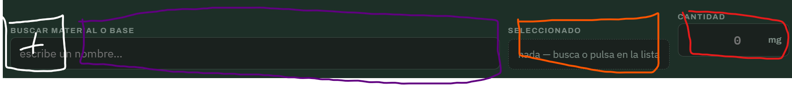

# Interrogatorio de diseño — la intención de la app

Registro de preguntas y respuestas para aclarar qué tiene que ser la app, empezando por
la **formulación**. **Se añade, no se reescribe**: si una respuesta cambia, se añade la
corrección con fecha debajo.

Método adaptado del [prompt de interrogatorio](antecedentes/formulacion/prompt-interrogatorio-diseno.md):
tandas de tres preguntas como máximo. El usuario puede responder **en prosa**. La
respuesta se interpreta, la lectura se escribe aquí y el usuario la confirma o la
corrige.

Cuando las rondas R1 a R4 estén cerradas, lo decidido pasa a [`decisiones.md`](decisiones.md)
como v3. Los [antecedentes](antecedentes/README.md) no obligan a nada.

Última sesión: 2026-09-25 (rondas 1 a 3)

---

## Ronda 1 — El núcleo

### P1 — ¿Qué es una fórmula?
- Bloque: 1 · el núcleo
- Abierta por: `antecedentes/formulacion/02-dominio-y-datos.md` §1 (composición cerrada con versiones) frente al Banco v2 (el historial de adiciones es la fórmula)
- Opciones presentadas: A) historial de adiciones · B) composición editable con versiones · C) las dos: se trabaja por adiciones y «cerrar versión» da una composición editable
- Recomendación: C
- Respuesta: **propia, más cercana a A**
- Razón del autor: *«lo ideal es que imiten la realidad, las formulas pueden ser editables pero aditivamente, pero con una sucesion de descendencia. por ejemplo si abro una formula que he creado y esta igual, añadirle productos la alterara pero esto no alterara las mezclas que se hayan creado a traves de la formula previa a la edicion. […] las formulas son una categoria de informacion en el proyecto que registrara una adicion de todos los componentes que la conforman. lo que hace falta es que luego puedan ser usadas para otros perfumes, por ejemplo, como acorde. creo que aqui el secreto seria seleccionar una opcion en opciones, importar formula como material. en cuanto la importas deja de ser una formula vinculada a otra formula, sino la formula importada se traduce en lo que la compone para la formula en la que se esta trabajando (se registra en el documento como el nombre de la formula ha sido agregada, pero internamente se desglosa en las materias primas que la componen)»*
- **Lectura:**
  1. Una fórmula es **un registro de adiciones**. Se edita **solo añadiendo**, como en el
     banco real, donde lo vertido no se desvierte.
  2. **Cada estado del registro queda fijo.** Lo que se haya hecho a partir de un estado
     anterior no cambia al añadir después: la versión de una fórmula es *hasta qué adición
     llega*.
  3. **Descendencia:** de cualquier estado puede nacer una fórmula hija que recuerda de qué
     madre y de qué estado sale.
  4. **Importar una fórmula como material.** Es una opción al añadir, y se hace **por
     copia desglosada, no por vínculo**:
     - el registro muestra una línea, «Fórmula X, 500 mg»;
     - por dentro se reparten esos 500 mg entre sus materias primas, en la proporción
       exacta de ese estado;
     - si la fórmula X cambia después, la que la importó no se entera.

     Es la «base inmutable» del Banco v2, generalizada a cualquier fórmula.
  5. **Lo que se descarta de los antecedentes:** acordes anidados con vínculo vivo, versión
     fijada, detección de ciclos y profundidad máxima (`02` §1, `03` §4). Al desglosar en
     el momento de importar, nada de eso hace falta.
- Fecha: 2026-09-25
- Estado: cerrada · lectura por confirmar
- Destino: decisiones.md

### P2 — ¿Dónde vive la verdad?
- Bloque: 1 · el núcleo
- Abierta por: la app lee los CSV del repositorio (`README.md` de la app, `exportar.py`) frente a un almacén propio
- Opciones presentadas: A) en el repositorio · B) en la app · C) repartida: referencia en el repositorio, fórmulas en la app
- Recomendación: C
- Respuesta: **propia: la app es autónoma, y el repositorio la alimenta mientras se construye**
- Razón del autor: *«la app aunque sea para empezar usandola yo tiene que ser autonoma, porque la infraestructura tiene que existir por si misma, yo diria que lo mejor seria que para la creacion de la app se importe informacion de la repo hasta que pueda existir por si misma, por ejemplo en cuanto la quiera hacer usable y que sea un ejecutable en mi movil si quiero que autocontenga regulacion ifra no que tenga que ir a un repositorio de mi ordenador»*
- **Lectura:**
  1. La app **funciona sola, también en el móvil y sin conexión**. Lleva dentro sus datos:
     IFRA, materiales, niveles de uso.
  2. El repositorio es **la fuente de la que se alimenta**. Los datos de referencia se
     importan del repositorio como un **paquete de datos versionado**. Es lo que ya hace
     [`exportar.py`](exportar.py), convertido en paso de construcción.
  3. **Autonomía de ejecución no es un repositorio aparte.** El código puede seguir en
     `app/`: lo que no puede hacer la app es necesitar el repositorio para funcionar.
  4. **Queda abierto (P5):** una vez autónoma, dónde se dan de alta los frascos y
     materiales nuevos, y cómo vuelve al repositorio lo que se crea en la app.
- Fecha: 2026-09-25
- Estado: cerrada · lectura por confirmar
- Destino: decisiones.md

### P3 — ¿Hasta dónde llega IFRA desde el primer día?
- Bloque: 1 · el núcleo
- Abierta por: `decisiones.md` §2.1 (suma por sustancia «para una iteración futura») y `antecedentes/formulacion/entradas-para-decisiones-app.md` (IFRA aplazado, **superado**: la fuente primaria ya existe)
- Opciones presentadas: A) techo por material · B) A + suma por sustancia donde haya datos · C) B + alérgenos declarables
- Recomendación: A ya y B enseguida
- Respuesta: **B, con el diseño preparado para C**
- Razón del autor: *«teniendo la bas de datos de ifra ya lo mejor seria estar diseñando de manera que se ponderen ya los alergenos que convergen entre materiales, al menos por diseño, aunque haya materiales que tengan solapamiento de alergenos no registrados es mejor registrar los que si se sepan porque es el estado esperado del funcionamiento, y en caso que no se tenga la informacion de unos simplemente funcionara como si solo tuviera el techo por cada material. en cualquier caso es mejor la segunda creo yo. por ultimo siempre que haya elementos desconocidos se debe avisar en la formulacion»*
- **Lectura:**
  1. **El modelo lleva constituyentes desde el principio.** Cada material puede declarar
     las sustancias reguladas o alérgenas que contiene, con su porcentaje, su base y su
     fuente.
  2. **El cálculo suma por sustancia** sobre toda la fórmula, desglosada: cumarina del
     frasco más la de la tintura, HAP de cade más estoraque, linalol de todas partes.
  3. **Se carga lo que se sabe.** Si un material no tiene constituyentes declarados,
     cuenta solo su techo propio. Ese es el funcionamiento esperado, no un error.
  4. **Lo desconocido siempre se avisa en la formulación.** Un material sin datos, una
     carga `SIN DATO` o un constituyente sin cuantificar salen marcados; nunca en verde.
     Es la regla 1.2 de `decisiones.md`.
  5. **Los alérgenos van en el diseño; los umbrales, pendientes.** Los umbrales de
     declaración en etiqueta de la UE son el vacío 12 de `fuentes/vacios.md`. No se
     inventan.
- Fecha: 2026-09-25
- Estado: cerrada · lectura por confirmar
- Destino: decisiones.md

---

## Ronda 2 — Registro, materiales y frascos

*Preguntas presentadas: P4 (corregir errores en un registro que solo crece), P5 (dónde
nacen frascos y materiales con la app autónoma), P6 (inventario en la primera versión).
El usuario respondió en un solo texto que **corrige P1** y responde a las tres.*

Respuesta literal, completa:

> *«en cuanto a la app durante la formulacion pienso que es practico que se pueda editar, en mi caso con ctrl z iba bien pero aun asi creo que he virado de la idea de que las formulas sean cerradas e ineditables, vira de algunos conceptos que si me gustaban, por ejemplo importar una formula de un tercero y querer recrearla pero ajustandola, las formulas seran editables y estan compuestas de agregados de materiales, son los materials los que no cambian, yo puedo coger una formula de acorde de melocoton y editarla, quitando componentes dulces y añadiendo olores fuertes, hacer acorde de melocoton pasado. en este caso pierde capacidades de ser uno a uno de la realidad pero gana ventajas en lo que considero que es el campo necesario, documentar y adjuntar formulaciones. en linea de esto, la app no tiene que tener un stock real, añade muchas complicaciones, no es intuitivo, el proposito de la app es la informacion intangible que trae, mientras que en mi caso yo tenia y estaba valorando los stocks en la app se enturbia,*
> *en la app hay: materiales conocidos, todos en glosario, capacidad de dar de alta materiales con la misma rigurosidad y parametros que los materiales conocidos, o con agujeros (tinturas limite ifra desconocido) de manera que esten tagged, capacidad de dar de alta acordes o materiales a raiz de las formulas, por ejemplo usar un perfume creado para otro o reducirlo a un eau de perfum pero añadiendole fijadores como remedio al cambio de concentracion... La idea es que las opciones de materiales no dependan de dar de alta manualmente stock eso para mi fue tedioso para gente puede ser hasta mas, aporta valor solo en pequeños casos. Creo que los pesos reales tienen que mandar solo en la formulacion, por ejemplo si un acorde de higos que hiciste de 10g es usado como material y se debe reformular al volverlo a reformular es importante que la importacion tenga en cuenta cuanto queda, se usaron 2g por ejemplo y la formulacion no esta preparada puede dar lugar a problemas. hay que definir como navegar con las formulas y materiales, lo ideal es que los amteriales contengan la importacion de los acordes con codigos de lo que lo componen y concentrado, quizas usanndo cas como terminologia, no se por ejemplo "mat(dpgg%50 - 15932-80-6%10 - Angelica seed absolute20% - Anisyl alcohol20%)". de manera que toda la libreria de materiales que manda es en base a ifra y por lo tanto esta al dia de los limites de ifra.»*

### P1 — corrección del 2026-09-25: las fórmulas se editan; los materiales no cambian
- **Lectura, que sustituye a los puntos 1 a 3 de la lectura anterior de P1:**
  1. **Una fórmula se edita libremente**: añadir, quitar, cambiar cantidades, con deshacer
     (Ctrl+Z). Se abandona «solo añadiendo» y «cada estado queda fijo».
  2. **Se deriva copiando.** Cualquier fórmula, propia o de un tercero, se copia y se ajusta
     como fórmula nueva: del acorde de melocotón sale el de melocotón pasado.
  3. **Lo que no cambia son los materiales.** Una fórmula convertida en material queda
     **congelada** como composición. **Sigue en pie el punto 4 de la lectura anterior**:
     importar una fórmula como material es copia desglosada, no vínculo.
  4. **Se acepta perder el uno a uno con el banco** a cambio de lo que es el propósito:
     **documentar y adjuntar formulaciones**.
- Estado: cerrada · lectura por confirmar
- Destino: decisiones.md

### P4 — ¿Cómo se corrige un error?
- Opciones presentadas: A) nada se borra, se tacha · B) deshacer la última mientras nada dependa de ella · C) editar cualquier línea
- Recomendación: B
- Respuesta: **C, con deshacer**, que la corrección de P1 hace innecesaria como pregunta aparte
- Estado: cerrada
- Destino: decisiones.md

### P5 — ¿Dónde nacen los materiales? *(respondida en parte)*
- Opciones presentadas: A) en la app · B) en el repositorio · C) repartido: referencia en el repositorio, lo personal en la app
- Recomendación: C
- **Lectura:**
  1. **La biblioteca son todos los materiales conocidos**, el glosario, no lo que tengas en
     casa. Cada uno con su IFRA por CAS. Es lo que el usuario llama que la librería «manda
     en base a IFRA» y por eso está al día de los límites.
  2. **En la app se dan de alta materiales nuevos** con los mismos campos y el mismo rigor,
     **o con huecos marcados**: una tintura sin carga conocida o un IFRA desconocido llevan
     etiqueta, no un cero.
  3. **En la app se dan de alta materiales a partir de fórmulas**: un acorde, un perfume
     usado como ingrediente de otro, o una reformulación. Por ejemplo, pasar un perfume a
     eau de parfum añadiendo fijadores para compensar el cambio de concentración.
  4. **Un material compuesto lleva su composición como código**, en términos de CAS donde
     los haya. Por ejemplo: `mat(DPG 50 % · 15932-80-6 10 % · Angelica seed absolute 20 % ·
     Anisyl alcohol 20 %)`. Así IFRA se calcula siempre sobre lo que contiene. El formato
     queda abierto en P9; hay precedente en
     [`05-libreria-global-e-intercambio.md`](antecedentes/formulacion/05-libreria-global-e-intercambio.md) §2.
- ⚠️ **Consecuencia:** hoy IFRA está transcrito solo para los **54 materiales de la paleta**
  ([`ifra-cat4.csv`](../conocimiento/normativa/ifra-cat4.csv)). Para que la biblioteca sea el
  glosario entero (3119 ingredientes por CAS), hace falta **una tabla de los 216
  estándares por CAS**, en categoría 4. Es trabajo de datos, con el método ya escrito en
  [la investigación de los 216 estándares](../fuentes/investigaciones/2026-09-23-niveles-de-uso-y-los-216-estandares.md).
  Y para los naturales, los constituyentes siguen siendo el hueco de P3.
- Estado: abierta en parte. Queda qué se trae del repositorio y qué vuelve (ronda 4)
- Destino: decisiones.md

### P6 — Inventario
- Opciones presentadas: A) sin cantidades · B) cantidad por frasco que se descuenta · C) B + planificación
- Recomendación: B
- Respuesta: **ninguna de las tres: no hay inventario de materias primas**
- **Lectura:**
  1. **La app no lleva stock.** La biblioteca no depende de dar nada de alta: se formula
     con cualquier material conocido.
  2. **Los pesos reales mandan solo dentro de la formulación.**
  3. **Una excepción, y es de formulación, no de almacén: las mezclas hechas.** Si hiciste
     10 g de un acorde de higos y lo usas como material, la app sabe cuánto hiciste y cuánto
     has usado. Si una fórmula pide más de lo que queda, avisa.
- Consecuencia: la decisión de agosto de «alta y baja de existencias en un clic» queda
  **superada**, salvo para las mezclas hechas.
- Estado: cerrada · lectura por confirmar
- Destino: decisiones.md

---

## Ronda 3 — Dilución, historial y código de material

*Preguntas presentadas: P7 (dónde vive la dilución sin frascos), P8 (qué guarda una
fórmula de su historia), P9 (código de un material compuesto). El usuario respondió P7
y P8 con una captura anotada de la barra de añadir del Banco v2. **P9 queda sin
responder.***

*La captura: en **blanco**, un «+» sobre el inicio del buscador; en **lila**, el campo
«Buscar material o base»; en **naranja**, el campo «Seleccionado»; en **rojo**, el campo
«Cantidad» en mg.*

Respuesta literal, completa:

> *«p7 exacto, seleccionar un material en el buscador te deja lugar a determinar la disolucion a la derecha*
> *\* en blanco, dar de alta un material fuera del registro, o bien matarial nuevo o añadir formula como material o bien añadir de la lista de materiales del usuario, si el ha dado de alta materiales, como tinturas por ejemplo que puede incluso que haya hecho test de limites de uso y demas estos materiales pueden vivir en la formulacion del usuario pero es añaden a proposito, no forman parte de la paleta base*
> *\* la parte lila funciona parecido a antes en este caso una diferencia significativa es que el propio buscador deja seleccionado el material , no tiene sentido un apartado de seleccionado porque no es compatible buscar un material nuevos sin deselecionar otro*
> *bien matarial nuevo (es practicidad si es algo que no se va a definir duramente con poner un nombre basta y pasa a seleccionado )*
> *añadir formula como material (en este caso la formula se añade como seleccionado, te añadira los porcentajes ponderando los XXXmg en cada uno de los componentes y te lo registrara como nombre formulaXXXmg registrando elnumero en los valores que son de cada material )*
> *la parte naranja es el porcentaje, el porcentaje que determina la dilucion, en el caso normal sera al 100%, y puedes manualmente ajustarla, al lado te sale el diluyente, tambien seleccionable de entre los normales o añadir un placeholder de diluyente por si es uno no estandar, como con el material fuera de registro. ademas lo ideal seria pinnear una dilucion para materiales de manera que puedes tener materiales que tienen diferentes como "favoritas" donde se registra tanto el % como el diluyente, por ultimo como QOF feature el programa te pre selecciona la ultima manera en la que agregaste el material, aunque no este en favoritos.*
> *en la cantidad se queda igual numero en mg seria ideal que etnre todos estos pasos el cursor te pase al siguiente de manera que sea rapido pero esto tambien es qof, todo no tiene que ser en mg seria ideal poder escoger entre gramos para gente que haga big batches pero en mi caso mg es go to.*
> *p8*
> *me gusta que haya un historial y me gusta que se pueda añadir notas en el de manera opcional al hacer una mezcla por ejemplo evaluar, como un material ha cambiado la formula para tenerlo en cuenta en futuras mezclas, lo que el historial tampoco tiene que ser recuperable necesariamente tengo que evaluar mas sobre el historial tiene que parecer mas que una gimmic. ahora se me ha ocurrido para que se vea mas que una tabla de numeros las notas añaden un punto al historial pero tambien creo que se podria luego hacer, con un boton de play una visualizacion de la parte de formulacion uno a uno de como evoluciona la formula. creo que cuando tenga mis diagramas infograficos de descripcion de olores bien hechos podran quedar una evolucion chula de como cambia y ademas puede ser un ups a nivel visual y algo que simplemente note cariño y una intencion visual tras la app, no sera algo tan necesario pero lo hace memorable el poder ver la evolucion de las infografias durante tu dearrollo.»*

### P7 — La barra de añadir
- Opciones presentadas: A) dilución escrita en cada línea · B) A + memoria de las diluciones usadas · C) frascos como registro sin peso
- Recomendación: B
- Respuesta: **B, ampliada con el diseño de la barra**
- **Lectura:**
  1. **Cuatro zonas, de izquierda a derecha**, y el cursor salta de una a la siguiente:
     - **➕ Fuera de la paleta base**, tres vías:
       - *material nuevo rápido:* basta un nombre y queda seleccionado, marcado como sin
         definir;
       - *fórmula como material;*
       - *de «mis materiales»:* los que el usuario ha dado de alta, como una tintura propia
         con sus pruebas de límites. Se añaden a propósito y **no son paleta base**.
     - **Buscador.** Como antes, pero **el propio buscador se queda con el material
       elegido**. Desaparece el campo «Seleccionado»: no se puede buscar otro sin soltar
       el anterior.
     - **Dilución:** porcentaje, **100 % por defecto** y editable, y al lado el
       **diluyente**, de los habituales o uno provisional si no es estándar. Se pueden
       **fijar diluciones favoritas** por material (porcentaje y diluyente), y por defecto
       sale **la última con que se añadió ese material**, aunque no sea favorita.
     - **Cantidad:** **mg por defecto**, con la unidad elegible (g para lotes grandes).
       Enter añade.
  2. **Fórmula como material.** Al añadir X mg, se reparten entre sus componentes en su
     proporción. La línea se ve como «Nombre de la fórmula, X mg», y cada componente suma
     su parte. Es el desglose de P1.
  3. **Tres niveles de material:**
     - *base:* el glosario, con IFRA;
     - *mis materiales:* definidos por el usuario, con rigor o con huecos marcados;
     - *provisionales:* solo un nombre.
- Consecuencia: **un provisional, sea material o diluyente, es un desconocido.** Por P3,
  la fórmula que lo lleve avisa de que no puede comprobar IFRA en esa parte.
- Detalles de interfaz, sin decisión de fondo: salto de cursor entre campos, unidad
  elegible, favoritas y última dilución preseleccionada.
- Fecha: 2026-09-25
- Estado: cerrada · lectura por confirmar
- Destino: decisiones.md

### P8 — El historial
- Opciones presentadas: A) solo la composición actual · B) composición + historial con notas, recuperable · C) el historial es la fórmula
- Recomendación: B
- Respuesta: **B, sin exigir que sea recuperable**
- **Lectura:**
  1. **Cada fórmula tiene historial**, con **notas opcionales**. Sirven para evaluar al hacer
     una mezcla: cómo cambió la fórmula un material, para tenerlo en cuenta en las
     siguientes. **Una nota deja una marca en el historial.**
  2. **Recuperar un punto del historial no es requisito**; está por evaluar.
  3. **Tiene que ser más que una tabla de números.**
  4. **Para más adelante:** un botón de *play* que reproduce la formulación paso a paso. Con
     las infografías de descripción olfativa de la línea paralela, sería ver cómo evoluciona
     la fórmula. No es necesario, pero la hace memorable.
- ⚠️ **Consecuencia que conviene fijar ya:** para que el *play* sea posible algún día,
  **el historial tiene que guardar cada cambio como un evento** (qué, cuánto, cuándo), no
  solo las notas. Guardarlo cuesta poco hoy; reconstruirlo después es imposible.
- Aquí la línea paralela del lenguaje visual **toca** la app, y solo en este punto: la
  app guarda la historia y las infografías la dibujarán. Va a la ronda 5 (lo aplazado).
- Fecha: 2026-09-25
- Estado: cerrada · lectura por confirmar
- Destino: decisiones.md

---

## Estado

| Ronda | Cerradas | Abiertas | Siguiente |
|---|---|---|---|
| R1 · El núcleo | 3 (P1 corregida; lecturas por confirmar) | 0 | — |
| R2 · Registro, materiales y frascos | 2 (P4, P6) | 1 en parte (P5) | — |
| R3 · Dilución, historial y código de material | 2 (P7, P8) | 1 (P9) | P9 |
| R4 · Búsqueda, fórmula frente a mezcla hecha | 0 | 2 (P10, P11) | P10 |
| R5 · Dónde se usa, y qué va y vuelve del repositorio | 0 | — | — |
| R6 · Lo aplazado (incluye el *play* del historial) | 0 | — | — |
